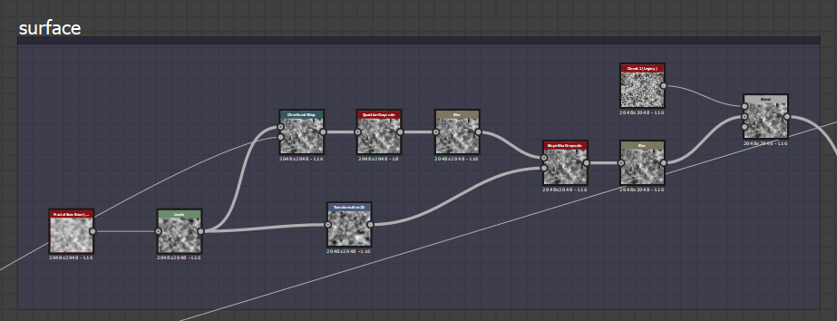

# 圖建立禮儀

建立大型且複雜的圖表很容易讓人感到困惑且難以導航。 有許多工具可以用來緩解這些問題，並且有一些良好的習慣可以養成，以避免日後出現問題。 本頁提供了我們推薦使用的技術清單，以製作乾淨、高效且功能齊全且易於分享與理解的圖表。

## 一般

### 圖的組織

#### 圖表項目

圖項目是輔助物件，可以在圖圖檢視](../../interface/the-graph-view/the-graph-view.md)中放置在節點[旁邊或周圍。三者中，框架提供最快且最大的好處，而評論與導航圖釘則更適合特定情境。

#### 框架

讓圖表更乾淨、更易讀的首要因素，是將框架放在圖的核心群組周圍。 沒有影格，一個大型圖幾乎無法閱讀，即使是小圖，畫出影格後也會更容易理解。 Frames 的一大優勢是<b> 它們的名字總是以相同的比例</b>呈現，即使你拉得很遠。

框架讓理解圖表中發生的事情變得容易許多。 他們可以幫助你作為作者幾個月後回來工作，或是同事等使用者，幫助你熟悉不熟悉的圖表。

放置框架時請使用以下標準：

* 找出 **功能** 區塊（例如8個節點共同產生髒污效果），並用框架將它們分組。
* 一定要盡量 **用不同顏色** 來搭配你的相框：同一個藍色的相框，預設顏色彼此之間差異不大。
* 使用 **清晰且具描述性且不冗長的名稱** （更多建議請見下方章節）
* 不要在框架裡放 **太多或太少** ，因為這對可讀性沒有幫助。 具體的數量顯然會因圖表和函數而異。
* 如有必要，在 **描述** 中加入文字，幫助理解畫面中發生了什麼。

#### 留言與釘選

註解和釘腳只是次要的，且並非製作良好圖表的絕對必要條件。 它們可用於以下情境：

* 註解很適合用來補充超出框架描述範圍的額外文字。 你可以在每個節點新增少量文字，主要是為了收集一些細節資訊。 留言的縮放不好，也無法從遠距離放大視角讀取。
* 導航圖釘允許你透過 F2 快捷鍵在圖表的特定區域中循環。 這對於需要在兩個相距非常遠的區域間切換的大型圖表非常有用。

### 輸入與輸出配置

輸入和輸出應放在圖的兩端：所有輸出在右邊，所有輸入在左邊，且垂直排列。 這讓尋找和辨識它們變得更容易。

上述例子是極端例子：幀不一定是必需或可行的，但應該很明顯，In-和Output的垂直對齊比隨機、隨機擺放更清楚。

### 連結重路由

在大型且非常長的圖中，有時會跨越非常大的跨度建立連結。 這導致連結線在圖中交叉，且控制不佳。 捷徑「Alt + Shift 拖曳」可以讓你重新組織這些連結，透過細分連結並在中間加一個額外的 handle，將它們重新導向不同的路徑。 建議在合理情況下加以利用。

### 標籤、標識與用法

任何用於分享或發佈的圖表，都應該在額外的元資料上妥善處理，以提升使用者友善性。 以下幾點很重要：

預設建議的標籤永遠不夠，請花時間和精力在暴露的參數以及輸入輸出中加入自訂標籤。

盡量不要讓識別碼和標籤差異太大：如果識別碼在其他地方（多個函式中）被使用，就很難找到哪個 UI 屬性對應哪個變數。

試著讓你的標籤與你在框架（框架標籤）和評論中使用的詞彙相符。 這樣比較容易找出圖表中哪個區段連結到哪個暴露的參數

### 參數設定

在揭露參數時，重要的不僅僅是標籤和識別碼，以下幾點應被記住：

* 選擇正確的編輯器類型。 滑桿不一定總是合理：角度或下拉介面元素也是可能的選擇。
* 設定正確的最小值和最大值，並決定是否要夾緊它們。
* 選擇合理的預設值：避免產生無用且邊緣情況的預設值。
* 如果需要，可以考慮用 [函式](../../function-graphs/function-graphs.md)重新映射範圍：從 0.125 到 0.357 的滑桿其實沒意義，你可以用線性插值輕鬆重新映射，讓 UI 元素使用 0 到 1 的範圍。

## 物質圖

### 色彩與灰階管理

使用色彩和灰階資料時需要非常謹慎，兩者混合並不容易即時完成。 以下幾點需要注意：

* 圖表中絕不應包含虛線紅色（錯誤）連結。
* 彩色與灰階之間不應有不必要的轉換，反之亦然。 在某些情況下，圖偏好設定中的「自動插入色彩/灰階轉換節點」可能導致一連串無用的 Docked 轉換節點。
* 理想上，資料會盡可能保持灰階，只有在絕對必要時才會轉換。 這降低了複雜度並節省了效能。
* 輸入與輸出應以正確類型為基準來建立或設定：例如，若「遮罩」輸入會被轉成灰階作為二進位遮罩，那麼將「遮罩」設為彩色就毫無意義。

### 解析度控制

控制物質圖](../../compositing-graphs/substance-compositing-graphs.md)的解析度[可能令人困惑，因此必須謹慎操作才能正確操作。犯錯可能導致嚴重影響表現，或造成品質低劣且無法使用的結果。

[要完全理解這個主題，務必了解絕對輸出大小與相對輸出大小。](../../compositing-graphs/output-size/output-size.md)

* 圖表幾乎在所有情況下都應該設定為「相對於父體」解析度，除非有非常特殊的例外且不需要（非常罕見）。
* 節點通常不應該有 Output Size 的覆寫設定。 解析度在大多數情況下，最好透過父屬性或圖屬性來控制。
* 對於點陣圖，應特別注意預設的絕對輸出大小不會分散到整個圖中，這點應被覆寫為相對於父圖。 這是上述規則中少數的例外之一。
