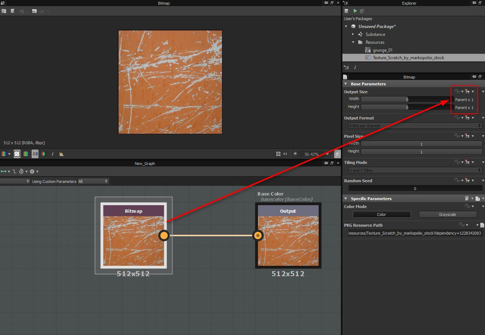

# 效能優化指引

## 物質圖

你的 [Substance 圖表](../../compositing-graphs/substance-compositing-graphs.md) 越複雜，渲染它們所需的運算能力就越多。 你應該試 <b>著在複雜度和渲染速度</b>之間取得平衡。\
如果你要在即時圖形應用中使用它們，例如遊戲，這點 *尤其* 重要。

一般來說，暴露可執行時修改的自訂參數的節點， <b>應盡量放在圖</b>的末端。

這是因為每個節點的輸出都會盡可能快取。 因此，可調整節點越往上，當這些暴露參數被修改時，需要處理的輸出就越多。 如果你的暴露節點靠近圖的末端，只需要重新計算它和輸出節點之間的少數節點。

例如，若在圖的開頭調整均勻顏色，後續所有節點都會重新計算。 如果你調整放在輸出前的 HSL 節點，只有該節點會被重新計算，大幅提升圖形的效能。

請仔細記錄以下指引：

### 一般與表演相關的設定

+++GPU 引擎比 CPU 引擎快很多
除非你有不支援（整合式）顯示卡，否則建議用 GPU Substance 引擎（用 Hotkey F9 換）。

+++

+++切換圖的父解析度較慢
它會重新計算圖形、快取和所有縮圖。 最好使用[<b>匯出對話框](../../compositing-graphs/exporting-bitmaps/exporting-bitmaps.md)的批次</b>標籤，這樣可以避免大量且不必要的重新計算（例如匯出到 8192 解析度時）。

+++

+++在極端情況下，可能需要增加記憶體快取空間
應用程式 [會限制影像快取可用的](../../interface/preferences-window/preferences-window.md) RAM，但你可以小心地覆蓋或增加這個限制。

+++

### 圖優化

+++請特別注意節點解析和繼承！
高數值會嚴重影響效能，因此請考慮材料可能的使用方式，以及是否能減少資料量。

我們建議你多了解 [Substance 圖](../../compositing-graphs/inheritance-compositing/inheritance-in-substance-compositing-graphs.md)中的節點解析（輸出大小）[&#128279;](../../compositing-graphs/output-size/output-size.md)與繼承。

+++

+++不需要顏色時就用灰階
彩色操作的時間是灰階操作的四倍。 也盡量減少彩色和灰階之間的字型轉換。

+++

+++當不需要 16 位元時，請使用 8 位元
Substance Engine 的 CPU 版本（SSE2） *實際上並不* 支援 16 位元色彩或 8 位元灰階。 GPU 引擎支援 8/16 位元的四種組合，以及灰階/彩色。 *目前，Unity 和 Unreal Engine 的外掛*&#x200B;中僅使用 CPU 引擎。

+++

+++盡可能最小化節點輸出大小
有時候，縮小某些節點不會影響最終結果，但會影響效能。 例如，使用與文件輸出大小相同的統一色彩節點是沒有意義的：統一色彩應設為絕對 [16px x 16px]，後續節點則設為相對於父色。 一般來說，這個技巧對低頻影像效果很好，例如Perlin雜訊。

+++

+++請勿使用小於16×16像素的影像
這會降低渲染效能。

+++

+++使用 Blend 節點時，若不必要，請關閉 Alpha 混合

+++

+++模糊與扭曲是對處理器需求最高的節點

+++

+++有些噪音產生器會受到繪製圖案數量的影響
例如， [方塊產生](../../compositing-graphs/nodes-reference-for-com/node-library/texture-generators/patterns/tile-generator/tile-generator.md) 器節點隨著你加入的圖案越多，處理速度會變慢。

+++

+++有些噪音會受到比例因子的影響
這個因素實際上會產生更多圖案。 受影響的節點包括雜訊、Cell 圖案等。如果你需要白噪音模式，不要使用比例值很高的雜訊，改用 [White Noise](../../compositing-graphs/nodes-reference-for-com/node-library/texture-generators/noises/white-noise/white-noise.md) 或 [White Noise Fast](../../compositing-graphs/nodes-reference-for-com/node-library/texture-generators/noises/white-noise-fast/white-noise-fast.md) 節點。

+++

+++相反地，也有一些非常快速的雜訊產生器
這些包括 [快速](../../compositing-graphs/nodes-reference-for-com/node-library/texture-generators/noises/white-noise-fast/white-noise-fast.md)白噪音、 [分形和基底](../../compositing-graphs/nodes-reference-for-com/node-library/texture-generators/noises/fractal-sum-base/fractal-sum-base.md)和 [各向異性雜訊](../../compositing-graphs/nodes-reference-for-com/node-library/texture-generators/noises/anisotropic-noise/anisotropic-noise.md)。

+++

+++在某些情況下，要注意大量的影像取樣功能
函式在 CPU 引擎上執行，但 [Pixel 處理器除外](../../compositing-graphs/nodes-reference-for-com/atomic-nodes/pixel-processor/pixel-processor.md)。 如果你在 Value Processors[&#128279;](../../compositing-graphs/nodes-reference-for-com/atomic-nodes/value-processor/value-processor.md) 或 [FXmaps](../../function-graphs/fxmaps/fxmaps.md) 中大量進行大量影像取樣（改變$pos座標），就會有大量 VRAM 與 CPU RAM 的切換，導致效能延遲。

+++

### 行動裝置使用的優化

+++不建議使用 Warps 和 FX-Maps
它們的性能消耗非常高。

+++

+++避免模糊節點
改用縮小的轉換。

+++

+++盡可能多用灰階工作
圖表末端切換到彩色模式。

+++

+++盡可能在輸出間共享節點

+++

### 嵌入式位圖的尺寸優化

[點陣](../../resources/bitmap-resource/bitmap-resource.md) [圖的輸出大小](../../compositing-graphs/output-size/output-size.md)預設設定為[「絕對」。](../../compositing-graphs/inheritance-compositing/inheritance-in-substance-compositing-graphs.md)這表示如果點陣圖透過節點鏈連接到輸出，最終輸出會強制與嵌入位圖大小相同。\
你插入點陣圖後的節點，其輸出大小會設定為[「相對於輸入」。](../../compositing-graphs/inheritance-compositing/inheritance-in-substance-compositing-graphs.md)這表示節點也會固有位圖大小，並將此大小沿節點鏈傳遞至輸出端。 要修正這個問題，你需要將位圖後面的節點設定為[「相對於父節點」。](../../compositing-graphs/inheritance-compositing/inheritance-in-substance-compositing-graphs.md)

如果圖設定為動態解析度，你可以將嵌入點陣圖的輸出大小改為相對於父圖。\
這樣一來，點陣大小會根據父圖改變，你就不會遇到圖處理比所需解析度更高的情況。

>[!WARNING]
>
> 將點陣節點設[&#128279;](../../compositing-graphs/nodes-reference-for-com/atomic-nodes/bitmap/bitmap.md)為「相對於父節點」並將[圖表發佈](../../compositing-graphs/publishing-asset-files/publishing-substance-3d-asset-files-sbsar.md)到 Substance 3D 資產（SBSAR），會將位圖儲存為 256x256 **的解析度**，而非原始大小。建議將位圖節點[輸出大小](../../compositing-graphs/output-size/output-size.md)的繼承方法[&#128279;](../../compositing-graphs/inheritance-compositing/inheritance-in-substance-compositing-graphs.md)保持為「絕對」，並在點陣節點後方使用[設定為「相對於父」的轉換二維](../../compositing-graphs/nodes-reference-for-com/atomic-nodes/transformation-2d/transformation-2d.md)節點。

<table>
<tr style="border: 0;">
<td style="border: 0;" valign="top">

此外，建議將點陣資源格式設為 Jpeg，以減少已發佈的 Substance 3D 資產（SBSAR）大小。

</td>
<td style="border: 0;" valign="top">

</td>
</tr>
</table>
