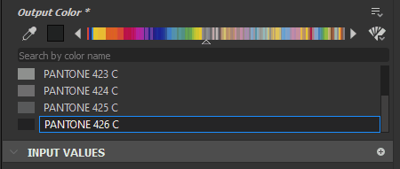

# 專色（潘通）

專色是一種選擇顏色的替代模式。 Substance 3D Designer 不使用標準的 RGB 或 HSV 色彩選擇器，而是讓你從色彩書中選擇顏色，匹配現有的色彩管理與重現系統。 這能確保 Designer 中使用的數位色彩與製造產品非常一致。

目前 Spot Colors 提供十七本潘通書籍。

## 色彩管理

由於專色是為了精確還原和匹配色彩，開始工作前必須先設定[Designer 的色彩管理](../../color-management/color-management.md) 。 專色在 Adobe Color Engine（ACE）</b>色彩管理中效果最佳<b>，而非 OCIO。它們在舊模式下可以正常使用，但如果你的螢幕沒有針對 sRGB 校正，你無法確定它們是否正確顯示。

簡言之，設定專色的色彩管理包含以下步驟：

* 透過建立或取得正確的ICC檔案來校正你的監控。
* 在 Designer&#39;s Preferences 啟用 Adobe Color Engine （ACE） 的色彩管理。
* 設定 2D 和 3D 視圖，使用你螢幕上的正確設定檔。
* 重新啟動以生效變更。
* 確認 Designer 與其他 Adobe 應用程式（如 Adobe Illustrator 或 Photoshop）之間的色彩匹配。 第一本潘通書《Solid Coated》中的「<b>Pantone Rhodamine Red C</b>」是個很好的測試案例，因為如果色彩管理不正確，顏色會大幅變化。

>[!WARNING]
>
> **縮圖顏色**
> 
> 節點縮圖 *預設*&#x200B;不具備色彩管理，因此只有在正確設定檔的 2D 檢視中信任色彩顯示。 縮圖色彩管理可以在專案色彩管理的偏好設定中啟用，但會帶來一些效能上的損失。

## 使用專色

### 從 RGB 切換到專色

即使你設定了色彩管理，顏色選擇器預設還是會用 RGB 或 HSV 色彩選擇器。 你需要手動切換成專色。 此設定會儲存在每個參數上，甚至在暴露參數時也會延續。

1. 點擊 RGB 色片旁邊的  <b>Color Picker 類型</b> 按鈕。
1. 不要 <b>用</b> RGB 顏色，從下拉選單中選擇任一 <b>色彩書</b> 。
1. 色彩選擇器的</b>圖示<b>會改變，介面也會切換為<b>專色</b>模式。

{width="512px"}

### 選擇與尋找專色

在色彩書中尋找並選擇專色有幾種方法。

* 你可以使用   <b>書頁兩側的左右箭頭</b> 來翻頁。 你也可以點擊並拖曳頁面顯示，在頁面間捲動。
* 你可以點擊當前頁面中的任何顏色來選擇。 通常會有更多顏色可用，需要往下滑動。
* 你可以用搜尋欄按名字或號碼搜尋顏色。 這個搜尋只匹配書中顏色的名字，沒有複雜的邏輯;搜尋「gray」只會找到名字裡有「gray」這個字的結果，你不會看到只有數字的灰色顏色。
* 若要獲得更大、更易使用的彩色書介面，請點擊吸管</b>圖示與<b>左箭頭</b>之間的<b>彩色預覽框。

{width="512px"}

### 挑選與轉換專色

專色可以用吸管</b>工具挑選。 <b>在專色模式下，取樣的 RGB 顏色會被轉換成目前所選書籍中最接近的專色。

Designer <b>的吸管</b> 工具可以在螢幕上任何地方使用，沒有限制，這表示你可以把 Designer 當作專色轉換工具使用，

切換書籍，甚至從專色書切回 RGB，都能將目前的顏色轉換成最接近的顏色。 這表示你可以在書中轉換顏色，再轉回 RGB。

>[!WARNING]
>
> 在書本間轉換專色是一個有損操作。 來回轉換通常不會得到你原本的顏色！

{width="512px"}
