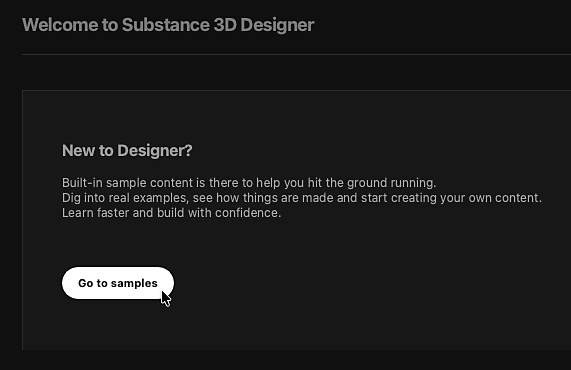

# 材料樣本

Designer 提供精選的範例圖表，涵蓋多種材料類型，供你學習與實驗。

這些樣本是作為圖形模板使用，也就是說，透過 <b>建立新的 Substance 圖</b>來存取。
新圖表是 <b>完整可編輯的範例</b> 副本，您可以自行編輯、拆解或擴充。
你可以從樣本中建立任意多的新圖表。

所有範例皆基於 **OpenPBR** 材質模型，這是業界新興標準，且支援日益增加。

建立新物質圖時，你會在 [新物質圖對話框](../../../compositing-graphs/creating-compositing-gra/creating-a-substance-compositing-graph.md)中找到樣本：

<table>
<tr style="border: 0;">
<td style="border: 0;" valign="top">

{zoomable="yes"}

打開 <b>分類</b> 組合框，選擇 <b>材料範例</b> 以列出可用的範本。

</td>
<td style="border: 0;" valign="top">

{zoomable="yes"}

你可以直接使用放置的「前往取樣</b>」按鈕，直接進入對話框<b>中的樣本列表在 <b>主畫面</b>。

</td>
</tr>
</table>

<table>
<tr style="border: 0;">
<td width="33.33%" style="border: 0;" valign="top">

在對話框中，將滑鼠移至範例項目的資訊圖示，即可獲得更多關於概念與技術的資訊在樣本中被探索。

</td>
<td width="100.00%" style="border: 0;" valign="top">

{zoomable="yes"}

</td>
</tr>
</table>

雙擊任意項目即可從該樣本中建立新的圖表。 您也可以選擇範例並點擊建立<b></b>按鈕。

雙擊任意項目即可從該樣本中建立新的圖表。 您也可以選擇範例並點擊建立<b></b>按鈕。一旦選取材料樣本並驗證圖表建立，對話結束而樣本的副本會以新圖的形式載入圖檢視中。

預設情況下，取樣的第一個輸出會載入 2D 視圖，紋理則套用到 3D 視圖。
所以你的工作區會自動設定好，你就可以開始使用了。 （這可依設計師 [偏好](../../../interface/preferences-window/preferences-window.md)調整）

>[!NOTE]
> 
> 這些材料範例使用 <code>OpenPBR v1.1</code> 材料模型及在 3D 視圖中檢視的意思是
> 3D 視圖中的材質會自動切換到 <code>OpenPBR 表面</code> 著色器以
> 請準確查看範例。

{zoomable="yes"}
