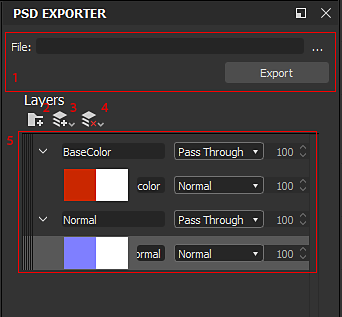

# 匯出 PSD 檔案

Substance 3D Designer 允許將材質匯出至 Adobe Photoshop 文件或 PSD 檔案。本頁說明用於將圖節點轉換為圖層的特殊介面。**這個過程並非自動完成：你有很大的控制權，但有限且通常無法精確匹配節點與層。** 此外，除非你明確設定 PSD 的輸出會和圖表相同，否則無法保證。 一般來說，你越想做到越準確、越準確，使用者需要付出的努力就越多。 一般來說，唯一能以非破壞性方式接近複製的，就是 [Blend Nodes](../../compositing-graphs/nodes-reference-for-com/atomic-nodes/blend/blend.md)。 調整圖層不支援，圖層樣式或其他除圖層混合模式外的其他功能也不支援。

[Substance 3D Designer 也能匯出成點陣圖檔案。](../../compositing-graphs/exporting-bitmaps/exporting-bitmaps.md)

## PSD 匯出對話框

PSD 匯出對話框只能透過一種方式開啟。 在[你想匯出成 PSD 的圖的圖中](../../interface/the-graph-view/the-graph-view.md)，點選<b>工具</b>按鈕並選擇 <b>PSD 匯出器</b>。介面會在圖視圖</b>中<b>顯示。

<table>
<tr style="border: 0;">
<td style="border: 0;" valign="top">

</td>
<td style="border: 0;" valign="top">

1. <b>檔案名稱與地點：</b> 請在此設定匯出資料夾和檔名。 按下匯出按鈕來執行匯出流程。
1. <b>新增群組：</b> 新增圖層群組
1. <b>新增圖層下拉選單：</b> 選擇兩種方法之一來新增圖層。 圖層也可以用 *滑鼠右鍵* 拖曳節點到堆疊中來新增。
1. <b>移除圖層下拉選單：</b> 移除選取或全部圖層。
1. <b>Layerstack：</b> 大部分設定工作都在這裡完成。 介面在 Photoshop 中反映有限的選項。 設定圖層名稱、混合模式和透明度在這裡。 若一層有兩個縮圖，第二個縮圖代表 Alpha 通道。

</td>
</tr>
</table>

## 工作流程

由於 Photoshop 不直接支援多輸出材質，有多種方式可以設定你的 PSD。 以下是最常見的方法概述。

* 為所有輸出設定多個資料夾。 一個資料夾放底色，一個放法線，一個放粗糙度，等等。
* 用滑鼠右鍵拖放輸出到相應的群組。 如果你想保持簡單，PSD 也可以只維持在這點。
* 想更擴充 PSD：往左往後移，將圖表中相關的中間步驟放入相應的群組。 無法在輸出/群組間共享圖層。

在極少數情況下，PSD 輸出較為重要，你可以建立圖表，只使用混合模式。 在這種情況下，應該可以重建一個更易編輯的圖表，作為分層文件。
