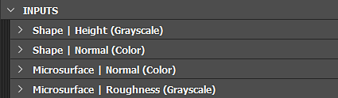

# 圖參數

本頁說明了Substance圖</b>的<b>標準參數。

圖中有幾個你可以修改的參數。 你可以點擊&#x200B;*圖表中的空白區域*，或在<b>檔案總覽</b>面板中選擇圖表&#x200B;*項目*&#x200B;來找到它們。參數會顯示在參數檢視中。

## 基礎參數

<table>
<tr style="border: 0;">
<td style="border: 0;" valign="top">

本節包含影響 *所有*&#x200B;節點的參數。

事實上，圖中每個將基底參數設為「相對於父 [」繼承方法](../../compositing-graphs/inheritance-compositing/inheritance-in-substance-compositing-graphs.md) 的節點，都會從 *圖的* 基底參數中取得其值。

反過來，圖的基礎參數值會依照圖被使用的情境而定。

</td>
<td style="border: 0;" valign="top">

{width="512px" zoomable="yes"}

</td>
</tr>
</table>

例如，當該圖被用作另一個圖的實例節點時，其基礎參數預設使用「相對於輸入」繼承方法。 這表示它們會從連接到主要輸入的節點取得數值。 （除非被 [覆蓋](#input-parameters)）

在大多數情況下，繼承在定義這些值以及這些值如何在圖中變化中扮演重要角色。 因此，強烈建議在使用這些參數前，先深入了解 [Substance 圖](../../compositing-graphs/inheritance-compositing/inheritance-in-substance-compositing-graphs.md) 中的繼承。

|                      |                                                                                                                                                                                                                                                                                                                                                                                                                                     |
|:---------------------|:------------------------------------------------------------------------------------------------------------------------------------------------------------------------------------------------------------------------------------------------------------------------------------------------------------------------------------------------------------------------------------------------------------------------------------|
| <b>輸出大小</b> | 這個參數讓你可以選擇 *圖中影像的基底解析度* 。  使用該 

 鎖定按鈕讓高度與寬度值相符，並在調整尺寸時保持影像方形。  *預設：（0,0） - 相對於父畫面*    [了解更多](../../compositing-graphs/output-size/output-size.md) |
| <b>輸出格式</b> | 允許從以下選項中選擇 *圖形中的基底位元深度* ：<ul data-preserve-html="true"><li data-preserve-html="true">8位元</li><li data-preserve-html="true">16位元</li><li data-preserve-html="true">HDR 低精度 16F（16 位元浮點）</li><li data-preserve-html="true">HDR 高精度 32F（32 位元浮點）</li></ul>*預設值：每個通道 8 位元-相對於父通道* |
| <b>像素尺寸</b> | 定義像素大小。 我們建議將寬度和高度值都&#x200B;**設為** 1 **。*預設值：（1,1） - 相對於父節點******* |
| <b>平鋪模式</b> | 從以下選項定義圖中的基礎 *鋪磚模式* ：<ul data-preserve-html="true"> <li data-preserve-html="true">沒有鋪磚</li> <li data-preserve-html="true">水平鋪磚</li> <li data-preserve-html="true">垂直鋪磚</li> <li data-preserve-html="true">H+V 鋪磚（即水平與垂直）</li> </ul>*預設：H 與 V 平鋪 - 相對於父* |
| <b>隨機種子</b> | 定義了圖的基礎 *隨機種子* 。  使用該 

 按鈕用來為隨機種子指派新的隨機值。  *預設值：0 - 相對於父種* |

<table>
<tr style="border: 0;">
<td width="100.00%" style="border: 0;" valign="top">

## 屬性

<b>屬性</b>區塊包含&#x200B;*圖的元資料*，提供識別&#x200B;**、*分類*&#x200B;及&#x200B;*依作者設計套用*&#x200B;圖的資訊。

</td>
<td width="33.33%" style="border: 0;" valign="top">

{zoomable="yes"}

</td>
</tr>
</table>

+++屬性列表

|                      |                                                                                                                                                                                                                                                                                                                                                                                                                                                                                                                                                                                                                                                                                                                                                                                                                                                                                                                                                                                                                                                                                                                                                                                                                                                                                                                                                                                                                                                                                             |
|:---------------------|:--------------------------------------------------------------------------------------------------------------------------------------------------------------------------------------------------------------------------------------------------------------------------------------------------------------------------------------------------------------------------------------------------------------------------------------------------------------------------------------------------------------------------------------------------------------------------------------------------------------------------------------------------------------------------------------------------------------------------------------------------------------------------------------------------------------------------------------------------------------------------------------------------------------------------------------------------------------------------------------------------------------------------------------------------------------------------------------------------------------------------------------------------------------------------------------------------------------------------------------------------------------------------------------------------------------------------------------------------------------------------------------------------------------------------------------------------------------------------------------------|
| **識別碼** | 這是圖的名稱，且必須是 *唯一的* ——同一封包中不能有兩個或以上具有相同 <b>識別碼</b> 的圖。 它在 Explorer 面板中用作圖形&#x200B;*的名稱*[。  *注意：*&#x200B;識別碼&#x200B;*不能是空字串*。](../../interface/the-explorer-window/the-explorer-window.md)空字串會自動被 `_` 或 `Substance_graph`取代。 此值只能使用&#x200B;**&#x200B;以下字元： *`A-Z, 1-9, @$%[{]}_-`。* 未授權字元會自動被替換為 `_`。  *預設：新\_Graph，或由使用者在圖建立時設定* |
| **唱片公司** | <b></b>標籤取代<b>識別碼</b>來顯示&#x200B;*圖的名稱*，以便在面對&#x200B;*使用者的情境中更易*&#x200B;閱讀——例如[函式庫](../../interface/the-library/the-library.md)條目或[實例節點](../creating-compositing-gra/graph-instances-sub-gra/graph-instances-sub-graphs.md)標籤。標籤可以&#x200B;*不是唯一的*，且可能包含特殊字元。  *提示：*&#x200B;如果你重新命名圖表——例如在 Explorer](../../interface/the-explorer-window/the-explorer-window.md) 裡[——你也可以考慮更改它的標籤！  *預設：空* |
| **類型** | <b>類型</b>用來定義實體圖](../../compositing-graphs/substance-compositing-graphs.md)的[預期目的。它主要用於 [「發送」互通功能](../../interface/the-explorer-window/send-to-interoperability/send-to-interoperability.md)。 |
| **材質模型** | 設定圖的材質模型，確保在 3D 視圖中使用適當的著色器，前提是有與模型&#x200B;*相符的著色器*。 例如：在 3D 檢視中以 `OpenPBR v1.1` 材質模式觀看圖表時，會選擇目標材質的 `OpenPBR Surface` 著色器。  若未找到匹配的著色器，或圖形模型設定為 `Undefined`，則 3D 視圖中目標材質所使用的著色器保持 *不變*。 |
| **物理尺寸** | 此值指定紋理在 *物理世界中*&#x200B;的尺寸，單位為X（長度）、Y（寬）和Z（高度）。 因此，它本質上與圖中產生的物質相關。 例如，實體尺寸可以用來在 2D 檢視</b>與 3D 檢視</b>中以正確的比例<b>顯示紋理。  *提示：* Substance 圖形的物理大小可在 Substance 函式圖中，透過 $physicalsize [內建變數](../../function-graphs/variables/system-variables/system-variables.md)，以 Float3 值的形式取得。  *注意：***目前 *Z**值未被&#x200B;**3D 檢視**器考慮*<b>。**因此，材料的高度比例**&#x200B;值應透過&#x200B;**設定為**&#x200B;高度尺&#x200B;**度使用的輸出**&#x200B;節點，或直接在材料屬性&#x200B;**中**&#x200B;設定。  *預設值：（0,0,0）* |
| **聖像** | 此區域允許您定義一個&#x200B;*圖示*，圖書館將用</b><b>來顯示此圖表的條目，無論是作為 <b>SBS</b> 還是 <b>SBSAR。</b>這個圖示也用於其他情境，例如 [Substance 3D Painter](https://www.adobe.com/products/substance3d-painter.html)的 <b>書架</b>。 該地區提供以下選項：<ul data-preserve-html="true"> <li data-preserve-html="true"><b>瀏覽</b>：讓你瀏覽現有映像檔的系統檔案 <i>，該檔案</i> 應該用作圖示</li> <li data-preserve-html="true"><b>生成</b>：此工具利用<i>內建的 PBR 渲染</b>節點預設</i><b>來產生圖示</li> <li data-preserve-html="true"><b>貼上</b>：讓你把目前在剪貼簿</i>裡<i>的圖片資料貼上成圖示</li> <li data-preserve-html="true"><b>移除</b>：此選項 <i>會移除</i> 現有圖示，並留下圖示欄位 <i>空置</i></li> </ul>*注意：*&#x200B;生成選項使用&#x200B;**實體尺寸**&#x200B;來決定 **PBR 渲染****的高度比例**，以影響位移效果。****&#x200B;如果&#x200B;**圖中存在設定為**&#x200B;物理大小&#x200B;**使用的輸出**&#x200B;節點，則會使用該輸出。若不存在此類輸出，則改用&#x200B;**&#x200B;圖的&#x200B;**屬性**&#x200B;值。若屬性值為 （0,0,0），則 *使用預設值* 0.1。  *注意：*  若 *未定義圖示* ， *則使用圖的第一個影像輸出* 。  *預設：空* |
| **包裝** | 此&#x200B;*圖所屬套件&#x200B;**的絕對*檔名**。資料夾&#x200B;****&#x200B;按鈕可以讓你在這個位置開啟新的系統&#x200B;*檔案瀏覽器視窗*。*預設：套件檔名 / 如果套件從未被儲存，則為空* |
| **在SBSAR中曝光** | 這控制圖及其輸出是否能在圖的 Package **發佈的 SBSAR** 檔案中查看&#x200B;*。若套件中某些圖僅作為主圖的子圖*&#x200B;使用&#x200B;*，*&#x200B;且不應該出現&#x200B;*在&#x200B;**SBSAR**中，這很有用。*&#x200B;預設：是&#x200B;****** |
| **圖書館節目** | 控制若套件存放於庫監控&#x200B;******&#x200B;位置，該圖是否應該在&#x200B;**函式庫**&#x200B;中可見&#x200B;**。*預設：在專案設定的函式庫標籤中設定* |
| **描述** | 這是 *該圖的描述文字* 。它可在函式庫&#x200B;**中圖形條目**&#x200B;工具提示&#x200B;*、該&#x200B;**圖的任何實例**節點，以及已有&#x200B;**實體整合**的軟體中看到*。*預設：空* |
| **分類** | 你可以用這個欄位在函式庫&#x200B;**中為該圖表項目**&#x200B;設定&#x200B;*分類*。*預設：空* |
| **作者** | 你可以用這個欄位輸入 *作者姓名* 。*預設值：空* |
| **作者網址** | 此欄位允許你輸入 *網址* ——例如作者的網站。*預設：空* |
| **標籤** | 你可以使用此欄位新增自己的 *標籤*，以提升 *圖表的可* 搜尋性與 *可發現* 性。*預設值：空* |
| **團體** | 啟用節點選單中項目的分組。 像圖形或位圖這類共享共同「群組」值的資源，會被歸類在以該群組命名的區塊中。 *預設：空* |
| **使用者資料** | 你可以利用這個欄位新增自己的額外資料。 這對於第三方軟體的自訂整合非常有用。 Substance 3D Painter 與 Sampler 利用這些使用者資料來設定特定行為。*預設值：空* |
| **範本資料** | 當 Substance 圖作為模板時，這個屬性會設定 [模板的類別和副標題](../../compositing-graphs/creating-compositing-gra/creating-a-substance-compositing-graph.md)。 它們的分離方式如下： &lt;category>&lt;subtitle>  *;預設：空*     &lt;/subtitle>&lt;/category> |

+++

## 輸入參數

<table>
<tr style="border: 0;">
<td style="border: 0;" valign="top">

所有與圖表相關的參數，包括 [公開的參數](../../compositing-graphs/manage-parameters/exposing-a-parameter/exposing-a-parameter.md)，皆在此 [管理](../../compositing-graphs/manage-parameters/manage-parameters.md)、編輯及預覽。

[也可以為部分或全部參數建立參數預設](../../compositing-graphs/manage-parameters/parameter-presets/parameter-presets.md) 。

</td>
<td style="border: 0;" valign="top">

{zoomable="yes"}

</td>
</tr>
</table>

+++覆寫基底參數
當將圖用於另一個圖作為 [實例節點](../creating-compositing-gra/graph-instances-sub-gra/graph-instances-sub-graphs.md)時，你可以控制該新實例節點上任意基底參數的預設值。

打開「輸入參數」區頂的漢堡選單，然後到「覆蓋基礎參數」子選單，選擇一個你想設定任意預設值的基礎參數。

所選參數的編輯器會出現在圖輸入參數列表的最上方。 接著你可以根據需要調整他們的價值和 [繼承方式](../../compositing-graphs/inheritance-compositing/inheritance-in-substance-compositing-graphs.md) 。

+++

>[!IMPORTANT]
>
> <b></b>使用[上下文編輯](../../interface/preferences-window/preferences-window.md)時，預覽和<b>預設</b>標籤會被停用。

## 輸入

<table>
<tr style="border: 0;">
<td style="border: 0;" valign="top">

在此部分，會列出圖中 [所有的輸入](../../compositing-graphs/nodes-reference-for-com/atomic-nodes/input-color/input-color.md) 節點。

你可以用拖放方式重新排序每個物品最左邊的把手。

</td>
<td style="border: 0;" valign="top">

{zoomable="yes"}

</td>
</tr>
</table>

## 輸出

<table>
<tr style="border: 0;">
<td style="border: 0;" valign="top">

在此部分，圖中所有 [的輸出](../../compositing-graphs/nodes-reference-for-com/atomic-nodes/output/output.md) 節點。

你可以用拖放方式重新排序每個物品最左邊的把手。

</td>
<td style="border: 0;" valign="top">

{zoomable="yes"}

</td>
</tr>
</table>
