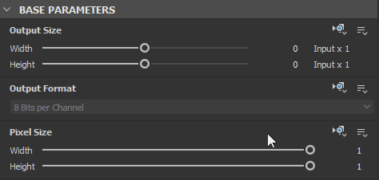
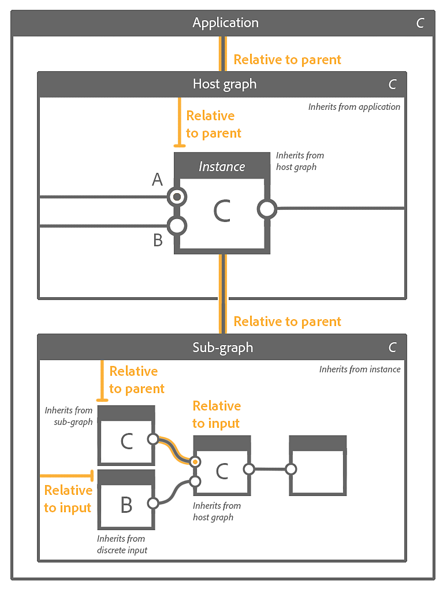

# 實質圖中的繼承

本頁說明繼承如何在 Substance 3D Designer](https://www.adobe.com/products/substance3d-designer.html) 中[應用[於 Substance 圖](../../compositing-graphs/substance-compositing-graphs.md)，以及繼承對圖的輸出影響。

{width="1400px"}

## 概觀

Substance 圖中的所有節點都可以 *繼承* 來源的某些參數值。 繼承意指改變來源值會 *帶動所有繼承節點的變更* 。 這是 Substance 3D Designer 在生成參數化資產方面強大的基本概念之一。

>[!NOTE]
>
> 本文件的範例物質圖表](../../compositing-graphs/sample-compositing-graphs/sample-substance-compositing-graphs.md)區段提供了[示範繼承的註解專案檔案。

### 繼承方法

<table>
<tr style="border: 0;">
<td style="border: 0;" valign="top">

{width="128px"}

<b>絕對</b>

無繼承，參數的值是任意且局部地&#x200B;*定義*&#x200B;的

</td>
<td style="border: 0;" valign="top">

{width="128px"}

<b>相對於輸入</b>

該值是從連接到 *節點主要輸入* 的資料繼承而來

</td>
<td style="border: 0;" valign="top">

{width="128px"}

<b>相對於母本</b>

該值是從 *節點或圖的父* 節點繼承而來

</td>
</tr>
</table>

繼承方法用於節點的 [基礎參數，該參數](../../compositing-graphs/graph-parameters/graph-parameters.md)是所有 *節點共同擁有的參數集合，控制其行為的基本面向* 。 這些參數包括：

* **輸出大小**
* **輸出格式** （即位元深度）
* **像素尺寸**
* **像素比率**
* **平鋪模式**
* **隨機種子**

這應該能讓你了解一個&#x200B;*節點的變化*&#x200B;如何影響下游&#x200B;*所有節點的*&#x200B;解析度、精度和平鋪行為。

>[!WARNING]
>
> 理解本頁討論概念的重要提醒： *實例節點* 是 [代表另一圖](../../compositing-graphs/creating-compositing-gra/graph-instances-sub-gra/graph-instances-sub-graphs.md)中圖的節點，具有 *自身離散參數值*，因此稱為 *實例*。\
> 例如，同一圖中的兩個 [Perlin 雜訊](../../compositing-graphs/nodes-reference-for-com/node-library/texture-generators/noises/perlin-noise/perlin-noise.md)節點，都是同一&#x200B;*源圖（`perlin_noise`在 `noise_perlin_noise.sbs`中）的表示*，且各自&#x200B;*擁有自己的參數值集合*。

>[!NOTE]
>
> **輸出大小：**&#x200B;使用鎖定鍵讓高度值&#x200B;*與寬度值相符*\
> **隨機種子：** 使用  按鈕為隨機種子指派新的隨機值。

## 變革

### 繼承方法的變更

在屬性面板中，節點屬性的基礎參數](../../compositing-graphs/graph-parameters/graph-parameters.md)區塊中列出[的所有參數，都有一個（圖示）<b>「設定繼承方法</b>」下拉按鈕，位於標籤對面。\
這個按鈕讓你選擇應該用來執行參數的繼承方法。

{width="512px"}

在大多數情況下， *節點*&#x200B;的基底參數會設定為 *相對於輸入*，以利用串接節點的程序行為，而 *圖*&#x200B;的基底參數則設為 *相對於父*&#x200B;節點，讓全域參數能適應圖所處的情境。

### 調整繼承值

部分基礎參數，如[輸出大小](../../compositing-graphs/output-size/output-size.md)、像素大小或隨機種子，可以相對於繼承值&#x200B;*進行調整*。

例如，當輸出大小參數使用&#x200B;*相對於繼*&#x200B;承方法時，值或`(1, -1)`表示 X 的解析度&#x200B;*高於繼承值的二次方，解析度比*&#x200B;繼承值低&#x200B;*一的二*&#x200B;次方，例如

* 繼承價值： `(9, 9)` 為 `2^9, 2^9 = 512, 512`
* 相對價值： `(1, -1)` 即 `2^(9+1), 2^(9-1) = 256, 1024`

>[!NOTE]
>
> [輸出大小](../../compositing-graphs/output-size/output-size.md)頁面深入探討這個關鍵的基底參數，建議閱讀以了解節點最終解析度的計算方式。

若函數被應用於基參數，函數的結果也會使用該參數的繼承法來解釋。\
以輸出大小為例，若函數目標是將繼承的解析度在 X 和 Y 上加倍，應該會輸出 `(2, 2)` 整數 2 值。

## 節點與圖的父體關係

使用「相對於父繼承法」時，你應該了解在特定情境下，父繼承到底是什麼。

節點的父節點是 *它所存在的圖* 。

圖的父圖是 *它所處的上下文* ：

* 如果該圖是實例化成另一個宿主圖的&#x200B;**&#x200B;子圖，則該子圖的父圖就是&#x200B;*實例節點*。該實例節點的父節點是 *主機圖*。
* 如果該圖是根圖，則父圖即為 *應用程式本身* 及其對特定參數設定的值。 例如，圖形會繼承自<b>圖檢視工具列](../../interface/the-graph-view/the-graph-view.md)中的[父大小</b>參數設定。

>[!WARNING]
>
> 當將套件發佈到 Substance 3D 資產檔案（SBSAR）時，家長身份會 *依現狀* 套用。 這表示將任何參數設為 *絕對* 繼承方法，該參數會 *鎖定* 在已發佈資產中的當前值。\
> 雖然這對[點陣](../../compositing-graphs/nodes-reference-for-com/atomic-nodes/bitmap/bitmap.md)圖節點或[優化](../../best-practices/performance-optimization/performance-optimization-guidelines.md)目的（例如）很理想，但我們&#x200B;*強烈*&#x200B;建議在處理 Substance 圖時，除非有&#x200B;*明確且刻意的用途*，否則應使用&#x200B;*相對*&#x200B;繼承方法。

### 情境編輯

在圖實例節點使用 [上下文編輯](../../compositing-graphs/creating-compositing-gra/graph-instances-sub-gra/graph-instances-sub-graphs.md) 時，圖的父節點即為 *實例節點*。 此時，<b>圖檢視工具列](../../interface/the-graph-view/the-graph-view.md)中的[父大小</b>設定會被&#x200B;*停用*，因為圖會繼承實例節點的基礎參數。

此特性是&#x200B;*上下文編輯的重點*，應&#x200B;**&#x200B;在設定繼承方法及評估任何節點基參數的當前值時納入考量。

## 多重輸入的繼承

當圖有多個輸入時，每個輸入可能繼承其離散輸入資料或圖本身，視其繼承方法而定：

<table>
<tr style="border: 0;">
<td style="border: 0;" valign="top">

{width="128px"}

<b>相對於輸入</b>

輸入會繼承其離散輸入資料，不論圖的基底參數為何。 這對於控制每次輸入的資料非常有幫助。

</td>
<td style="border: 0;" valign="top">

{width="128px"}

<b>相對於母本</b>

輸入是從圖中繼承而來，而它接收到的資料也會相應地調整。

</td>
<td style="border: 0;" valign="top">

</td>
</tr>
</table>

### 主要輸入

<table>
<tr style="border: 0;">
<td style="border: 0;" valign="top">

<table>
<tr style="border: 0;">
<td style="border: 0;" valign="top">

{width="48px"}

</td>
<td style="border: 0;" valign="top">

{width="48px"}

</td>
<td style="border: 0;" valign="top">

{width="48px"}

</td>
</tr>
</table>

其中一個輸入可設定為圖形的&#x200B;**主輸入，**&#x200B;方法是點擊&#x200B;**該[輸入](../../compositing-graphs/nodes-reference-for-com/atomic-nodes/input/input.md)節點的右鍵**，並在情境選單中選擇&#x200B;**「設定為主要輸入**」選項。

</td>
<td style="border: 0;" valign="top">

</td>
</tr>
</table>

當該圖作為實例節點實例化到另一個圖時，該實例節點所有設定為 *相對於輸入* 的基底參數都會繼承該 *輸入*&#x200B;所連接的資料。 實例節點的主要輸入可由連接器上的小黑點識別。

其他設定為&#x200B;*相對於父*&#x200B;節點的輸入，會繼承相同的基底參數值，因為它們繼&#x200B;**&#x200B;承自圖，圖繼承自&#x200B;*實例節點\*，而實例節點\**繼承自主輸入。

\*：如果圖使用*&#x200B;了相對於父* 繼承法，這是正確的。

## 範例

以下是涵蓋不同繼承情況及以下角色繼承方法相互作用的範例，從上到下：

1. 應用
1. 宿主圖
1. 主機圖中的實例節點
1. 子圖——即實例節點所參考的圖
1. 子圖中的節點

*演員的繼承方法*&#x200B;集合會以橘色顯示在其上方。*遺產流向源頭的過程*&#x200B;以橘色線條顯示。

字母代表 *獨立的基礎參數集合* ，應該能幫助追蹤哪個演員繼承了哪些資料。

<table>
<tr style="border: 0;">
<td style="border: 0;" valign="top">

**範例A**

{zoomable="yes"}

</td>
<td style="border: 0;" valign="top">

**範例B**

{zoomable="yes"}

</td>
</tr>
</table>

<table>
<tr style="border: 0;">
<td style="border: 0;" valign="top">

**範例C**

{zoomable="yes"}

</td>
<td style="border: 0;" valign="top">

**範例D**

{zoomable="yes"}

</td>
</tr>
</table>

## 處理繼承問題

當你建立圖並增加複雜度時，可能會遇到因繼承而產生的意想不到結果。 如果節點的輸出解析度或精度（例如位元深度）不正確，你應該往繼承鏈&#x200B;*上查*，找出這些值的來源。

一個良好的起點是檢查節點下方顯示的資料：這些資料包括節點第一個輸出&#x200B;*輸出的解析度、色彩格式與精度*。雖然理解解析度很簡單，但第二項數據值得詳細說明：

* *字母前綴*&#x200B;指的是影像的色彩格式：
  * <b>L</b>：亮度（即灰階）
  * <b>C</b>：顏色
* 這些 *數字* 代表影像的位元深度，從最低到最高精度：
  * <b>8</b>：8位元整數（0-1 中 256 步）
  * <b>16</b>：16位元整數（0-1 中 65,536 步）
  * <b>16F</b>：16位元浮點數（低精度值超過0-1，含負數）
  * <b>32F</b>：32位元浮點（高精度值超過0-1，含負數）

如果節點有多個輸出，你可以用兩種簡單方法檢查它們的解析度和精度：

* 雙擊<b>輸出接頭&#x200B;*的左鍵*</b>即可在2D視圖](../../interface/2d-view/2d-view.md)中顯示影像[，並檢查2D視圖視窗左下角&#x200B;*顯示*&#x200B;的影像資訊
* 建立一個 [Levels](../../compositing-graphs/nodes-reference-for-com/atomic-nodes/levels/levels.md) 或 [Transformation 2D](../../compositing-graphs/nodes-reference-for-com/atomic-nodes/transformation-2d/transformation-2d.md) 節點，並將其輸入連接到你想檢查的輸出。 節點預設會 *繼承輸出* ，然後你可以檢查節點下方的值。

現在你可以往圖中節點鏈往上走，嘗試找出 *第一個出現意外值的節點* 。 檢查其基礎參數的繼承方法。

如果沒問題且該節點是實例節點，你需要深入打開該實例節點所參考的圖。 從圖的輸出節點開始重複這個過程，往上游推進。

### 一個常見的例子

特別是， *主輸入* 概念容易 *被忽略* ，可能導致繼承問題。

[Blend](../../compositing-graphs/nodes-reference-for-com/atomic-nodes/blend/blend.md) 節點非常容易受到這種影響，因為它被頻繁使用。它的 <b>背景</b> 輸入就是主要輸入。

{width="512px"}

你需要注意混合兩個輸入的順序：你想保留解析度和精度的輸入，如果需要的混合模式允許的話，應該連接到背景輸入。 如果沒有，那你可能需要調整 Blend 節點的基礎參數和繼承方法來補償。
