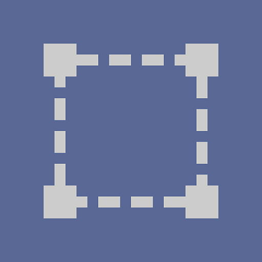

# 原子節點

原子節點是 Substance 圖的基本建構單元。

庫中[&#128279;](../../../interface/the-library/the-library.md)其他所有 Substance 圖節點都是由原子節點組成，如果你把它們拆解到最低層級。

<table>
<tr style="border: 0;">
<td style="border: 0;" valign="top">

[位圖](../../../compositing-graphs/nodes-reference-for-com/atomic-nodes/bitmap/bitmap.md)

</td>
<td style="border: 0;" valign="top">

[混合](../../../compositing-graphs/nodes-reference-for-com/atomic-nodes/blend/blend.md)

</td>
<td style="border: 0;" valign="top">

[模糊](../../../compositing-graphs/nodes-reference-for-com/atomic-nodes/blur/blur.md)

</td>
<td style="border: 0;" valign="top">

[曲線](../../../compositing-graphs/nodes-reference-for-com/atomic-nodes/curve/curve.md)

</td>
<td style="border: 0;" valign="top">

[方向模糊](../../../compositing-graphs/nodes-reference-for-com/atomic-nodes/directional-blur/directional-blur.md) [&#128279;](../../../compositing-graphs/nodes-reference-for-com/atomic-nodes/directional-blur/directional-blur.md)

</td>
</tr>
</table>

<table>
<tr style="border: 0;">
<td style="border: 0;" valign="top">

[方向曲速](../../../compositing-graphs/nodes-reference-for-com/atomic-nodes/directional-warp/directional-warp.md)

</td>
<td style="border: 0;" valign="top">

[壓印](../../../compositing-graphs/nodes-reference-for-com/atomic-nodes/emboss/emboss.md)

</td>
<td style="border: 0;" valign="top">

[距離](../../../compositing-graphs/nodes-reference-for-com/atomic-nodes/distance/distance.md)

</td>
<td style="border: 0;" valign="top">

[漸變（動態）](../../../compositing-graphs/nodes-reference-for-com/atomic-nodes/gradient-dynamic/gradient-dynamic.md)

</td>
<td style="border: 0;" valign="top">

[梯度圖](../../../compositing-graphs/nodes-reference-for-com/atomic-nodes/gradient-map/gradient-map.md)

</td>
</tr>
</table>

<table>
<tr style="border: 0;">
<td style="border: 0;" valign="top">

[效果圖](../../../compositing-graphs/nodes-reference-for-com/atomic-nodes/fx-map/fx-map.md)

</td>
<td style="border: 0;" valign="top">

[灰階轉換](../../../compositing-graphs/nodes-reference-for-com/atomic-nodes/grayscale-conversion/grayscale-conversion.md)

</td>
<td style="border: 0;" valign="top">

[HSL](../../../compositing-graphs/nodes-reference-for-com/atomic-nodes/hsl/hsl.md)

</td>
<td style="border: 0;" valign="top">

[輸入顏色](../../../compositing-graphs/nodes-reference-for-com/atomic-nodes/input/input.md)

</td>
<td style="border: 0;" valign="top">

[輸入灰階](../../../compositing-graphs/nodes-reference-for-com/atomic-nodes/input/input.md) [&#128279;](../../../compositing-graphs/nodes-reference-for-com/atomic-nodes/input/input.md)

</td>
</tr>
</table>

<table>
<tr style="border: 0;">
<td style="border: 0;" valign="top">

[輸入值](../../../compositing-graphs/nodes-reference-for-com/atomic-nodes/input/input.md)

</td>
<td style="border: 0;" valign="top">

[關卡](../../../compositing-graphs/nodes-reference-for-com/atomic-nodes/levels/levels.md)

</td>
<td style="border: 0;" valign="top">

[正常](../../../compositing-graphs/nodes-reference-for-com/atomic-nodes/normal/normal.md)

</td>
<td style="border: 0;" valign="top">

[輸出](../../../compositing-graphs/nodes-reference-for-com/atomic-nodes/output/output.md)

</td>
<td style="border: 0;" valign="top">

[像素處理器](../../../compositing-graphs/nodes-reference-for-com/atomic-nodes/pixel-processor/pixel-processor.md)

</td>
</tr>
</table>

<table>
<tr style="border: 0;">
<td style="border: 0;" valign="top">

[磨利](../../../compositing-graphs/nodes-reference-for-com/atomic-nodes/sharpen/sharpen.md)

</td>
<td style="border: 0;" valign="top">

[頻道切換](../../../compositing-graphs/nodes-reference-for-com/atomic-nodes/channel-shuffle/channel-shuffle.md)

</td>
<td style="border: 0;" valign="top">

[SVG](../../../compositing-graphs/nodes-reference-for-com/atomic-nodes/svg/svg.md)

</td>
<td style="border: 0;" valign="top">

[文字](../../../compositing-graphs/nodes-reference-for-com/atomic-nodes/text/text.md)

</td>
<td style="border: 0;" valign="top">

[轉換二維](../../../compositing-graphs/nodes-reference-for-com/atomic-nodes/transformation-2d/transformation-2d.md)

</td>
</tr>
</table>

<table>
<tr style="border: 0;">
<td style="border: 0;" valign="top">

[制服顏色](../../../compositing-graphs/nodes-reference-for-com/atomic-nodes/uniform-color/uniform-color.md)

</td>
<td style="border: 0;" valign="top">

[價值處理器](../../../compositing-graphs/nodes-reference-for-com/atomic-nodes/value-processor/value-processor.md)

</td>
<td style="border: 0;" valign="top">

[曲速](../../../compositing-graphs/nodes-reference-for-com/atomic-nodes/warp/warp.md)

</td>
<td style="border: 0;" valign="top">

</td>
<td style="border: 0;" valign="top">

</td>
</tr>
</table>

## 放置原子節點

在 Substance 圖中建立原子節點有幾種方法：

### <b>節點調色盤</b>

節點調色盤位於 [圖視工具列](../../../interface/the-graph-view/the-graph-view.md) 中，方便存取原子節點：只要點擊節點或在圖中拖曳即可。

調色盤可透過這個按鈕切換： 

### <b>節點選單</b>

在圖視圖中按 *空白鍵* 或 *Tab* 鍵，會顯示可搜尋的節點列表，預設列出所有原子節點。

搜尋欄位讓你瀏覽 [函式庫](../../../compositing-graphs/nodes-reference-for-com/node-library/node-library.md)中的所有其他節點，包括 [你自己的內容](../../../interface/the-library/managing-custom-content/managing-custom-content-and-filters.md) （如果新增的話）。

### <b>圖形情境選單</b>

在圖表中右鍵點擊，然後進入「新增節點」子選單，可以進入原子節點的清單。

### <b>圖書館</b>

函式庫[&#128279;](../../../interface/the-library/the-library.md)的「原子節點」類別承載所有原子節點。它們可以拖放到物質圖中。

### <b>鍵盤快捷鍵</b>

你可以自訂 [鍵盤快捷鍵](../../../interface/preferences-window/preferences-window.md) ，立即建立圖中的任何節點，包括原子節點。
