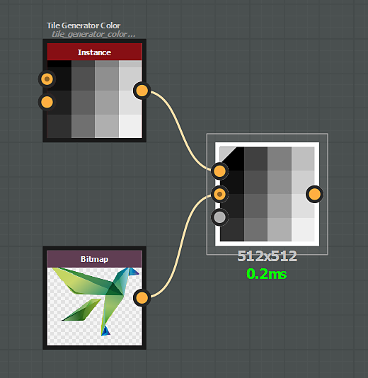

# 混合模式

[混合](../../../../../compositing-graphs/nodes-reference-for-com/atomic-nodes/blend/blend.md)節點提供以下混合模式：

## 複製

*複製*&#x200B;混合模式會把前景放在背景上。

{zoomable="yes"}

對於彩色影像，透明度預設會考慮 alpha 通道。

這可以透過使用「Alpha blending」參數來改變。

{zoomable="yes"}

## 加法（線性閃避）

*新增*&#x200B;混合模式會將前景輸入值加入背景中對應的每個像素。

{zoomable="yes"}

## 減法

*Substract* 混合模式會從背景中每個對應像素中扣除前景輸入值。

若減法結果小於0，則該值上限為0，結果為純黑色。

{zoomable="yes"}

## 乘法

*乘法*&#x200B;混合模式會將背景輸入值乘以前景中對應的每個像素。

由於每個像素的值介於 0 與 1 之間，結果總是相等或更低（較暗）。

{zoomable="yes"}

## 新增字幕

*新增字幕*&#x200B;混合模式的運作方式如下：

* 前景像素值大於 0.5 的像素會加入各自的背景像素。
* 前景像素值低於 0.5 的像素會從其對應的背景像素中扣除。

{zoomable="yes"}

## 麥克斯（Lighten）

*最大*&#x200B;混合模式會選擇背景與前景之間的較高值。

{zoomable="yes"}

## 敏（暗黑）

*最小*&#x200B;混合模式會選擇背景與前景之間的較低值。

{zoomable="yes"}

## 切換

*Switch* 的混合模式與複製模式相似，但有一個&#x200B;*關鍵*&#x200B;差異：

* 「不透明度」設為 0：連接到「前景」輸入 *的節點串流不會被計算*。
* 「不透明度」設為 1：連接到「背景」輸入 *的節點串流不會被計算*。

因此，此模式可用來提升圖表的效能。

[Switch](../../../../../compositing-graphs/nodes-reference-for-com/node-library/filters/blending/switch/switch.md) 和 [Switch 灰階](../../../../../compositing-graphs/nodes-reference-for-com/node-library/filters/blending/switch/switch.md)節點會設定成在這些特定配置中使用混合節點。

{zoomable="yes"}

## 分界

*除法*&#x200B;混合模式會將背景輸入像素的值除以前景中對應的每個像素。

{zoomable="yes"}

## 疊加層

*疊加*&#x200B;混合模式結合了乘法與螢幕混合模式：

* 
  * 若下層像素值低於 0.5，則 *會套用乘法* 混合
  * 若下層像素值高於 0.5，則 *會套用 Screen* 類型的混合

{zoomable="yes"}

## 螢幕

在螢幕混合模式下，兩個輸入的像素值會被反轉、乘以，然後再反轉。

結果與乘法相反，且相較於原始效果總是相等或更高（更亮）。

{zoomable="yes"}

## 柔和的光線

柔光混合模式會根據前景色的亮度，產生細微的亮或暗效果。

亮度超過 50% 的混合色會讓背景像素變亮，而亮度低於 50% 的顏色會讓背景像素變暗。

{zoomable="yes"}
