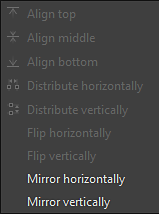

# 曲線

<table>
<tr style="border: 0;">
<td width="33.33%" style="border: 0;" valign="top">

{width="200px"}

</td>
<td width="100.00%" style="border: 0;" valign="top">

用自訂曲線重新映射影像中的數值。

該節點提供影像色調重映射介面，類似其他 2D 影像編輯應用程式。 使用者可以放置點並調整貝塞爾曲線，以重新映射輸入，輸入可為灰階或彩色。它在與漸層過渡搭配使用時特別有用，可以將它們重新映射到特定的高度剖面，因為它能非常精確地建模斜面剖面等。

</td>
</tr>
</table>

與大多數其他節點不同，Curve 節點沒有典型的標準介面，包含滑桿和參數，而是呈現完整的曲線編輯器。 請參閱下方可擴充的使用說明。

[然而，這也意味著曲線節點中的任何參數都無法暴露給子圖](../../../../compositing-graphs/manage-parameters/exposing-a-parameter/exposing-a-parameter.md)。 唯一的選擇是使用 [多開關（Multi-Switch](../../../../compositing-graphs/nodes-reference-for-com/node-library/filters/blending/multi-switch/multi-switch.md) ）來切換不同的曲線曲線。

<table>
<tr style="border: 0;">
<td width="100.00%" style="border: 0;" valign="top">

</td>
<td width="83.33%" style="border: 0;" valign="top">

</td>
<td width="100.00%" style="border: 0;" valign="top">

</td>
</tr>
</table>

<table>
<tr style="border: 0;">
<td style="border: 0;" valign="top">

## 參數

### 曲線編輯器

</td>
<td style="border: 0;" valign="top">

### 輸入連接器

### 輸出連接器

</td>
<td style="border: 0;" valign="top">

### 範例

</td>
</tr>
</table>

## 參數

|  |  |
| --- | --- |
| <b>套用/暴露曲線</b> *布林值* | 允許將使用者曲線複製到輸出端，而非套用到輸入影像 |
| <b>曲線定址</b> *布林值* | 此參數決定輸入中 [0， 1] 範圍外的 HDR 像素如何處理：是壓縮或折疊至 [0， 1]。 |
| <b>曲線</b> *曲線鍵陣列* | 用來映射輸入灰階值的自訂曲線。   可使用 [曲線編輯器](#curve-editor)進行編輯。 |

## 曲線編輯器

### 建立並移動一個點

要建立一個點，只需雙擊曲線視圖中的任意位置：

### 控制點數影響

<table>
<tr style="border: 0;">
<td width="100.00%" style="border: 0;" valign="top">

為了獲得精確結果，曲線節點為每個點提供不同的模式：

</td>
<td width="33.33%" style="border: 0;" valign="top">

</td>
</tr>
</table>

  將點模式重設為預設值。

  鎖定/解鎖兩個貝茲處理器，讓使用者能同時或獨立移動它們。

  兩端由貝濟爾（Bezier）處理員控制。

  點的右側由貝茲處理器控制，左側則保持平坦。

  點的左側由貝茲爾處理器控制，右側則保持平坦。

  尖端側保持平坦

### 顯示輸入直方圖

你可以只要點擊 ，就能顯示或隱藏輸入的直方圖 

### 分別控制每個通道（顏色輸入）

<table>
<tr style="border: 0;">
<td width="100.00%" style="border: 0;" valign="top">

當你輸入 是色彩節點時，你可以調整每個通道的曲線：

只要在右上角的下拉選單中選擇你想通過的曲線：

</td>
<td width="33.33%" style="border: 0;" valign="top">

</td>
</tr>
</table>

在 RGB 曲線模式下，你可以按/按開 來隱藏或顯示各通道曲線：

### 對齊、鏡像與翻轉

<table>
<tr style="border: 0;">
<td width="100.00%" style="border: 0;" valign="top">

如果你右鍵點擊曲線視圖，會看到更多選項。

<b>對齊頂部：</b> 將選取的點與最高點水平對齊。

<b>對齊中間：</b> 將選取的點水平對齊到選取的平均高度。

<b>對齊底部：</b> 將選取的點與最低點水平對齊。

</td>
<td width="50.00%" style="border: 0;" valign="top">

</td>
</tr>
</table>

<b>水平/垂直分布：</b> 將選取軸上的點分布

<b>水平/垂直翻轉：</b> 根據選定軸將選中的點翻轉。

<b>水平/垂直鏡像：</b> 根據所選軸線鏡像整條曲線

### 鍵盤快速鍵

<table>
<tr style="border: 0;">
<td style="border: 0;" valign="top">

<b>左鍵+阻力</b>

畫一個選擇框。

</td>
<td style="border: 0;" valign="top">

</td>
</tr>
</table>

<table>
<tr style="border: 0;">
<td style="border: 0;" valign="top">

<b>Shift + Drag</b>

限制 X 軸或 Y 軸的移動。

</td>
<td style="border: 0;" valign="top">

</td>
</tr>
</table>

<table>
<tr style="border: 0;">
<td style="border: 0;" valign="top">

<b>Alt + 左鍵 + 拖曳</b>

暫時折斷把手，讓它們能獨立移動。

</td>
<td style="border: 0;" valign="top">

</td>
</tr>
</table>

### 調整曲線的框架

在調整處理器時，可能會遇到一個處理器在曲線視角上的情況。

在這種情況下，你可以用按鈕  來調整大小。

按鍵會  把縮放重設成 1

## 輸入連接器

|  |  |
| --- | --- |
| <b>輸入</b> *灰階/彩色* 原色 | 要處理的影像。 |

## 輸出連接器

|  |  |
| --- | --- |
| <b>產出</b> *灰階/彩色* |  |

## 範例

*即將推出。*
