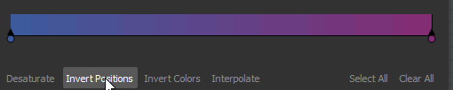
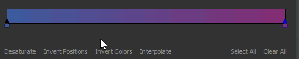

# 梯度圖

<table>
<tr style="border: 0;">
<td width="33.33%" style="border: 0;" valign="top">

{width="200px"}

</td>
<td width="100.00%" style="border: 0;" valign="top">

用自訂漸層重新映射影像中的灰階值。

這個節點有雙重功能：它可以單純作為<b> </b>灰階轉色的轉換節點，或是用來將灰階輸入對應到自訂的色彩斜坡。

</td>
</tr>
</table>

該節點提供先進且功能豐富的漸層編輯器，能精確映射多種顏色：請前往 [本頁的漸層編輯器](#gradient-editor) 區了解更多。

<table>
<tr style="border: 0;">
<td width="100.00%" style="border: 0;" valign="top">

</td>
<td width="83.33%" style="border: 0;" valign="top">

</td>
<td width="100.00%" style="border: 0;" valign="top">

</td>
</tr>
</table>

## 範例

## 參數

|  |  |
| --- | --- |
| <b>彩色模式</b> *布林值* | 將輸出模式設為彩色或灰階。 |
| <b>梯度處理</b> *布林值* | 將梯度設定為重複（拼貼）或夾取超出 [0， 1] 範圍的值。 |
| <b>梯度</b> *漸變鍵陣列* | 自訂漸層斜坡用來映射輸入灰階值。 可在原地編輯，或使用 [漸層編輯器](#gradient-editor)進行。 |

## 漸層編輯器

此視窗提供編輯漸層地圖節點所用的參考漸層，將灰階值映射為顏色的控制。

可透過梯度映射節點的 <b>屬性（Properties</b> ）以下方式開啟：

* 點擊漸層編輯器</b>按鈕上的<b>左鍵;
* 在漸層條中的針腳上按雙擊左鍵。 點擊的針腳會在漸層編輯器中自動被選中，讓你可以直接編輯它的數值。

### 編輯漸層圖釘

顏色及其在漸變條上的位置由放置在漸層條上的針腳控制。

每個針腳在漸層位置設定一個顏色。

第一根和最後一個針腳前後的漸層部分分別設定為該針的顏色。

以下控制項可用於編輯腳位：

<table>
<tr style="border: 0;">
<td style="border: 0;" valign="top">

<b>加入銷</b>

在漸層上點擊 LMB，或就在下方，在你點擊的漸層條位置加一個針腳。

新針腳會在該位置設定為漸層的顏色。

</td>
<td style="border: 0;" valign="top">

</td>
</tr>
</table>

<table>
<tr style="border: 0;">
<td style="border: 0;" valign="top">

<b>移動銷</b>

按住左鍵，沿著漸層條拖曳選取的銷釘來移動它們。

你也可以選擇針腳並使用<b></b>位置參數來設定一個數值。位置是 [0;1] 範圍內的一個值，其中 0 是梯度的起點，1 是其終點。

</td>
<td style="border: 0;" valign="top">

</td>
</tr>
</table>

當選取多個腳位時，可以同時移動&#x200B;**&#x200B;所有腳位。當一個或多個針腳在移動時達到梯度的盡頭時，根據用於移動的滑鼠按鈕，有兩種行為可供選擇：

* <b>左鍵：</b> 針會留在末端，代表它們會堆疊在該位置，且相對位置會改變;
* <b>MMB：</b> 針會繞回梯度的另一端，表示它們的相對位置保持不變。

<table>
<tr style="border: 0;">
<td style="border: 0;" valign="top">

<b>刪除釘</b>

選擇腳位並按下刪除鍵，或將腳位從漸層條上拖曳以刪除它們。

</td>
<td style="border: 0;" valign="top">

</td>
</tr>
</table>

<table>
<tr style="border: 0;">
<td style="border: 0;" valign="top">

<b>倒立姿勢</b>

鏡像選取針腳在梯度上的位置。

</td>
<td style="border: 0;" valign="top">

</td>
</tr>
</table>

<table>
<tr style="border: 0;">
<td style="border: 0;" valign="top">

<b>全部清空</b>

移除漸層條上的所有銷釘。

</td>
<td style="border: 0;" valign="top">

</td>
</tr>
</table>

<b>反轉色</b>

此按鈕可將所選針腳的顏色切換為負極。

<b>去飽和</b>

此按鈕會降低選取針腳所設定的顏色飽和度。

### 插值模式

針腳設定好後，你可以利用可用的插值模式控制顏色如何從一個針腳過渡到下一個針腳：

+++線性
預設插值模式：在每個腳位之間進行簡單的線性插值，使梯度均勻推進。

+++

+++平面切線
當將梯度間的過渡視為貝塞爾曲線，其中針腳是曲線上的點時，此模式將這些點設定為水平切線。

這會產生一個類似平滑步插值的過渡。

當選擇此模式時， <b>中點</b> 參數會啟用，並允許你偏移曲線垂直中點間的水平位置。 這實際上是在「出」與「入」的切線之間傾斜天秤。

+++

+++平滑
對每點之間的插值曲線進行平滑處理。

選擇此模式後， <b>平滑</b> 度參數會啟用，並可調整平滑強度，0 等 <b>於線性</b> 插值模式。

+++

+++無插值
顏色只會在針的位置改變，並且會保持不變，直到梯度條上的下一個針腳。

這導致顏色之間有明顯的階梯，且只有針腳設定的顏色會出現在漸層中。

+++

### 色彩選擇器

色彩選擇器讓你可以用多種方式設定顏色：

* <b>漸變與色相條</b>

  <table>
  <tr style="border: 0;">
  <td style="border: 0;" valign="top">

  調整小工具在漸層和色相條中缺口的位置來設定顏色。

  </td>
  <td style="border: 0;" valign="top">

  

  </td>
  </tr>
  </table>

* <b>RGB、HSV 與 Alpha 滑桿</b>

  <table>
  <tr style="border: 0;">
  <td width="100.00%" style="border: 0;" valign="top">

  RGB、HSV 和 Alpha 滑桿讓你能透過調整滑桿或直接設定數值來精確設定顏色。

  或者，在滑桿下方的專用輸入欄位使用十六進位碼。

  </td>
  <td width="33.33%" style="border: 0;" valign="top">

  

  </td>
  </tr>
  </table>

* <b>螢幕上的選擇</b>

  <table>
  <tr style="border: 0;">
  <td style="border: 0;" valign="top">

  使用 <b>選擇</b> 按鈕，在畫面中任意點擊 LMB 即可取樣該位置的顏色。

  </td>
  <td style="border: 0;" valign="top">

  

  </td>
  </tr>
  </table>

<table>
<tr style="border: 0;">
<td width="100.00%" style="border: 0;" valign="top">

選取的顏色會在顏色縮圖的上半部預覽。\
下半部顯示先前使用的顏色。 雙擊左鍵，就能把調整過的顏色還原回來。

</td>
<td width="16.67%" style="border: 0;" valign="top">

</td>
</tr>
</table>

當選擇多個腳位時，RGB、HSV 和 Alpha 滑桿會變成 delta（Δ）滑桿，意即用來讓每個腳位的值以相同幅度的偏移。

<table>
<tr style="border: 0;">
<td width="100.00%" style="border: 0;" valign="top">

此外，以下功能可在顏色縮圖下方作為按鈕使用：

<b>反轉：</b>將顏色切換為負片;

<b>對灰色：</b>顏色去飽和度;

<b>複製&#x200B;</b>*：* 將目前選取的顏色複製到夾板;

<b>貼上：</b>切換到剪貼板目前的顏色;

<b>sRGB</b>：使用 sRGB 色彩空間來顯示顏色。 當禁用時，會使用線性色彩空間;

<b>浮點：</b> 以浮點顯示 RGB、HSV 和 Alpha 滑桿值。

</td>
<td width="25.00%" style="border: 0;" valign="top">

</td>
</tr>
</table>

### 漸層滴管

漸層吸管是這個節點最實用的功能之一，因為你只要在參考圖片上畫一條線，就能創造出複雜的漸層。

<b>精準</b>滑桿會幫助你調整新建立的漸層，透過增加或減少按鍵數量：按鍵數越低，漸變越能精確匹配你選擇的數值。

## 輸入連接器

|  |  |
| --- | --- |
| <b>輸入</b> *灰階* 初級 | 要處理的灰階影像。 |

## 輸出連接器

|  |  |
| --- | --- |
| <b>產出</b> *灰階* |  |

## 範例

*即將推出。*
