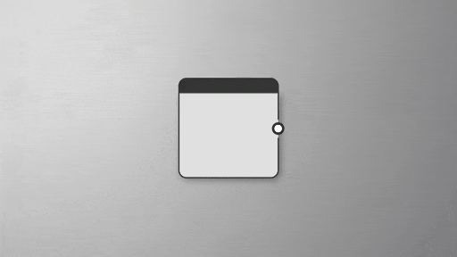

# 輸入顏色

<table>
<tr style="border: 0;">
<td width="33.33%" style="border: 0;" valign="top">

</td>
<td style="border: 0;" valign="top">

## 說明

輸入節點是一種特殊類型的節點，會在你的圖中創造動態槽位，讓任何輸入在圖被用於其他情境時都能被連接起來。

與 [輸出節點](../../../../compositing-graphs/nodes-reference-for-com/atomic-nodes/output/output.md)不同，你必須明確放置色彩、灰階或值輸入。 無法自行建立「中立」輸入，並根據連接的裝置改變類型。

輸入節點不如輸出節點[&#128279;](../../../../compositing-graphs/nodes-reference-for-com/atomic-nodes/output/output.md)重要：你可以擁有完美運作且先進的圖形，不需要輸入。輸入只在你想以外部輸入為基礎來製作圖形或節點實例結果時使用，例如在建立 [實例](../../../../compositing-graphs/creating-compositing-gra/graph-instances-sub-gra/graph-instances-sub-graphs.md) 或 [Substance 3D Painter 的濾鏡](https://experienceleague.adobe.com/en/docs/substance-3d-painter/using/effects/filter) 時。

另見： [輸入灰階](../input-grayscale/input-grayscale.md)、 [輸入值](../input-value/input-value.md)

</td>
</tr>
</table>

## 參數

預設情況下，如果沒有插電，輸入色彩或灰階會回傳黑色。 你可以設定不同的預設值，或是從總管[&#128279;](../../../../interface/the-explorer-window/the-explorer-window.md)拖曳現有[的點陣資源](../../../../resources/importing-linking-and-new/importing-linking-and-new-resources.md)到圖表中的輸入節點，以便在欄位中預覽這些資料。這只適用於色彩和灰階輸入。 預設值在其他情境中使用時是持久的，預覽點陣圖則在其他情況下被捨棄。

如果你想用其他圖的輸出看到，你必須用上述方法匯出該圖成點陣圖，或是使用「上下文內」編輯。

|  |  |
| --- | --- |
| <b>PKG 資源路徑</b> *弦* | 指向一個自訂的點陣圖資源以便預覽。 |
| <b>預設值</b> *色彩/灰階/明暗* | 如果這個插槽沒有連接，可以讓你用除了黑色以外的其他數值作為預設輸入。 |

## 屬性

|  |  |
| --- | --- |
| <b>識別碼</b> *弦* | 唯一必須且獨特的屬性。 不可包含空格。 這個模組用於標記輸入（如果沒有設定標籤），以及區分不同的輸出。 不要只把這些設定放在「input\_1」！ |
| <b>描述</b> *弦* | Designer 函式庫與 Painter 書架中使用的可選描述。 |
| <b>唱片公司</b> *弦* | UI 標籤 用於 Designer 和 Painter UI 中漂亮的標籤。 可以包含空格。 建議用類似識別碼的名稱，只是用空白鍵代替底線。 |
| <b>使用者資料</b> *弦* | 額外且可選的使用者資料可用於特定的過濾操作，基本上是一個萬用字元、自訂資料欄位。 |
| <b>團體</b> *弦* | Group 屬性用於將輸入群組在一起，用於設計者的 [連結建立模式](../../../../interface/the-graph-view/link-creation-modes/link-creation-modes.md)。 具有相同（大小寫區分）群組屬性的輸入，將以單一連接方式呈現為緊湊材質模式。 |

## 繼承

<table>
<tr style="border: 0;">
<td style="border: 0; vertical-align: top">

當有多個輸入時，你需要注意圖如何 [從這些輸入繼承其基底參數](../../../../compositing-graphs/inheritance-compositing/inheritance-in-substance-compositing-graphs.md) 。\
基礎參數包括 <b>輸出大小</b>、 <b>輸出格式</b> 及 <b>平鋪模式</b>等。

輸入可以定義為 [主要輸入](../../../../compositing-graphs/inheritance-compositing/inheritance-in-substance-compositing-graphs.md)。 這個輸入接著驅動所有輸入的屬性，繼承方法設定為 *相對於父*&#x200B;輸入。 這是輸入節點預設&#x200B;*設定的繼承方法*。

</td>
<td width="25%" style="border: 0;" valign="top">

</td>
</tr>
</table>

你可以在節點上點擊 *右鍵* ，並在情境選單中選擇 <b>「設定為主要輸入」選項，將該輸入節點設為圖表的主輸入</b> 。\
節點的主要輸入會在連接器&#x200B;*上用*&#x200B;一個小黑點標記（在本節旁的範例中以紅色圈圈標示）。

或者，任何設定為 *相對於輸入* 繼承方法的輸入，都會繼承其所連接節點的屬性， *無論* 主輸入為何。

最後，你可以將某個屬性的繼承方法 *設為絕對*，來覆寫該屬性的任何值。

>[!TIP]
>
> 想了解更多關於繼承的資訊，請前往 [本文件中的「實質繼承圖」](../../../../compositing-graphs/inheritance-compositing/inheritance-in-substance-compositing-graphs.md) 頁面。

>[!IMPORTANT]
>
> *Substance 3D 資產（SBSAR）[&#128279;](../../../publishing-asset-files/publishing-substance-3d-asset-files-sbsar.md)不支援*輸入節點&#x200B;*的相對於輸入*&#x200B;繼承方法。在發佈套件前，將所有輸入節點的繼承方法設為 *相對於父* 節點。

## 整合屬性

輸入不會直接傳送到 3D 視圖，但其使用屬性會被 [Substance 3D Painter](https://experienceleague.adobe.com/en/docs/substance-3d-painter/using/home) 用來自動填補特定地圖（多用於 [濾鏡](https://experienceleague.adobe.com/en/docs/substance-3d-painter/using/effects/filter)）。

此外，使用屬性也會用於 [連結建立模式](../../../../interface/the-graph-view/link-creation-modes/link-creation-modes.md)，以匹配正確的輸入與輸出欄位。

<b>使用情況</b>

|  |  |
| --- | --- |
| <b>組成部分</b> *弦* | 這決定了最終輸入中實際包含哪些通道。 這是舊有設定，現在已經不再被積分和圖形使用。 |
| <b>使用情況</b> *弦* | 為此輸入定義一種型別或使用方式。 它指示其他節點應該如何連接到這個輸入。 |
| <b>色彩空間</b> *弦* | 設定該輸入應解讀的色彩空間。 |
