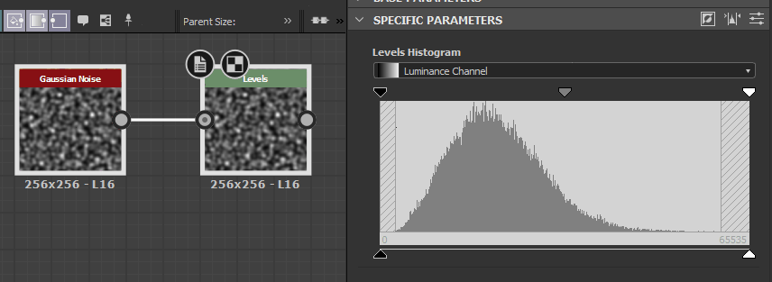

# 關卡

<table>
<tr style="border: 0;">
<td width="33.33%" style="border: 0;" valign="top">

{width="200px"}

</td>
<td width="100.00%" style="border: 0;" valign="top">

調整影像陰影、中間調與高光的全域色調範圍與色彩平衡。

Levels節點允許你透過設定輸入與輸出重映射因子來重新映射輸入的音調，這些元素以類似其他2D影像編輯器常見的直方圖介面呈現。

</td>
</tr>
</table>

它是 Substance 3D Designer 中核心且最實用的節點之一，經常用於重新映射和調整圖表中的數值，因為它提供了最精確且準確的介面來調整數值。

雖然它是重要的節點，但在某些情況下介面會有點笨重，所以一定要考慮 [Auto Level](../../../../compositing-graphs/nodes-reference-for-com/node-library/filters/adjustments/auto-levels/auto-levels.md)、 [Contrast/Luminosity](../../../../compositing-graphs/nodes-reference-for-com/node-library/filters/adjustments/contrast-luminosity/contrast-luminosity.md) 和 [Histogram Scan](../../../../compositing-graphs/nodes-reference-for-com/node-library/filters/adjustments/histogram-scan/histogram-scan.md) 作為替代方案。

<table>
<tr style="border: 0;">
<td width="100.00%" style="border: 0;" valign="top">

</td>
<td width="83.33%" style="border: 0;" valign="top">

</td>
<td width="100.00%" style="border: 0;" valign="top">

</td>
</tr>
</table>

## 範例

## 參數

節點提供兩種介面來調整數值：直方圖與滑桿。 你可以用「特定參數」標頭欄最右邊的按鈕切換：

<table>
<tr style="border: 0;">
<td width="100.00%" style="border: 0;" valign="top">

高亮的黃色按鈕用來切換直方圖（上方）數值滑桿（下方）的介面

</td>
<td width="66.67%" style="border: 0;" valign="top">

</td>
</tr>
</table>

|  |  |
| --- | --- |
| <b>低等級</b> *浮動/漂浮4* | 定義輸入影像的低光強度。 重新映射輸入 Low 值，變成全黑。 |
| <b>高階等級</b> *浮動/漂浮4* | 定義輸入影像的高光等級。  重新映射輸入 高值，使其變成全白。 |
| <b>中路等級</b> *浮動/漂浮4* | 定義輸入影像的中色調層級。  將輸入的中等值重新映射成中灰色。 |
| <b>保持低速平衡</b> *浮動/漂浮4* | 定義輸出影像的低光等級。  夾具輸出黑色值以設定限制。 |
| <b>保持高水平</b> *浮動/漂浮4* | 定義輸出影像的高光等級。  夾具輸出白色值以設定限制。 |
| <b>中間鉗</b> *布林值* | 判斷轉換後的輸入值是否在計算輸出前被夾在 [0， 1]。 |

## 使用指南

請觀看這段關於關卡節點及其直方圖編輯器的影片概述：

### 快速動作

在「特定參數」標頭列中，你可以找到按鈕，方便存取直方圖的功能：

<b>1 - 反轉：</b> 交換「水平化低」與「平衡化高」參數的值。

<b>2 - 自動水平</b> ：自動調整「低水平」與「高度水平」參數的數值，分別調整為影像中存在的最低與最高值。

<b>3 - 切換介面：</b> 在直方圖與滑桿編輯器間切換。

### 直方圖

直方圖編輯器適合視覺化、快速調整，當不需要精確數值，且參數外露也不重要時。 這通常是使用關卡最快速且最簡單的方式。

根據輸入類型（彩色或灰階），你可以使用直方圖上方的下拉選單選擇你要修改的通道。

### 滑桿

滑桿編輯器取消了視覺化編輯器，只提供數值滑桿，主要用於你想要精確定位或重新映射到非常精確的數值，或是想 [暴露這些參數](../../../../compositing-graphs/manage-parameters/exposing-a-parameter/exposing-a-parameter.md)，因為這只能在滑桿編輯器中實現。

滑桿會根據顏色或灰階輸入而改變：色彩輸入會為每個 RGBA 通道分別產生 4 個滑桿，灰階只有一個滑桿，讓操作更方便。 請參閱上方的參數列表，了解每個滑桿的說明。

## 輸入連接器

|  |  |
| --- | --- |
| <b>輸入</b> *灰階/彩色* 原色 | 要處理的影像。 |

## 輸出連接器

|  |  |
| --- | --- |
| <b>產出</b> *灰階/彩色* |  |

## 範例

*即將推出。*
