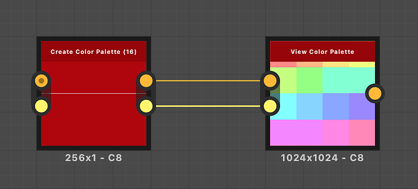

# 創造色彩調色盤（16）

<table>
<tr style="border: 0;">
<td width="33.33%" style="border: 0;" valign="top">

{width="200px"}

<b>收錄於：</b> 篩選>調整

</td>
<td width="100.00%" style="border: 0;" valign="top">

## 說明

建立有序的顏色清單，並輸出為調色盤，最多可選 16 種顏色。

節點可利用「調色盤」輸入組合，為現有調色盤附加新顏色。

此節點可與以下節點結合使用： [量化色彩](../../../../../../compositing-graphs/nodes-reference-for-com/node-library/filters/adjustments/quantize-color/quantize-color.md)、 [套用色彩調色](../../../../../../compositing-graphs/nodes-reference-for-com/node-library/filters/adjustments/apply-color-palette/apply-color-palette.md)盤、 [修改色彩調色盤](../../../../../../compositing-graphs/nodes-reference-for-com/node-library/filters/adjustments/modify-color-palette/modify-color-palette.md)、 [檢視色彩調色盤](../../../../../../compositing-graphs/nodes-reference-for-com/node-library/filters/adjustments/view-color-palette/view-color-palette.md)。

</td>
</tr>
</table>

<table>
<tr style="border: 0;">
<td style="border: 0;" valign="top">

</td>
<td style="border: 0;" valign="top">

### 輸出連接器

</td>
<td style="border: 0;" valign="top">

### 參數

</td>
</tr>
</table>

## 輸入連接器

|  |  |
| --- | --- |
| <b>調色盤</b> *色彩 原色* | 一個以像素列編碼的有序 RGB 顏色清單。 調色盤最多可容納256種顏色。   此輸入為可選。 若使用，節點設定的顏色會附加到此調色盤中。   調色盤可用「檢視色彩調色盤[&#128279;](../../../../../../compositing-graphs/nodes-reference-for-com/node-library/filters/adjustments/view-color-palette/view-color-palette.md)」節點來視覺化。 |
| <b>調色盤色彩量</b> *整數* | 調色盤中儲存的顏色數量。   如果這個數字與「調色盤」影像輸入中的實際顏色數量不符，視覺化可能不完整，或有比絕對必要的空白欄位還多。 |

## 輸出連接器

|  |  |
| --- | --- |
| <b>調色盤</b> *顏色* | 附上了更新後的調色盤，並附上指定顏色。 |
| <b>調色盤色彩量</b> *整數* | 調色盤中儲存的顏色數量更新，並加上指定的顏色數量。 |

## 參數

|  |  |
| --- | --- |
| <b>顏色數量</b> *整數* | 調色盤中應該加入多少顏色。 |
| <b>顏色#</b> *Float3*   *可用參數數量與「色彩量」值相同* | 一種應該加入調色盤的顏色。   顏色會依照這個編號清單的順序附加到調色盤中。 |

## 範例

<table>
<tr style="border: 0;">
<td style="border: 0;" valign="top">

{zoomable="yes"}

</td>
<td style="border: 0;" valign="top">

{zoomable="yes"}

</td>
</tr>
</table>

{zoomable="yes"}
