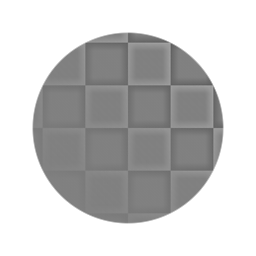
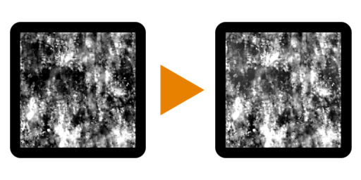

# 高通

<table>
<tr style="border: 0;">
<td width="33.33%" style="border: 0;" valign="top">

{width="128px"}

{width="128px"}

<b>收錄於：</b> 篩選>調整

</td>
<td width="100.00%" style="border: 0;" valign="top">

## 說明

執行高通濾波器，提供彩色及灰階版本。 類似同名的 Photoshop 動作。\
對於消除影像中明顯的亮度差異非常有用，例如在平鋪時清理貼圖時。

重要：務必使用適合你輸入的版本！ 色彩輸入用「Highpass」，灰階輸入用「Highpass Grayscale」。

</td>
</tr>
</table>

## 參數

|  |  |
|:---|:---|
| <b>半徑</b> <i>0.0 - 64.0</i> | 濾波半徑：半徑小則能去除小差異，半徑越大就能去除大面積。 |

## 範例

<table style="margin-top: 32px; margin-bottom: 32px">
    <tr style="border: 0">
        <td style="border: 0; background: transparent">
            
        </td>
        <td style="border: 0; background: transparent">
            
        </td>
    </tr>
</table>
