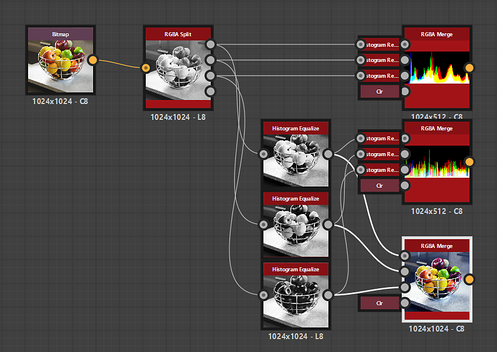

# 直方圖等化

<table>
<tr style="border: 0;">
<td width="33.33%" style="border: 0;" valign="top">

{width="200px"}

<b>收錄於：</b> 篩選>調整

</td>
<td width="100.00%" style="border: 0;" valign="top">

## 說明

它能將灰階影像的直方圖等化，有效地調整灰階值，目標是達到均勻分布。

</td>
</tr>
</table>

## 輸入

|  |  |
|:---|:---|
| <b>輸入</b> <i>灰階</i> 初級 | 直方圖應被均衡化的影像。 |

## 輸出

|  |  |
|:---|:---|
| <b>產出</b> <i>灰階</i> | 結果影像已套用直方圖等化。 |

## 參數

|  |  |
|:---|:---|
| <b>直方圖解析度</b> *整數* | 直方圖的寬度。 較高的值能讓更細緻的值分布。   可用解析度以像素為單位：256、512、1024、2048、4096 |
| <b>直方圖平滑</b> *浮標* | 直方圖可透過重新分配影像中的灰階值來平滑，以平衡 *各值間的差異* 。   這個參數會調整平滑的強度。 |

## 範例

<table>
  <tr>
    <td>
      
       <i>之前</i>
    </td>
    <td>
      
       <i>之後</i>
    </td>
  </tr>
</table>

{zoomable="yes"}

<table>
  <tr>
    <td>
      
       <i>之前</i>
    </td>
    <td>
      
       <i>之後</i>
    </td>
  </tr>
</table>

{zoomable="yes"}

<table>
  <tr>
    <td>
      
       <i>之前</i>
    </td>
    <td>
      
       <i>之後</i>
    </td>
  </tr>
</table>

{zoomable="yes"}
