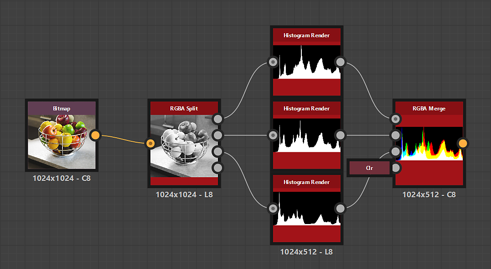

# 直方圖渲染

<table>
<tr style="border: 0;">
<td width="33.33%" style="border: 0;" valign="top">

{width="200px"}

<b>收錄於：</b> 篩選>調整

</td>
<td width="100.00%" style="border: 0;" valign="top">

## 說明

繪製灰階影像的直方圖。

</td>
</tr>
</table>

<table>
<tr style="border: 0;">
<td style="border: 0;" valign="top">

</td>
<td style="border: 0;" valign="top">

### 輸出連接器

</td>
<td style="border: 0;" valign="top">

### 參數

</td>
</tr>
</table>

## 輸入連接器

|  |  |
| --- | --- |
| <b>輸入</b> *灰階* 初級 | 應該繪製直方圖的影像。 |

## 輸出連接器

|  |  |
| --- | --- |
| <b>產出</b> *灰階* | 從輸入影像中計算出直方圖視覺化。 |

## 參數

|  |  |
| --- | --- |
| <b>直方圖解析度</b> *整數* | 直方圖的寬度。 較高的值能讓更細緻的值分布。   可用解析度以像素為單位：256、512、1024、2048、4096 |
| <b>自動秤</b> *布林值* | 當「True」時，會重新映射直方圖，使其使用影像的全高度。   當「False」時，每欄使用與輸入影像中某值出現次數相同的高度像素數。 |
| <b>規模</b> *浮標* | 垂直縮放直方圖，1 為直方圖的全高。 |
| <b>抽樣</b> *整數* | 當直方圖解析度與渲染解析度不匹配時，對直方圖影像的過濾方法有以下影響：<ul data-preserve-html="true"> <li data-preserve-html="true"><b>雙線性：</b> 對直方圖進行雙線性濾波，產生插值點</li> <li data-preserve-html="true"><b>最近：</b> 取樣最近的像素且不經過濾波，導致平坦步進</li> </ul> |
| <b>翻轉Y軸</b> *布林值* | 當「True」時，垂直方向會鏡像直方圖。 |

## 範例

{zoomable="yes"}

{zoomable="yes"}
