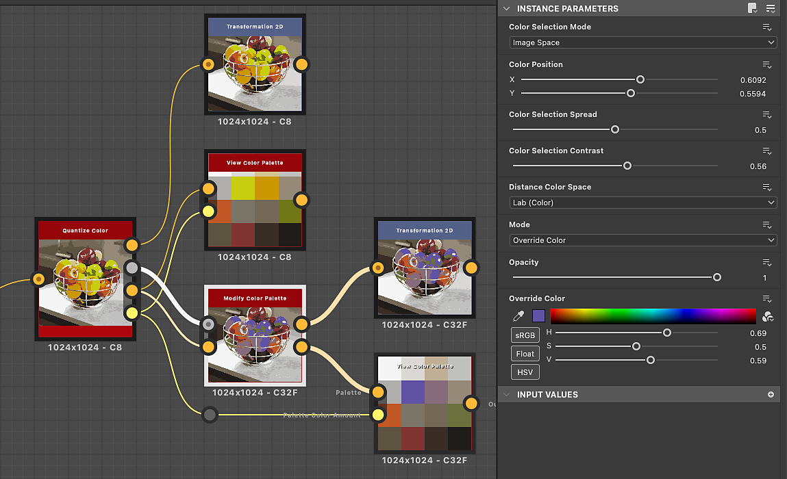

# 修改色彩調色盤

<table>
<tr style="border: 0;">
<td width="33.33%" style="border: 0;" valign="top">

{width="200px"}

<b>收錄於：</b> 篩選>調整

</td>
<td width="100.00%" style="border: 0;" valign="top">

## 說明

修改有序調色盤中的顏色，並利用 ID 映射套用到影像上。

顏色可透過將 ID 映射中的索引與調色盤中的顏色索引匹配來選擇。

例如，調色盤中的顏色 #2 會套用到所有 ID 映射中 ID 值為 2 的像素。

此節點可與以下節點結合使用： [量化色彩](../../../../../../compositing-graphs/nodes-reference-for-com/node-library/filters/adjustments/quantize-color/quantize-color.md)、 [建立色彩調色](../../../../../../compositing-graphs/nodes-reference-for-com/node-library/filters/adjustments/create-color-palette-16/create-color-palette-16.md)盤、 [套用色彩調色](../../../../../../compositing-graphs/nodes-reference-for-com/node-library/filters/adjustments/apply-color-palette/apply-color-palette.md)盤、 [檢視色彩調色盤](../../../../../../compositing-graphs/nodes-reference-for-com/node-library/filters/adjustments/view-color-palette/view-color-palette.md)。

</td>
</tr>
</table>

<table>
<tr style="border: 0;">
<td style="border: 0;" valign="top">

</td>
<td style="border: 0;" valign="top">

### 輸出連接器

</td>
<td style="border: 0;" valign="top">

### 參數

</td>
</tr>
</table>

## 輸入連接器

|  |  |
| --- | --- |
| <b>身分證</b> *灰階* 初級 | 輸入 ID 映射用於選擇顏色，以便在輸出中修改與分配顏色。 ID 映射是一種影像，其中屬於整體（例如形狀）的像素都擁有相同的唯一識別值。 此時，值為整數。 ID 映射可透過 [量化色彩](../../../../../../compositing-graphs/nodes-reference-for-com/node-library/filters/adjustments/quantize-color/quantize-color.md) 節點產生。 |
| <b>調色盤</b> *顏色* | 一個以像素列編碼的有序 RGB 顏色清單。 調色盤最多可容納256種顏色。 這就是節點所修改的調色盤。 調色盤可透過 [量化色彩](../../../../../../compositing-graphs/nodes-reference-for-com/node-library/filters/adjustments/quantize-color/quantize-color.md) 或 [建立色彩調色盤](../../../../../../compositing-graphs/nodes-reference-for-com/node-library/filters/adjustments/create-color-palette-16/create-color-palette-16.md) 節點產生。 |

## 輸出連接器

|  |  |
| --- | --- |
| <b>產出</b> *顏色* | 將修改過調色盤中的顏色映射到 ID 映射的索引的結果。 |
| <b>調色盤</b> *顏色* | 已套用指定的色彩修改的更新調色盤。 該調色盤可用「套用色彩調色盤[&#128279;](../../../../../../compositing-graphs/nodes-reference-for-com/node-library/filters/adjustments/apply-color-palette/apply-color-palette.md)」節點套用到另一張影像，或透過[「檢視色彩調色盤](../../../../../../compositing-graphs/nodes-reference-for-com/node-library/filters/adjustments/view-color-palette/view-color-palette.md)」節點進行視覺化。 |

## 參數

|  |  |
| --- | --- |
| <b>色彩選擇模式</b> *整數* | 選擇調色盤中應修改的目標顏色的方法：<ul data-preserve-html="true"> <li data-preserve-html="true"><b>色彩指數：</b>目標顏色的指數</li> <li data-preserve-html="true"><b>影像空間：</b>ID 映射中應取樣索引的位置。 選擇此模式後，2D 視圖中會出現一個位置裝置方便選擇</li> </ul> |
| <b>顏色位置</b> *當「色彩選擇模式」設為「影像空間」時，Float2*   *可用* | 索引應取樣的ID映射位置。 在 2D 視圖中使用這個裝置，可以輕鬆選擇影像中的某個位置。 提示：你可以顯示擷取 ID 映射的量化影像，然後選擇「修改色彩調色盤」節點來顯示該裝置。 這讓選擇要修改的顏色變得更直覺。 |
| <b>色指數</b> *當「色彩選擇模式」設為「色彩索引」時，整數*   *可使用。* | 目標顏色的索引。 調色盤中的顏色由左到右排列，第一個顏色的索引為 0。 |
| <b>色彩選擇擴散</b> *浮標* | 控制選擇範圍延伸到鄰近顏色的程度。 顏色排列成&#x200B;*一個立方體*，寬度、高度和深度為漸層，顏色的每個分量從0增加到1（例如： 紅、綠、藍三色RGB材質）。 這個參數會調整立方體中所選顏色周圍的距離，其他顏色也可以調整，其中 1 是整個立方體的寬度。 |
| <b>色彩選擇對比</b> *浮標* | 控制選取相鄰顏色的衰減漸變。 顏色排列成&#x200B;*一個立方體*，寬度、高度和深度為漸層，其中顏色的分量從0增加到1（例如： 紅、綠、藍三色RGB材質）。 此參數調整立方體中其他顏色的選取衰減，0 是從選定顏色到最遠的平滑漸層，1 是從完全包含到未包含的截斷。 |
| <b>距離色彩空間</b> *整數* | 顏色排列成&#x200B;*一個立方體*，寬度、高度和深度為漸層，其中顏色的分量從0增加到1（例如： 紅、綠、藍三色RGB材質）。 這個參數讓你可以選擇用來分配立方體顏色的色彩空間，進而改變鄰近的顏色。 您可以選擇符合您使用情境的色彩空間：<ul data-preserve-html="true"> <li data-preserve-html="true"><b>Lab（顏色）：</b>一個標準化的感知色彩空間，會以一種「感覺」接近的顏色在立方體中實際靠近的方式分配顏色。 這適用於可於顯示器上可視覺化的影像。</li> <li data-preserve-html="true"><b>RGB（資料）：</b>顏色分為紅、綠、藍，並沿這些軸線直線分布，完全不顧人類感知。 這適用於包含原始資料的影像，例如法線貼圖。</li> </ul> |
| <b>模式</b> *整數* | 修改目標顏色的方法：<ul data-preserve-html="true"> <li data-preserve-html="true"><b>覆寫顏色：</b>用另一種顏色替換</li> <li data-preserve-html="true"><b>HSL：</b>利用色相、飽和度和明度偏移來調整顏色</li> </ul> |
| <b>不透明度</b> *浮標* | 控制原始顏色與修改後顏色之間的插值，其中 1 表示修改後的顏色完全取代原始顏色。 |
| <b>覆蓋顏色</b> *當「模式」設為「覆蓋顏色」時，Float3*   *可用* | 指定應取代原始顏色的顏色。 |
| <b>HSL</b> *當「模式」設為「HSL」時，Float3*   *可用* | 控制對原始顏色施加的色調、飽和度和明度偏移。 |

## 範例

{zoomable="yes"}

{zoomable="yes"}

<table>
  <tr>
    <td>
      
       <i>之前</i>
    </td>
    <td>
      
       <i>之後</i>
    </td>
  </tr>
</table>
