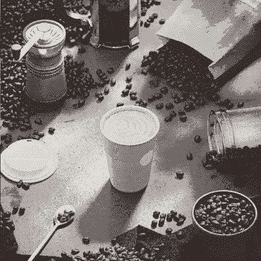
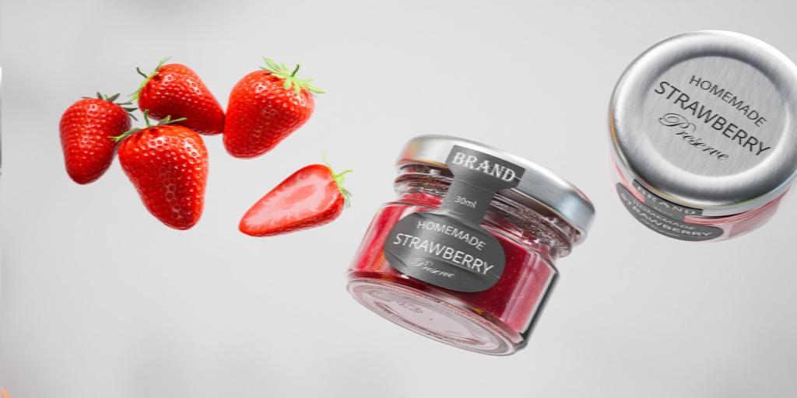

# 量化顏色

<table>
<tr style="border: 0;">
<td width="33.33%" style="border: 0;" valign="top">

{width="200px"}

<b>收錄於：</b> 篩選>調整

</td>
<td width="100.00%" style="border: 0;" valign="top">

## 說明

減少彩色影像中的顏色數量，有效地將漸層壓平。

除了處理過的影像外，節點還會擷取以下資料：

* 剩 <b>餘顏色的調色盤</b> ，可用來為其他影像上色
* 量化區域的 <b>識別映射</b> ，可用來使用不同的調色盤重新上色處理後的影像
* <b>剩餘顏色的數量</b>作為原始整數值

</td>
</tr>
</table>

若「忽略 alpha」參數設為「False」，則原始影像的 alpha 通道用於選擇應從中擷取顏色以進行量化過程的區域，而透明區域的顏色則被忽略。

這實際上提供了對萃取顏色的控制。

此節點可與以下節點結合使用： [建立色彩調色](../../../../../../compositing-graphs/nodes-reference-for-com/node-library/filters/adjustments/create-color-palette-16/create-color-palette-16.md)盤、 [套用色彩調色](../../../../../../compositing-graphs/nodes-reference-for-com/node-library/filters/adjustments/apply-color-palette/apply-color-palette.md)盤、 [修改調色盤](../../../../../../compositing-graphs/nodes-reference-for-com/node-library/filters/adjustments/modify-color-palette/modify-color-palette.md)、 [檢視調色盤](../../../../../../compositing-graphs/nodes-reference-for-com/node-library/filters/adjustments/view-color-palette/view-color-palette.md)。

## 輸入

|  |  |
|:---|:---|
| <b>輸入</b> <i>色彩 原色</i> | 應該量化的彩色影像。 |

## 輸出

|  |  |
|:---|:---|
| <b>產出</b> <i>顏色</i> | 量化的彩色影像。 |
| <b>身分證</b> <i>灰階</i> | 一個映射，每個量化顏色都被賦予唯一的整數識別碼。   這可用於：<ul data-preserve-html="true"> <li data-preserve-html="true"><b>從一些量化區域中擷取一個遮罩</b> ，並用 [ID to Mask](../../../../../../compositing-graphs/nodes-reference-for-com/node-library/filters/adjustments/id-to-mask/id-to-mask.md) 節點</li> <li data-preserve-html="true"><b>使用[「套用色彩調色盤](../../../../../../compositing-graphs/nodes-reference-for-com/node-library/filters/adjustments/apply-color-palette/apply-color-palette.md)」或[「修改色彩調色盤](../../../../../../compositing-graphs/nodes-reference-for-com/node-library/filters/adjustments/modify-color-palette/modify-color-palette.md)」節點重新上</b>色量化影像</li> </ul> |
| <b>調色盤</b> <i>顏色</i> | 調色盤從影像中提取，量化後保留剩餘顏色。   影像是有序的 RGB 顏色列表，編碼為一列像素，最多可容納 256 種顏色。   調色盤可用「檢視色彩調色盤[&#128279;](../../../../../../compositing-graphs/nodes-reference-for-com/node-library/filters/adjustments/view-color-palette/view-color-palette.md)」節點來視覺化。 |
| <b>調色盤色彩量</b> <i>整數</i> | 調色盤中儲存的顏色數量。 |

## 參數

|  |  |
|:---|:---|
| <b>Max。 顏色量</b> *整數* | 量化影像中應使用的最大顏色數量。   這個量與從影像中提取的調色盤所用量相同。「最大值」表示因量化技術而無法達成此量。 請查看「調色盤色彩量」輸出，了解實際萃取的顏色量。 |
| <b>輪廓平滑</b> *浮標* | 控制對輸入影像施加的平滑效果半徑，用以將量化影像簡化成更實淨、連貫的形狀。   注意：此平滑需要大量計算，因此提高此值會明顯增加節點的計算時間。 |
| <b>抖動</b> *浮標* | 套用抖動圖案以重現原始影像中的漸層與色彩混合，同時僅使用量化後剩餘的顏色。   務必使用「輪廓平滑」值為 0，以產生預期的抖動效果。 |
| <b>抖動模式</b> *整數* | 用來重現原始影像中漸層與色彩混合的抖動圖案：<ul data-preserve-html="true"> <li data-preserve-html="true">藍噪聲</li> <li data-preserve-html="true">拜耳</li> </ul> |
| <b>忽略 alpha</b> *布林值* | 預設情況下，原始影像的 alpha 通道用於選擇應從中擷取顏色以進行量化過程的區域，而透明區域的顏色則被忽略。 這實際上提供了對萃取顏色的控制。   事實上，你可能只想在量化過程中使用影像可見部分的顏色。   這個開關可以讓你關閉這個遮罩，無論透明度如何都能使用 *完整* 影像。 |
| <b>距離色彩空間</b> *整數* | 顏色排列成 *一個立方體* ，寬度、高度和深度為漸層，顏色的每個分量從0增加到1（例如： 紅、綠、藍三色RGB材質）。   量化過程包括選擇 *影像中的定義色* ，然後在立方體中尋找最接近它們的顏色，再用該定義色取代它們。   此參數可讓您選擇用於分配立方體色彩的色彩空間，透過改變偵測定義顏色的標準及重新排列鄰近顏色，改變量化結果。   您可以選擇符合您使用情境的色彩空間：<ul data-preserve-html="true"> <li data-preserve-html="true"><b>Lab（顏色）：</b> 一個標準化的感知色彩空間，會以一種「感覺」接近的顏色在立方體中實際靠近的方式分配顏色。 這適用於可在顯示器上視覺化的影像</li> <li data-preserve-html="true"><b>RGB（資料）：</b> 顏色分為紅、綠、藍，並沿這些軸線直線分布，完全不顧人類感知。 這適用於包含原始資料的影像，例如法線貼圖</li> </ul> |
| <b>識別碼排序模式</b> *整數* | 顏色排列成 *一個立方體* ，其中寬度、高度和深度為漸層，顏色的每個分量從 0 增加到 1（例如： 紅、綠、藍三色RGB材質）。   此參數選擇用來排序提取調色盤中顏色列表的方法，以及提取 ID 映射區域的索引：<ul data-preserve-html="true"> <li data-preserve-html="true"><b>Z曲線：</b> 顏色依在色方中找到的下一個，使用Z曲線排序，從白色到黑色</li> <li data-preserve-html="true"><b>色相：</b> 顏色依照最近的色相排序</li> <li data-preserve-html="true"><b>表示性：</b> 顏色從量化影像中使用量化到最少排序</li> </ul> |
| <b>降頻濾波</b> *整數* | 色彩量化過程涉及計算影像縮小尺寸（即縮小）的直方圖，以依重要性排序顏色。 此參數控制在計算直方圖前對縮放影像進行過濾的方法：<ul data-preserve-html="true"> <li data-preserve-html="true"><b>雙線性</b> ：對影像進行雙線性濾波，產生帶有插值色彩的直方圖，這些顏色可能不屬於原始影像，並稀釋部分原始色彩。 這有助於使用大量顏色的影像。</li> <li data-preserve-html="true"><b>最近：</b> 取樣最近像素的顏色，無需過濾，產生僅使用原始影像顏色的直方圖。 這適用於使用少量顏色的影像。</li> </ul> |

## 範例

<table>
  <tr>
    <td>
      
       <i>之前</i>
    </td>
    <td>
      
       <i>之後</i>
    </td>
  </tr>
</table>

<table>
  <tr>
    <td>
      
       <i>之前</i>
    </td>
    <td>
      
       <i>之後</i>
    </td>
  </tr>
</table>

<table>
  <tr>
    <td>
      
       <i>之前</i>
    </td>
    <td>
      
       <i>之後</i>
    </td>
  </tr>
</table>

<table>
  <tr>
    <td>
      
       <i>之前</i>
    </td>
    <td>
      
       <i>之後</i>
    </td>
  </tr>
</table>

<table>
  <tr>
    <td>
      
       <i>之前</i>
    </td>
    <td>
      
       <i>之後</i>
    </td>
  </tr>
</table>
