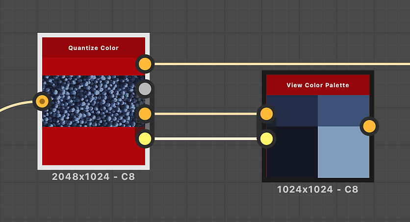

# 查看色彩調色盤

<table>
<tr style="border: 0;">
<td width="33.33%" style="border: 0;" valign="top">

{width="200px"}

<b>收錄於：</b> 篩選>調整

</td>
<td width="100.00%" style="border: 0;" valign="top">

## 說明

將色彩調色盤打包成方形或矩形，方便在圖形檢視或 2D 檢視中視覺化。\
打包的目標是盡量減少空位。

</td>
</tr>
</table>

調色盤中的顏色順序保持不變，顏色從左到右、從上到下流動，類似文字包裝。

此節點可用來視覺化以下節點所產生的調色盤： [量化顏色](../../../../../../compositing-graphs/nodes-reference-for-com/node-library/filters/adjustments/quantize-color/quantize-color.md)、 [建立色彩調色盤](../../../../../../compositing-graphs/nodes-reference-for-com/node-library/filters/adjustments/create-color-palette-16/create-color-palette-16.md)、 [修改色彩調色盤](../../../../../../compositing-graphs/nodes-reference-for-com/node-library/filters/adjustments/modify-color-palette/modify-color-palette.md)。

## 輸入

|  |  |
|:---|:---|
| <b>調色盤</b> <i>色彩 原色</i> | 一個以像素列編碼的有序 RGB 顏色清單。 調色盤最多可容納256種顏色。   這是節點打包並渲染的調色盤。 |
| <b>調色盤色彩量</b> <i>整數</i> | 調色盤中儲存的顏色數量。   如果這個數字與「調色盤」影像輸入中的實際顏色數量不符，視覺化可能不完整，或有比絕對必要的空白欄位還多。 |

## 輸出

|  |  |
|:---|:---|
| <b>產出</b> <i>顏色</i> | 是對濃密調色盤的視覺化。 |

## 範例

<table>
<tr style="border: 0;">
<td style="border: 0;" valign="top">

{zoomable="yes"}

</td>
<td style="border: 0;" valign="top">

{zoomable="yes"}

</td>
</tr>
</table>

<table>
<tr style="border: 0;">
<td style="border: 0;" valign="top">

{zoomable="yes"}

</td>
<td style="border: 0;" valign="top">

{zoomable="yes"}

</td>
</tr>
</table>
