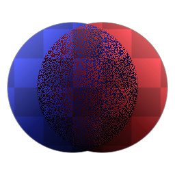

# 溶解

<table>
<tr style="border: 0;">
<td width="33.33%" style="border: 0;" valign="top">

{width="128px"}

<b>收錄於：</b> 濾鏡>混合

</td>
<td width="100.00%" style="border: 0;" valign="top">

## 說明

將兩個輸入混合在一起，並以白噪音作為過渡的遮罩。

</td>
</tr>
</table>

## 輸入

|  |  |
|:---|:---|
| <b>前景</b> <i>色彩輸入</i> |  |
| <b>背景</b> <i>色彩輸入</i> |  |
| <b>面具</b> <i>灰階輸入</i> | 遮罩槽用於遮蔽節點的效果。 |

## 參數

|  |  |
|:---|:---|
| <b>不透明度</b> <i>0.0 - 1.0</i> | 融合前景與背景的不透明度。 |
| <b>Alpha 混合</b> <i>錯誤/真實</i> | 切換前景與背景 alpha 通道的混合。 若設為 False，則忽略前景的 alpha 通道。 |
