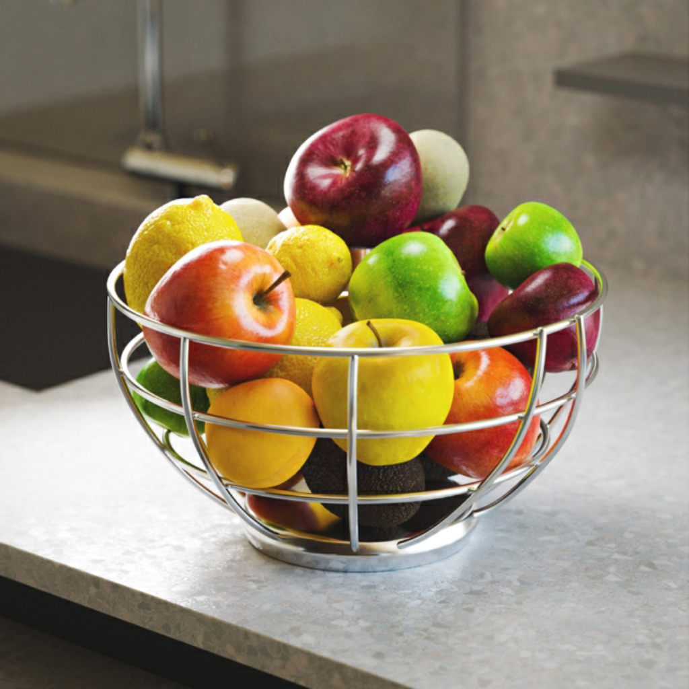

# MLV 彩色

<table>
<tr style="border: 0;">
<td width="33.33%" style="border: 0;" valign="top">

<b>收錄於：</b> 模糊>濾鏡

</td>
<td width="100.00%" style="border: 0;" valign="top">

## 說明

MLV 代表<b>「最小變異數均值」（Mean of Least Variance）。</b>這個濾鏡能強化影像的邊緣並平滑雜訊。

濾鏡會尋找影像中的結構區域，並利用這些區域來銳化和壓平影像。 在某些情況下，這可能導致梯度上的階梯比結構區域更寬。

</td>
</tr>
</table>

>[!NOTE]
>
> 另 [見MLV灰階](../../../../../../compositing-graphs/nodes-reference-for-com/node-library/filters/blurs/mlv-grayscale/mlv-grayscale.md)。

## 輸入

|  |  |
|:---|:---|
| <b>輸入</b> <i>顏色</i> | 應該處理的彩色影像。 |

## 輸出

|  |  |
|:---|:---|
| <b>產出</b> <i>顏色</i> | 那張濾鏡彩色影像。 |

## 參數

|  |  |
|:---|:---|
| <b>強度</b> *浮標* | 濾波強度施加在影像上。  較高的數值會使細節和雜訊更平滑，並延伸到較平坦的區域。 |
| <b>平滑度</b> *浮標* | 對結構區域施加的平滑強度，使區域變得更圓潤，並減少在較高過濾強度下可能出現的階梯效應。 |
| <b>標準</b> *整數* | 用來選擇定義影像結構區域的數值的準則。  換句話說，像素應該 *被分組* 成應該平滑的區域。  *- 變異數：* 選擇平均數周圍散佈最低的值，導致像素群彼此相似&#x200B; *- 變異係數：* 在考慮平均值的同時選擇數值，導致較亮區域的變異較小，反向減少 |
| <b>高斯分布</b> *布林值* | 使用高斯分布來將像素分組成結構區域。  當「True」時，會讓區域更平滑，且扁平效果會減少。 |
| <b>情感阿爾法</b> *布林值* | 當「True」時，也會對影像的 alpha 通道施加濾波。  當「False」時，alpha 通道會完全忽略，輸出中保持不變。 |
| <b>迭代</b> *整數* | 過濾執行次數，每次迭代都套用在前一次的結果上。  更多迭代會產生更平坦且銳利的結構區域。 |

## 範例

<table>
  <tr>
    <td>
      
       <i>之前</i>
    </td>
    <td>
      
       <i>之後</i>
    </td>
  </tr>
</table>

<table>
  <tr>
    <td>
      
       <i>之前</i>
    </td>
    <td>
      
       <i>之後</i>
    </td>
  </tr>
</table>

<table>
  <tr>
    <td>
      
       <i>之前</i>
    </td>
    <td>
      
       <i>之後</i>
    </td>
  </tr>
</table>
