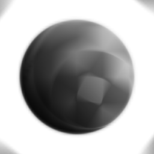

# 放射狀模糊

<table>
<tr style="border: 0;">
<td width="33.33%" style="border: 0;" valign="top">

<b>收錄於：</b> 模糊>濾鏡

</td>
<td width="100.00%" style="border: 0;" valign="top">

## 說明

在輸入時產生旋轉的動態模糊效果。

</td>
</tr>
</table>

## 參數

|  |  |
|:---|:---|
| <b>取樣</b> <i>1 - 128</i> | 設定模糊效果的品質。 |
| <b>角度</b> <i>0.0 - 0.5</i> | 設定效果的「旋轉」程度。 |
| <b>中心位置</b> | 設定效果的中心點。 |

## 範例

<table style="margin-top: 32px; margin-bottom: 32px">
    <tr style="border: 0">
        <td style="border: 0; background: transparent">
            
        </td>
    </tr>
</table>
