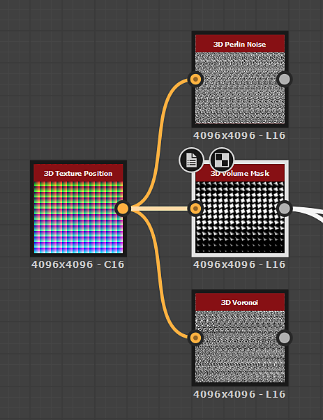

# 3D 貼圖位置

<table>
<tr style="border: 0;">
<td width="41.60%" style="border: 0;" valign="top">

{width="256px"}

**收錄於：***濾波器/效果*

**很簡單**

</td>
<td width="58.30%" style="border: 0;" valign="top">

## 說明

**3D 貼圖位置**&#x200B;節點會&#x200B;*產生單位立方體的位置切片*。

這可以用來烘焙 3D 雜訊，或作為 *3D 材質圖集*&#x200B;來運作。

</td>
</tr>
</table>

## 參數

沒有參數。

## 範例圖片

<table>
<tr style="border: 0;">
<td style="border: 0;" valign="top">

{width="256px"}

</td>
<td style="border: 0;" valign="top">

{width="128px"}

</td>
</tr>
</table>
