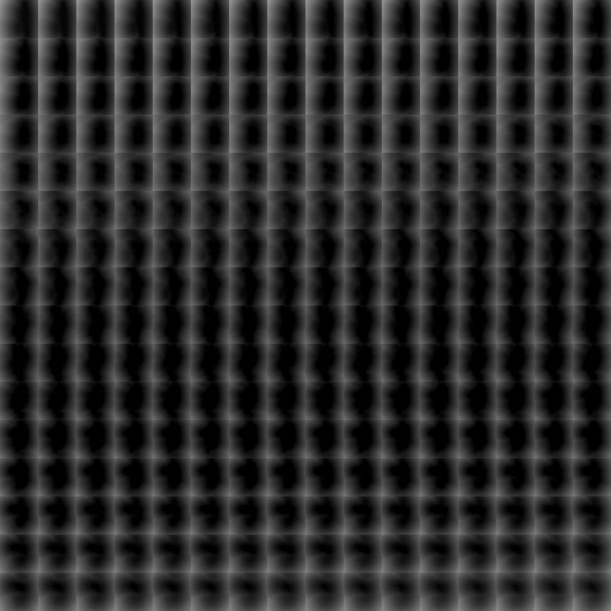

# 3D 貼圖 SDF

<table>
<tr style="border: 0;">
<td width="33.33%" style="border: 0;" valign="top">

{width="200px"}

<b>收錄於：</b> 濾波>效應

</td>
<td width="100.00%" style="border: 0;" valign="top">

## 說明

**3D Texture SDF** 節點會&#x200B;*從&#x200B;**輸入**&#x200B;的* 3D 材質&#x200B;*遮罩（代表形狀*&#x200B;體積&#x200B;*的切片）產生形狀的有符號距離場*。

</td>
</tr>
</table>

## 輸入

|  |  |
|:---|:---|
| <b>遮罩輸入</b> <i>灰階</i> | <i>3D 材質</i>遮罩代表形狀<i>體積</i>的切片。 |

## 參數

|  |  |
|:---|:---|
| <b>門檻</b> <i>浮標</i> | 當形狀體積以漸變梯度描述<i>時，會</i>設定形狀表面被<i>偵測到<i></i>的梯度</i>值。 |
| <b>產出</b> <i>整數</i> | 應輸出的距離場類型： - 距離場</i>：輸出描述形狀外</i>距離的距離<i>場。 - <i>有符號距離場</i>：輸出描述形狀外</i>（正）與<i>內部</i>（負）距離<i><i>的距離場。 |

## 範例

<table style="margin-top: 32px; margin-bottom: 32px">
    <tr style="border: 0">
        <td style="border: 0; background: transparent">
            
        </td>
        <td style="border: 0; background: transparent">
            
        </td>
        <td style="border: 0; background: transparent">
            
        </td>
    </tr>
</table>
