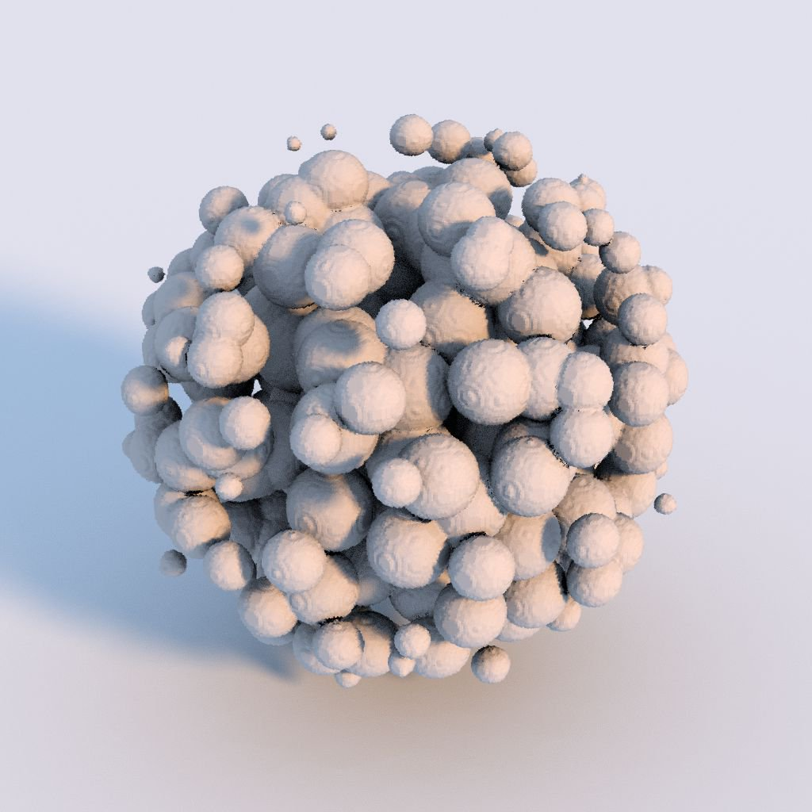

# 3D 貼圖表面渲染

<table>
<tr style="border: 0;">
<td width="33.33%" style="border: 0;" valign="top">

{width="200px"}

<b>收錄於：</b> 濾波>效應

</td>
<td width="100.00%" style="border: 0;" valign="top">

## 說明

**3D Texture Surface Render** 節點會渲染由 *3D 材質*&#x200B;描述的形狀表面，並利用其從 3D 距離場&#x200B;**影像輸入得到**&#x200B;的對應&#x200B;*距離場*。

該曲面在單位立方體&#x200B;*的範圍內*&#x200B;表示。光照是利用&#x200B;****&#x200B;環境輸入影像映射到無限球體來計算的。

>[!NOTE]
>
> 距離欄位預期為 **4096x4096** 的紋理，描述形狀，並以 **16x16** 格子，包含 256 個切片。\
> 你可以使用 [3D Texture SDF](../../../../../../compositing-graphs/nodes-reference-for-com/node-library/filters/effects/3d-texture-sdf/3d-texture-sdf.md) 節點來計算 256 個切片的 3D 貼圖的距離場。

</td>
</tr>
</table>

## 輸入

|  |  |
|:---|:---|
| <b>三維距離場</b> <i>灰階</i> | 這張 4096x4096 的影像代表形狀距離場</i>的 256 <i>個切片</i><i>，排列成 16x16 的格子。 你可以使用 [3D Texture SDF](../../../../../../compositing-graphs/nodes-reference-for-com/node-library/filters/effects/3d-texture-sdf/3d-texture-sdf.md) 節點來計算 256 個切片的 3D 貼圖的距離場。 |
| <b>環境</b> <i>顏色</i> | 代表環境的影像<i>應在渲染時映射到無限球體，並用於計算<i>光照</i>。</i> 當<b>背景模式</b>參數設為<i>環境<i></i>或環境</i>時，影像也用於渲染場景背景。 |

## 參數

|  |  |
|:---|:---|
| <b>輸出解析度</b> <i>整數2</i> | 輸出影像的解析度以 <b>X</b> 和 <b>Y</b> 表示，表示為 <i>二</i>的冪方。 |
| <b>攝影機位置</b> <i>Float2</i> | 相機在形狀周圍的位置。 當節點被選中後，你可以在 2D 視圖</b>中使用位置裝置<b>來繞<i>行</i>攝影機。 |
| <b>攝影機距離</b> <i>浮標</i> | 相機到形狀的距離。 |
| <b>攝影機視野</b> <i>浮標</i> | 相機的視野 <i>以度數</i>為單位。 |
| <b>阿貝多</b> <i>Float3</i> | 形狀表面的反照率顏色。 |
| <b>背景模式</b> <i>整數</i> | 表示渲染場景背景的方法： - <i>地面輻照度</i>：地面平面 計算出的輻射度- <i>環境</i>：環境影像輸入映射到無限球體的環境色</b><b>，類似於強烈模糊的影像 版本- <i>均勻色彩</i>：均勻填滿背景以指定顏色 - <i>環境</i>：<b>映射到無限球體的環境</b>影像輸入 |
| <b>背景色</b> <i>Float4</i> | 用於均勻填滿渲染場景背景的顏色。 <i>注意</i>：此參數僅在背景 <b>模式</b> 參數設為 <i>統一色彩</i>時可用。 |
| <b>啟用接地平面</b> <i>布林值</i> | 當 <i>True 時</i>，會渲染一個地面平面。 <i>包圍該形狀的單位立方體</i>就位於此平面上。 |
| <b>無限平面</b> <i>布林值</i> | 將地面平面設定為 <i>無限</i> 延伸至地平線。 <i>注意</i>：此參數僅在啟用 <b>地面平面</b> 參數設 <i>為 True</i> 時可用。 |
| <b>接地平面尺寸</b> <i>Float2</i> | 調整地面平面的大小。 <i>注意</i>：此參數僅在啟用地面平面</b>參數<i>設為 True</i>、<b>無限平面</b>參數<i>設為 False</i> 時可用<b>。 |

## 範例

<table style="margin-top: 32px; margin-bottom: 32px">
    <tr style="border: 0">
        <td style="border: 0; background: transparent">
            
        </td>
        <td style="border: 0; background: transparent">
            
        </td>
        <td style="border: 0; background: transparent">
            
        </td>
        <td style="border: 0; background: transparent">
            
        </td>
        <td style="border: 0; background: transparent">
            
        </td>
    </tr>
</table>
