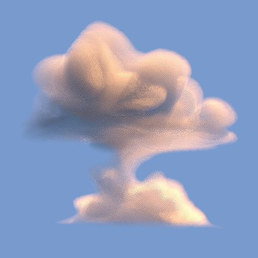
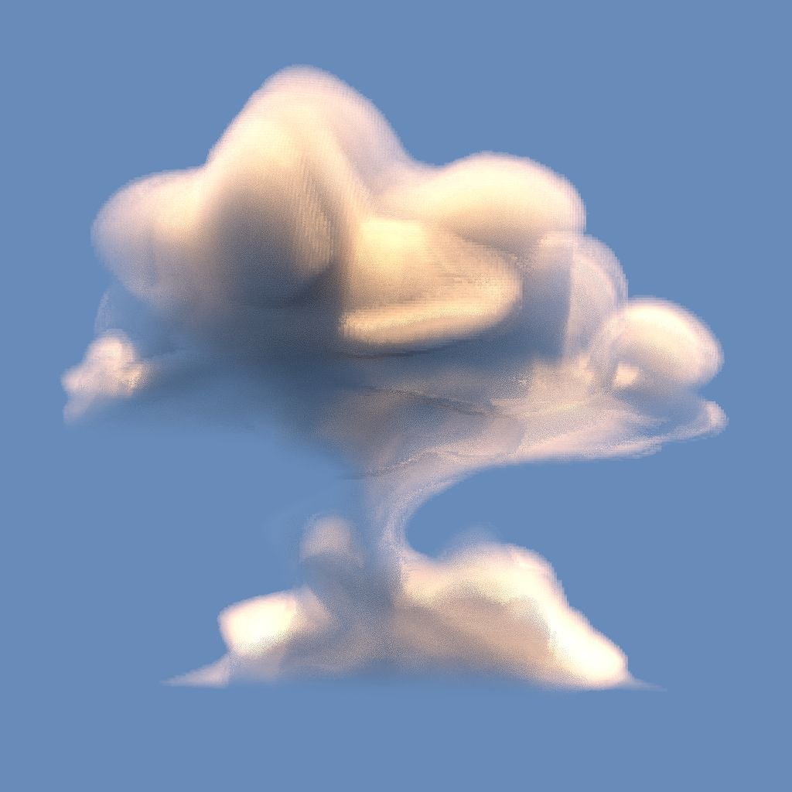

# 3D 貼圖體積渲染

<table>
<tr style="border: 0;">
<td width="33.33%" style="border: 0;" valign="top">

{width="200px"}

<b>收錄於：</b> 濾波>效應

</td>
<td width="100.00%" style="border: 0;" valign="top">

## 說明

**3D 紋理體積渲染**&#x200B;節點會根據&#x200B;**&#x200B;**&#x200B;3D 有符號距離場**&#x200B;影像輸入，渲染由 *3D 紋理*&#x200B;描述的形狀體積。

體積在單位立方&#x200B;*體的範圍內*&#x200B;表示。照明是利用 *定向光* 和 *半球形天窗*&#x200B;計算的。

>[!NOTE]
>
> 有符號距離欄位預期為 **一個 4096x4096** 的紋理，描述形狀，並以 **16x16** 格網，包含 256 個切片。\
> 你可以使用 [3D Texture SDF](../../../../../../compositing-graphs/nodes-reference-for-com/node-library/filters/effects/3d-texture-sdf/3d-texture-sdf.md) 節點來計算 256 個切片的 3D 貼圖的有符號距離場。

</td>
</tr>
</table>

## 輸入

|  |  |
|:---|:---|
| <b>3D 有符號距離場</b> <i>灰階</i> | 這張4096x4096的影像代表形狀有符號距離場</i>的256<i>個切片</i><i>，排列成16x16格子。 你可以使用 [3D Texture SDF](../../../../../../compositing-graphs/nodes-reference-for-com/node-library/filters/effects/3d-texture-sdf/3d-texture-sdf.md) 節點來計算 256 個切片的 3D 貼圖的有符號距離場。 |
| <b>密度</b> <i>灰階</i> | 4096x4096 的影像代表形狀密度</i>的 256 <i>切片</i><i>，排列成 16x16 格子。密度以灰階值映射，從 0（完全透明）到 1（完全不透明）。 你可以使用 [3D 體積遮罩](../../../../../../compositing-graphs/nodes-reference-for-com/node-library/texture-generators/patterns/3d-volume-mask/3d-volume-mask.md) 或 3D 雜訊節點（3D[&#x200B; Perlin Noise](../../../../../../compositing-graphs/nodes-reference-for-com/node-library/texture-generators/noises/3d-perlin-noise/3d-perlin-noise.md)、 [3D Voronoi](../../../../../../compositing-graphs/nodes-reference-for-com/node-library/texture-generators/noises/3d-voronoi/3d-voronoi.md)、 [3D Ridged Noise Fractal](../../../../../../compositing-graphs/nodes-reference-for-com/node-library/texture-generators/noises/3d-ridged-noise-fractal/3d-ridged-noise-fractal.md) 等），搭配 [3D 貼圖位置](../../../../../../compositing-graphs/nodes-reference-for-com/node-library/filters/effects/3d-texture-position/3d-texture-position.md) 節點作為位置輸入，產生一個包含 256 片的 3D 貼圖體積遮罩。 |

## 參數

|  |  |
|:---|:---|
| <b>輸出解析度</b> <i>整數2</i> | 輸出影像的解析度以 <b>X</b> 和 <b>Y</b> 表示，表示為 <i>二</i>的冪方。 |
| <b>攝影機位置</b> <i>Float2</i> | 相機在形狀周圍的位置。 當節點被選中後，你可以在 2D 視圖</b>中使用位置裝置<b>來繞<i>行</i>攝影機。 |
| <b>燈光位置</b> <i>Float2</i> | 指 <i>的是</i> 形狀周圍方向光的位置。 選中節點後，你可以在 2D 視圖</b>中使用位置裝置<b>繞<i>光源旋轉</i>。 |
| <b>攝影機距離</b> <i>浮標</i> | 相機到形狀的距離。 |
| <b>攝影機視野</b> <i>浮標</i> | 相機的視野 <i>以度數</i>為單位。 |
| <b>吸收</b> <i>浮標</i> | 調整光線通過體積時<i></i>吸收的量。 |
| <b>羽毛</b> <i>浮標</i> | 將密度</b>輸入所提供的<b>值乘以<i>內</i>距離場值。 這有效地調整了從體積外界向內的漸變漸變</i>寬<i>度。 |
| <b>淺色模式</b> <i>整數</i> | 設定取得方向性光顏色的方法： - <i>溫度（開爾文）：</i>顏色由光溫產生， <i>較低</i> 值則為 <i>較</i> 暖色 - <i>RGB 顏色</i>：使用 RGB 值定義顏色 |
| <b>光溫（開爾文）</b> <i>浮標</i> | 光線的定向溫度，影響其 <i>顏色</i>。 數值越 <i>低</i> ， <i>顏色越暖</i> 。 實用數值： 1800 K - 蠟燭光 2800 K - 白熾燈泡 5500 K - 日光 6200 K - 自然白光 7000 K - 陰天天空 <i>注意</i>：此參數僅在光 <b>色模式</b> 參數設為 <i>溫度（開爾文）</i>時可用。 |
| <b>淺色</b> <i>Float3</i> | 方向性燈光的顏色。 <i>注意</i>：此參數僅在光 <b>色模式</b> 參數設為 <i>RGB 色彩</i>時可用。 |
| <b>光強</b> <i>浮標</i> | 方向光的強度。 |
| <b>環境色彩</b> <i>Float3</i> | 環境天窗的顏色。 |
| <b>環境強度</b> <i>浮標</i> | 環境天窗的強度。 |
| <b>阿貝多</b> <i>Float3</i> | 體積的反照率顏色。 |
| <b>背景模式</b> <i>整數</i> | 根據背景色</b>來對渲染場景<b>背景進行陰影的方法： - <i>著色</i>：顏色會受到方向光<i>的顏色</i>與<i>強度</i> 影響- <i>恆定色彩</i>：顏色會均勻地施加<i>，不受</i>光源方向的影響 |
| <b>背景色</b> <i>Float4</i> | 用來填滿渲染場景背景的顏色。 |
| <b>抖動</b> <i>浮標</i> | 調整藍噪</i>的強度<i>，用來平滑陰影。 |
| <b>啟用接地平面</b> <i>布林值</i> | 當 <i>為真</i>時，會渲染一個 <i>無限的</i> 地面平面。 <i>包圍該形狀的單位立方體</i>就位於此平面上。 |
| <b>無限平面</b> <i>布林值</i> | 將地面平面設定為 <i>無限</i> 延伸至地平線。 <i>注意</i>：此參數僅在啟用 <b>地面平面</b> 參數設 <i>為 True</i> 時可用。 |
| <b>接地平面尺寸</b> <i>Float2</i> | 調整地面平面的大小。 <i>注意</i>：此參數僅在啟用地面平面</b>參數<i>設為 True</i>、<b>無限平面</b>參數<i>設為 False</i> 時可用<b>。 |

## 範例

<table style="margin-top: 32px; margin-bottom: 32px">
    <tr style="border: 0">
        <td style="border: 0; background: transparent">
            
        </td>
        <td style="border: 0; background: transparent">
            
        </td>
        <td style="border: 0; background: transparent">
            
        </td>
        <td style="border: 0; background: transparent">
            
        </td>
        <td style="border: 0; background: transparent">
            
        </td>
        <td style="border: 0; background: transparent">
            
        </td>
    </tr>
</table>
