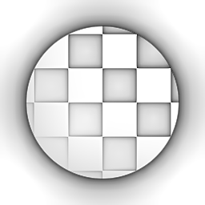

# 環境遮蔽（HBAO）（濾波節點）

<table>
<tr style="border: 0;">
<td style="border: 0;" valign="top">

{width="128px"}

## 環境遮蔽（HBAO）

**收錄於：***濾鏡/效果*

**中級**

</td>
<td style="border: 0;" valign="top">

## 說明

輸入高度圖，並產生環境遮蔽圖。 它使用基於地平線的環境遮蔽演算法，該演算法最初用於螢幕空間即時 AO 生成。 對於從程序式高度圖製作程序式AO地圖非常有用。

關於另一種更進階但較慢的 AO 版本，請參見 [環境遮蔽（RTAO）](../../../../../../compositing-graphs/nodes-reference-for-com/node-library/filters/effects/ambient-occlusion-rtao/ambient-occlusion-rtao.md)

## 參數

* **使用世界單位**： *虛假/真*&#x200B;切換：使用世界或場景空間單位。 能提供額外參數，讓控制更精確。
* **高度深度**： *0.0 - 1.0*&#x200B;僅在世界單位設定為 False 時使用。 控制全域縮放。
* **表面大小**： **0.0 - 1000.0**&#x200B;僅在世界單位設為 True 時使用。 控制全域縮放。
* **身高比例（公分）：***0.0 - 1000.0*&#x200B;僅在世界單位設定為 True 時使用。控制全域縮放。
* **半徑**： *0.0 - 1.0*&#x200B;控制區域的擴散。
* **品質**： *4 個樣本、8 個樣本、16 個樣本*\
  透過計算所用樣本數量來設定品質等級。
* **GPU 優化**： *錯誤/真*&#x200B;啟用內部 GPU 優化，加快處理速度。

## 範例圖片

| 

 | 

 |
| --- | --- |
|  |  |

</td>
</tr>
</table>
