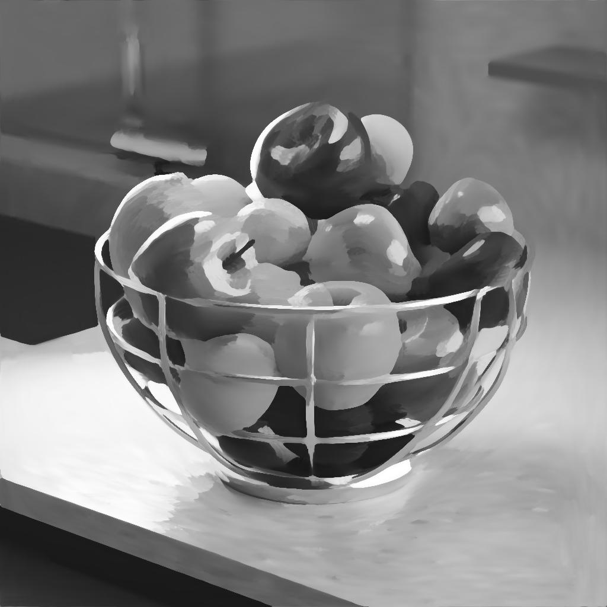

# 各向異性桑原灰階

<table>
<tr style="border: 0;">
<td width="33.33%" style="border: 0;" valign="top">

{width="200px"}

<b>收錄於：</b> 濾鏡>效應

</td>
<td width="100.00%" style="border: 0;" valign="top">

## 說明

套用各向異性方向模糊，符合影像細節。 結果是影像似乎 *沿著內部形狀的方向流動* 。

這種可調整的模糊會計算或接收方向 *圖* 來判斷該流動，並可將該流線銳化成更平坦、更清晰的區域。

另見： [各向異性桑原色](../anisotropic-kuwahara/anisotropic-kuwahara.md)

</td>
</tr>
</table>

流動也可以透過旋轉施加模糊的方向來分解。 同樣地，也可以使用自訂方向圖來覆蓋從影像中計算出來的方向圖。

此濾鏡能產生繪畫效果，且有助於風格化。

+++ 異向性

流動強度主要由 [各向](#parameters) 異性參數控制，如下圖所示。

左：各向異性 0.0 / 右：各向異性 1.0

<table>
<tr style="border: 0;">
<td style="border: 0;" valign="top">

{zoomable="yes"}

</td>
<td style="border: 0;" valign="top">

{zoomable="yes"}

</td>
</tr>
</table>

+++

## 輸入

|                                                       |                                                                                                                                                                                                                                                                                                                         |
|-------------------------------------------------------|-------------------------------------------------------------------------------------------------------------------------------------------------------------------------------------------------------------------------------------------------------------------------------------------------------------------------|
| <b>輸入</b> <i>灰階</i> <code>初級</code> | 應該處理的灰階影像。 |
| <b>各向異性角度圖</b> <i>灰階</i> | 灰階影像描述了對計算方向施加額外旋轉的效果，灰階值為轉數。   當「各向異性」參數設為 0 時，該映射仍有影響，因為它會影響桑原濾波器所用核的旋轉。 |
| <b>坡度圖</b> <i>灰階</i> | 該地圖代表方向圖所遵循的斜率，依據「斜率圖輸入乘數」參數值。 |
| <b>半徑地圖（可選）</b> <i>灰階</i> | 連接後，模糊的「半徑」會與輸入影像相乘。 |
| <b>方向圖</b> <i>顏色</i> | 描述各向異性濾波核所使用的方向的映射。   當「各向異性」參數設為 0 時，該映射仍有影響，因為它會影響桑原濾波器所用核的旋轉。   注意：此輸入僅在「使用輸入方向圖」參數設為「True」時使用。 |

## 輸出

|                                   |                                                                                                                                                                                                                                      |
|-----------------------------------|--------------------------------------------------------------------------------------------------------------------------------------------------------------------------------------------------------------------------------------|
| <b>產出</b> <i>灰階</i> | 節點對輸入影像施加各向異性模糊的結果。 |
| <b>方向圖</b> <i>顏色</i> | 方向圖是根據輸入影像計算出來，並用來驅動各向異性模糊。   若「使用輸入方向圖」參數設為「True」，則輸入「方向圖」所提供的影像會被使用，輸出則維持原樣。 |

## 參數

|                                                                                                                              |                                                                                                                                                                                                                                                                               |
|------------------------------------------------------------------------------------------------------------------------------|-------------------------------------------------------------------------------------------------------------------------------------------------------------------------------------------------------------------------------------------------------------------------------|
| <b>半徑</b> <i>浮標</i> | 模糊半徑，數值越大，模糊效果越強。   最高數值是32。 |
| <b>平滑度</b> <i>浮標</i> | 調整計算方向上顏色混合的程度。   當此值為 0 時，顏色大多會朝該方向移位，幾乎不會發生混合。 |
| <b>銳利度</b> <i>浮標</i> | 提升模糊區域的對比度，使其看起來更平坦且更清晰。 |
| <b>各向異性</b> <i>浮標</i> | 調整方向圖在模糊中的貢獻。   當參數值為 0 時，方向圖及其所有修飾符（包括參數與輸入映射）仍會受到影響，因為方向圖用於桑原濾波核。 |
| <b>使用輸入方向圖</b> <i>布林值</i> | 當為「真」時，輸入影像不會計算方向圖，而是用連接到「方向圖」輸入的影像來驅動各向異性模糊。 |
| <b>張量光滑度</b> <i>當「使用輸入方向圖」設為「False」時，浮點</i>  <i>可使用。</i> | 調整從影像計算並儲存在方向圖中的方向上的模糊強度。   提高這個數值能確保影像在高頻細節豐富時呈現更平滑的結果。 |
| <b>各向異性角</b> <i>當「使用輸入方向圖」設為「False」時，浮點</i>  <i>可使用。</i> | 在方向圖上加入旋轉，以轉數計算。   這個額外的旋轉是&#x200B;**&#x200B;與「各向異性角度圖」輸入所指定的旋轉累積的。 |
| <b>各向異性角度映射乘法</b> <i>當「使用輸入方向圖」設為「False」時，浮點</i>  <i>可使用。</i> | 調整「各向異性角度圖」輸入中的強度，這些值會以旋轉數相加到方向圖上。   這個額外的旋轉與「各向異性角」參數所指定的旋轉是 *累積* 的。 |
| <b>斜率圖輸入乘法</b> <i>當「使用輸入方向圖」設為「False」時，浮點</i>  <i>可使用。</i> | 調整方向圖與「斜率圖」輸入所提供斜率的強度。 |

## 範例

<table>
  <tr>
    <td>
      
       <i>之前</i>
    </td>
    <td>
      
       <i>之後</i>
    </td>
  </tr>
</table>

<table>
  <tr>
    <td>
      
       <i>之前</i>
    </td>
    <td>
      
       <i>之後</i>
    </td>
  </tr>
</table>

<table>
  <tr>
    <td>
      
       <i>之前</i>
    </td>
    <td>
      
       <i>之後</i>
    </td>
  </tr>
</table>
