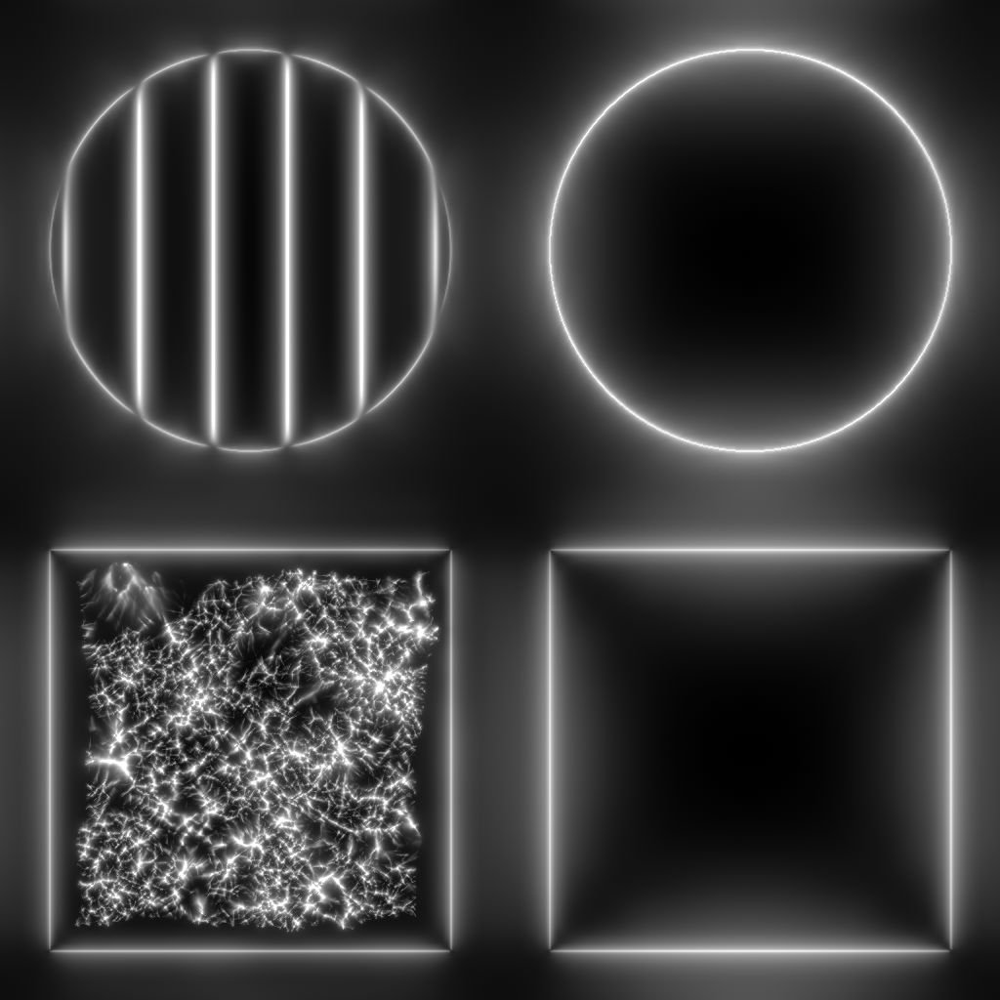

# 曲率平滑

<table>
<tr style="border: 0;">
<td width="33.33%" style="border: 0;" valign="top">

{width="200px"}

<b>收錄於：</b> 濾鏡>效應

</td>
<td width="100.00%" style="border: 0;" valign="top">

## 說明

計算由法線貼圖描述的曲率。

曲率圖代表曲面的凹面與凸面。\
平坦區域為50%為灰色。 凸面較亮，凹面較暗。

</td>
</tr>
</table>

凹面與凸面區域也被獨立輸出，方便根據這些特性選擇或遮蔽區域。

>[!TIP]
>
> 可以考慮 [Curvature](../../../../../../compositing-graphs/nodes-reference-for-com/node-library/filters/effects/curvature-filter-node/curvature-filter-node.md) 想要更銳利的版本，如果[需要更多選項，也可以考慮 Curvature Sobel](../../../../../../compositing-graphs/nodes-reference-for-com/node-library/filters/effects/curvature-sobel/curvature-sobel.md) 。

## 輸入

|  |  |
|:---|:---|
| <b>正常</b> <i>顏色</i> <b>小學</b> | 描述應計算曲率曲率的法線映射。 |

## 輸出

|  |  |
|:---|:---|
| <b>曲率</b> <i>灰階</i> | 曲率映射是從輸入法線映射中計算出來的。   平坦區域為50%為灰色。 凸面較亮，凹面較暗。 |
| <b>凸性</b> <i>灰階</i> | 由輸入法向映射計算出凸性映射。   一個區域越凸，地圖上就越亮。  平坦或凹陷的區域為黑色。 |
| <b>凹陷</b> <i>灰階</i> | 凹面映射是從輸入法線映射中計算出來的。   區域越凹，地圖上越亮。  平坦或凸起的區域則為黑色。 |

## 參數

|  |  |
|:---|:---|
| <b>標準格式</b> *整數* | 輸入法線貼圖的格式。 這有效地將綠色通道反轉。<ul data-preserve-html="true"> <li data-preserve-html="true"><b>DirectX：</b> Y 軸指向上方</li> <li data-preserve-html="true"><b style="">OpenGL：</b> Y 軸指向下方</li> </ul> |

## 範例

<table>
  <tr>
    <td>
      
       <i>之前</i>
    </td>
    <td>
      
       <i>之後</i>
    </td>
  </tr>
</table>

<table>
<tr style="border: 0;">
<td style="border: 0;" valign="top">

{zoomable="yes"}

</td>
<td style="border: 0;" valign="top">

{zoomable="yes"}

</td>
</tr>
</table>

<table>
  <tr>
    <td>
      
       <i>之前</i>
    </td>
    <td>
      
       <i>之後</i>
    </td>
  </tr>
</table>

<table>
<tr style="border: 0;">
<td style="border: 0;" valign="top">

{zoomable="yes"}

</td>
<td style="border: 0;" valign="top">

{zoomable="yes"}

</td>
</tr>
</table>
