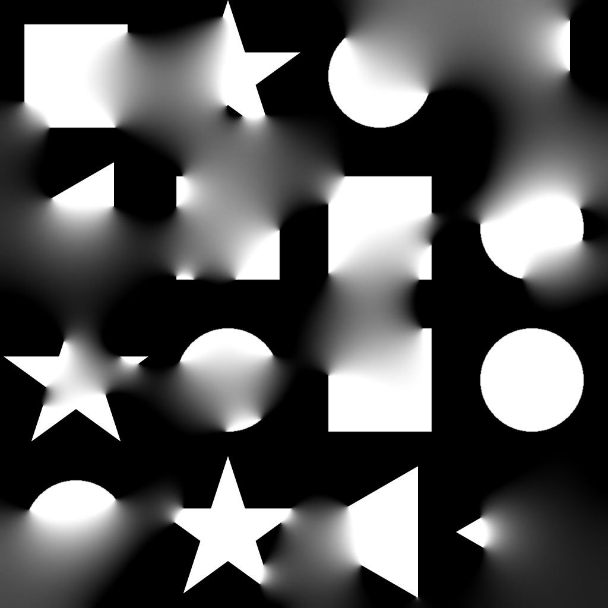

# 擴散灰階

<table>
<tr style="border: 0;">
<td width="41.60%" style="border: 0;" valign="top">

{width="200px"}

**收錄於：***濾鏡/效果*

**中級**

</td>
<td width="58.30%" style="border: 0;" valign="top">

## 說明

根據提供的&#x200B;**遮罩**&#x200B;影像輸入，對來源&#x200B;**影像輸入的數值**&#x200B;施加擴散處理，創造平滑的數值漸層。

只有與遮罩相符的像素值會被擴散;其他像素不參與結果。

</td>
</tr>
</table>

## 參數

* **迭代**&#x200B;次數： *0.0 - 64.0*&#x200B;擴散迭代次數（越多越好但越慢）。 有用的數值約為[8， 48]範圍。\
  請注意，如果你不追求數學正確性，低數值也沒問題，甚至更好。\
  **距離**： **0.0 - 1.0**&#x200B;調整擴散的最大距離。
* **啟用抖動**： *真/假*&#x200B;控制每次通過的取樣方法。 抖動允許收斂次數較少，但會引入雜訊。\
  沒有它，每次通過速度會更快，但要達到平滑且不產生帶狀偽影的效果，仍需多次通過。

## 輸入

* **資料來源***：灰階*\
  影像要擴散。
* **面具***灰階*\
  擴散遮罩：在Source *中取*&#x200B;樣白色像素，並在黑色像素中擴散。圖片應該是黑白的。 若遮罩包含梯度，截止值為 0.5。
* **強度***灰階*\
  定義局部擴散過程的強度。 這張地圖應該對 *比* ，才能有明顯效果。

## 範例圖片

<table>
<tr style="border: 0;">
<td style="border: 0;" valign="top">

{width="256px"}

</td>
<td style="border: 0;" valign="top">

{width="256px"}

</td>
<td style="border: 0;" valign="top">

{width="256px"}

</td>
</tr>
</table>

<table>
<tr style="border: 0;">
<td style="border: 0;" valign="top">

{width="256px"}

</td>
<td style="border: 0;" valign="top">

{width="256px"}

</td>
<td style="border: 0;" valign="top">

{width="512px"}

</td>
</tr>
</table>
