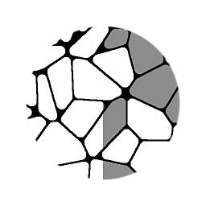

# 從洪水填充到灰階/彩色

<table>
<tr style="border: 0;">
<td width="33.33%" style="border: 0;" valign="top">

{width="128px"}

{width="128px"}

<b>收錄於：</b> 濾鏡>效應

</td>
<td width="100.00%" style="border: 0;" valign="top">

## 說明

使用泛光填充資料產生灰階或色彩值色片。 與 [從洪水填充到隨機灰階](../../../../../../compositing-graphs/nodes-reference-for-com/node-library/filters/effects/flood-fill-random-gra/flood-fill-to-random-grayscale.md)不同，這兩個節點允許更多控制來設定精確的變化與音調，並額外提供一個輸入映射，以決定每個單元的基准值。

這是一個強大的系統，能賦予每個細胞獨特的數值或顏色，同時仍保有控制權，並基於預設輸入來決定。

</td>
</tr>
</table>

## 輸入

|  |  |
|:---|:---|
| <b>洪水填埋</b> <i>色彩輸入</i> |  |
| <b>灰階/彩色輸入</b> <i>灰階/彩色輸入</i> |  |

## 參數

|  |  |
|:---|:---|
| <b>亮度/色彩調整</b> <i>-1.0 - 1.0</i> | 設定節點的偏壓或基準值。 當使用灰階或彩色輸入時，會用來改變該初始值作為起點。 |
| <b>亮度/顏色隨機</b> <i>-1.0 - 1.0</i> | 設定變化的程度。 |
