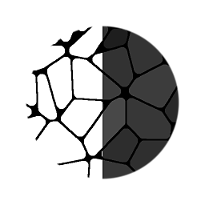

# 注水至BBox尺寸

<table>
<tr style="border: 0;">
<td style="border: 0;" valign="top">

{width="128px"}

## 注水至BBox尺寸

**收錄於：***濾鏡/效果*

**很簡單**

</td>
<td style="border: 0;" valign="top">

## 說明

從 [洪水填充](../../../../../../compositing-graphs/nodes-reference-for-com/node-library/filters/effects/flood-fill/flood-fill.md) 基底生成灰階地圖，並將數值綁定於每個圖塊的個別大小。

數值是相對於整個畫布大小（全白磁磚會拉伸整個畫布），因此對比度通常較低。

## 參數

* **輸出**： *max（X， Y）， X， Y*&#x200B;設定該值基於的度量：寬度、長度或兩者兼有。

## 範例圖片

| 

 |
| --- |
|  |

</td>
</tr>
</table>
