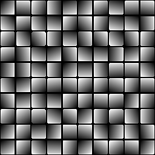

# 從淹水填土到梯度

<table>
<tr style="border: 0;">
<td style="border: 0;" valign="top">

{width="128px"}

## 從淹水填土到梯度

**收錄於：***濾鏡/效果*

**很簡單**

</td>
<td style="border: 0;" valign="top">

## 說明

將 [洪水填充](../../../../../../compositing-graphs/nodes-reference-for-com/node-library/filters/effects/flood-fill/flood-fill.md) 基底轉換成（隨機定向的）漸層。 對於製作一個隨機傾斜和傾斜的高度圖非常有用。

## 參數

### 輸入

* **泛光填充**： *色彩輸入*&#x200B;底色泛光填充資料。
* **角度輸入**： *灰階輸入*\
  視角圖用於用外部圖來判定每格子的角度。
* **斜坡輸入**： *灰階輸入*&#x200B;可選地圖以判定每單元梯度邊坡強度。

### *參數*

* **角度**： *0.0 - 1.0*&#x200B;設定所有圖塊的統一全局角度/方向。
* **角度變化**： *0.0 - 1.0*&#x200B;每個方塊的角度會隨機化。 這是最有用且最強大的參數！
* **乘以邊界盒大小**： *0.0 - 1.0*&#x200B;將整個線性效果放大為瓦片的個別邊界盒大小。 這代表較小的格子會比較大的格子顏色更深。
* **角度影像輸入乘法**： *0.0 - 1.0*&#x200B;可選角度輸入貼圖對產生的漸層方向產生影響
* **斜坡影像輸入倍率**： *0.0 - 1.0*\
  設定可選的坡度輸入地圖對生成的梯度坡度強度的影響。
* **乘以坡度強度**： *0.0 - 1.0*
* **平坡顏色**：*（灰階值）*允許設定平坦斜坡的實心值。

## 範例圖片

| 

 | 

 |
| --- | --- |
|  |  |

</td>
</tr>
</table>
