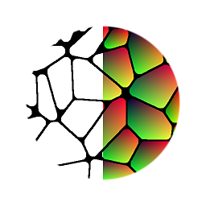

# 洪水填埋

<table>
<tr style="border: 0;">
<td style="border: 0;" valign="top">

{width="128px"}

## 洪水填埋

**收錄於：***濾鏡/效果*

**很簡單**

</td>
<td style="border: 0;" valign="top">

## 說明

洪水填充是進階效果的一部分，讓你能為基本的二進位磚塊貼圖增添更多變化。 它並非單獨使用，而是作為其他洪水填充效果的起點。 這種分割且獨立的資料，讓工作流程更具動態性、優化性且破壞性較低。

其他泛洪填充效果包括[：從泛濫填充到漸層](../../../../../../compositing-graphs/nodes-reference-for-com/node-library/filters/effects/flood-fill-to-gradient/flood-fill-to-gradient.md)、[泛洪填充到色彩/灰階](../../../../../../compositing-graphs/nodes-reference-for-com/node-library/filters/effects/flood-fill-grayscale-col/flood-fill-to-grayscale-color.md)、[泛光填充到隨機灰階](../../../../../../compositing-graphs/nodes-reference-for-com/node-library/filters/effects/flood-fill-random-gra/flood-fill-to-random-grayscale.md)、泛光填充到隨機顏色[&#128279;](../../../../../../compositing-graphs/nodes-reference-for-com/node-library/filters/effects/flood-fill-random-color/flood-fill-to-random-color.md)、[泛光填充到BBox大小](../../../../../../compositing-graphs/nodes-reference-for-com/node-library/filters/effects/flood-fill-to-bbox-size/flood-fill-to-bbox-size.md)、[泛洪填充到位置](../../../../../../compositing-graphs/nodes-reference-for-com/node-library/filters/effects/flood-fill-to-position/flood-fill-to-position.md)、[泛洪填充映射器](../../../../../../compositing-graphs/nodes-reference-for-com/node-library/filters/effects/flood-fill-mapper/flood-fill-mapper.md)和[泛洪填充到索引](../../../../../../compositing-graphs/nodes-reference-for-com/node-library/filters/effects/flood-fill-to-index/flood-fill-to-index.md)

>[!WARNING]
>
> 輸入映射必須符合洪水填充（Flood Fill）才能運作。 理想狀況下，它是二元映射（僅黑/白，無灰階），每個圖塊與其他線條之間都被一個全黑邊框分隔，每個像素都用全黑（0,0,0）。 一個完美的候選例子是 [瓦片產生器](../../../../../../compositing-graphs/nodes-reference-for-com/node-library/texture-generators/patterns/tile-generator/tile-generator.md)。
> 
> 若磚塊間未以全黑像素分隔，通常在使用灰階斜度值時，會出現問題。 你可以從整體沒有紅色值，以及可能出現奇怪的瑕疵線來辨識。 此時，調整輸入映射的對比度或切換輸入映射。 記得調整安全/速度的權衡設定，看看是否有改善。

## 參數

* **安全與速度的權衡**：*簡單或小形狀，複雜或大型形狀，無故障模式。*將計算模式設定為最適合輸入形狀。 如果選擇正確的模式，能獲得更精確的結果。
* **Avanced 選項**： *顯示進階參數並輸出/隱藏進階參數與輸出*
* **覆蓋安全/速度權衡**： *-1 - 100*&#x200B;僅開啟進階選項時可見。 允許覆蓋內部功能。 非常進階，主要用來製作自己的特效或除錯。

## 範例圖片

| 

 | 

 |
| --- | --- |
|  |  |

洪水填海的好壞結果範例。

</td>
</tr>
</table>
