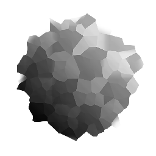

# 馬賽克

<table>
<tr style="border: 0;">
<td width="33.33%" style="border: 0;" valign="top">

{width="128px"}

{width="128px"}

<b>收錄於：</b> 濾鏡>效應

</td>
<td width="100.00%" style="border: 0;" valign="top">

## 說明

透過多重穿越 [曲速](../../../../../../compositing-graphs/nodes-reference-for-com/atomic-nodes/warp/warp.md) 效果，將現有的平滑斜度梯度地圖「Facetising」。 當同一張地圖同時用於兩個輸入時，它會放大並強調最亮的區域。

這對於為灰階貼圖（如 Heightmap）增添更多細緻度很有用，因為它能為形狀帶來更多細緻度。

</td>
</tr>
</table>

## 輸入

|  |  |
|:---|:---|
| <b>顏色</b> <i>色彩/灰階輸入</i> |  |
| <b>馬賽克地圖</b> <i>灰階輸入</i> | 曲速引擎地圖。 可以和第一次輸入一樣。 |

## 參數

|  |  |
|:---|:---|
| <b>取樣</b> <i>0 - 16</i> | 決定多樣本品質。 |
| <b>強度</b> <i>0.0 - 1.0</i> | 效果的強度。 |

## 範例

<table style="margin-top: 32px; margin-bottom: 32px">
    <tr style="border: 0">
        <td style="border: 0; background: transparent">
            
        </td>
    </tr>
</table>
