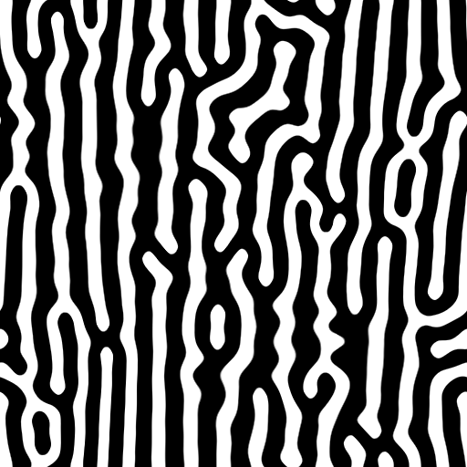

# 反應擴散快處理

<table>
<tr style="border: 0;">
<td width="33.33%" style="border: 0;" valign="top">

<b>收錄於：</b> 濾鏡>效應

</td>
<td width="100.00%" style="border: 0;" valign="top">

## 說明

此節點對輸入的灰階影像執行反應擴散效應。

反應擴散是一種物質擴散（擴散）並與其他物質相互作用（反應）的過程。 它是一個數學模型，模擬自然界中在動物皮膚上形成特定圖案時所發生的情況。

這個節點是為了效能優化的，並且在速度上做了一些準確度的取捨。

</td>
</tr>
</table>

## 輸入

|  |  |
|:---|:---|
| <b>輸入</b> <i>灰階</i> | 反應擴散效應應該應用在灰階影像上。 |

## 輸出

|  |  |
|:---|:---|
| <b>產出</b> <i>灰階</i> | 灰階影像代表作用擴散效果，應用於輸入影像。 |

## 參數

|  |  |
|:---|:---|
| <b>半徑</b> *浮標* | 影響應該擴散到多遠。 |
| <b>對比</b> *浮標* | 調整輸入的對比度，作為一種阻擋。 |

## 範例

<table>
<tr style="border: 0;">
<td style="border: 0;" valign="top">

</td>
<td style="border: 0;" valign="top">

</td>
<td style="border: 0;" valign="top">

</td>
</tr>
</table>
