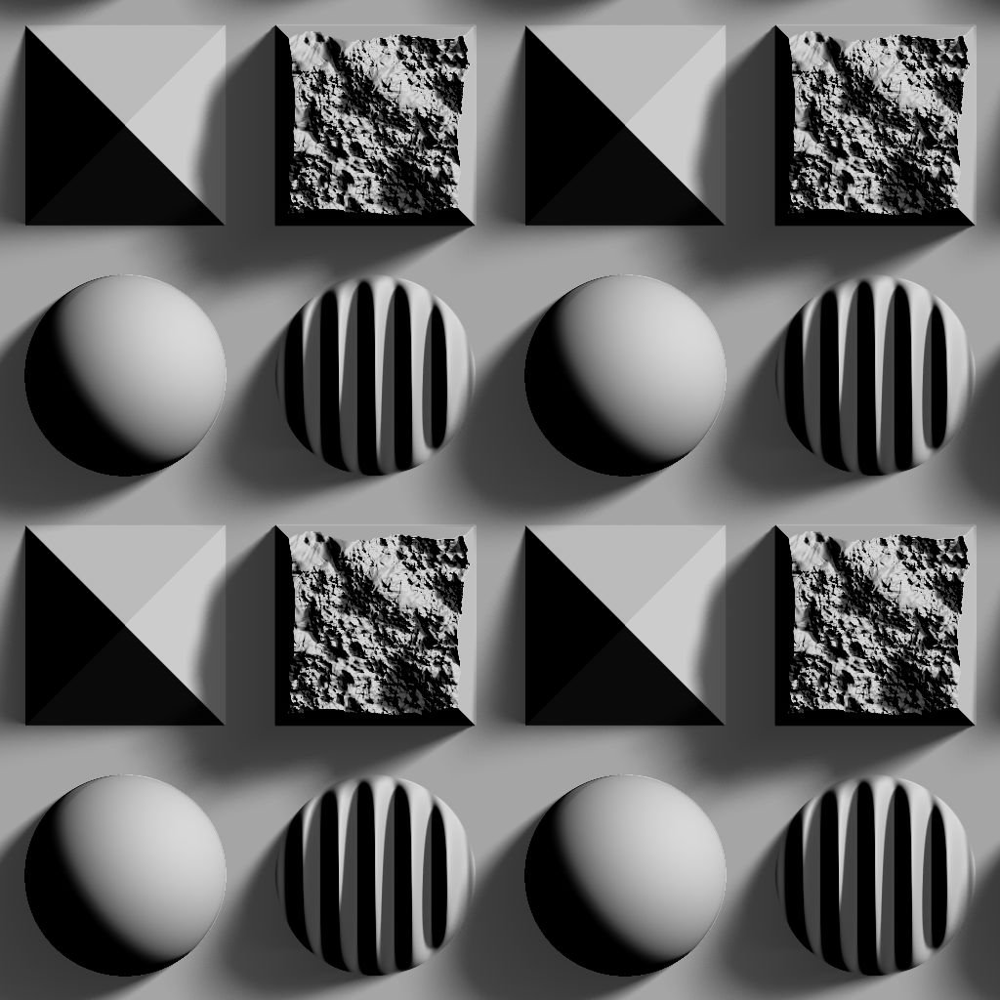

# RT 陰影

<table>
<tr style="border: 0;">
<td width="33.33%" style="border: 0;" valign="top">

<b>收錄於：</b> 濾鏡>效應

</td>
<td width="100.00%" style="border: 0;" valign="top">

## 說明

從高度圖輸入產生光線追蹤陰影。

由於計算時間，此節點不應與 CPU（SSE）引擎搭配使用。

</td>
</tr>
</table>

## 參數

|  |  |
|:---|:---|
| <b>取樣</b> <i>整數</i> | 計算陰影所使用的光線數量。 較高的數值能提供更平滑且精確的結果，但代價是效能下降。 |
| <b>模式</b> <i>整數</i> | 畫出表面陰影的方法。 |
| <b>身高比例</b> <i>浮標</i> | 輸入高度圖強度的乘數。 |
| <b>燈光位置</b> <i>Float2</i> | 光源在包圍表面的球體上的位置：  - <b>X</b>：水平位置，以旋轉數表示; - <b>Y</b>：垂直位置，0.5為天頂，0/1為地平線。 |
| <b>光強</b> <i>浮標</i> | 光源的強度。 |
| <b>光線尺寸</b> <i>Float2</i> | （當 <b>模式</b> 設為 <i>陰</i>影）光源大小為矩形。 |
| <b>光線比例（柔和陰影）</b> <i>浮標</i> | 光線</b>大小對光線方向的貢獻<b>為乘數。 數值越高，陰影越平滑。 |
| <b>讓光明在地平線上</b> <i>布林值</i> | 如果 <b>光線位置</b> 設定為將光線置於地平線以下，這個參數會防止光線越過該門檻，意即 Y 值會被限制在 [0;1] 範圍。 |
| <b>陰影不透明度</b> <i>浮標</i> | 是陰影不透明度的倍數。 |
| <b>影子衰減</b> <i>浮標</i> | 陰影與投射者距離越遠，陰影衰減的乘數。 值為0則陰影均勻（柔和陰影仍適用）。 |
| <b>最大陰影長度</b> <i>浮標</i> | 陰影與施法者最大可拉出的距離。 值為0則不會出現可見陰影。 |

## 範例

<table style="margin-top: 32px; margin-bottom: 32px">
    <tr style="border: 0">
        <td style="border: 0; background: transparent">
            
        </td>
        <td style="border: 0; background: transparent">
            
        </td>
        <td style="border: 0; background: transparent">
            
        </td>
    </tr>
</table>
