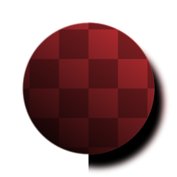

# 形狀滴影

<table>
<tr style="border: 0;">
<td style="border: 0;" valign="top">

{width="128px"}

{width="128px"}

## 形狀滴影（灰階）

**收錄於：***濾鏡/效果*

**中級**

</td>
<td style="border: 0;" valign="top">

## 說明

在輸入黑白遮罩（灰階版本）或帶透明影像（彩色版本）上，執行其他 2D 影像處理軟體中著名的「投影陰影」效果。

它與 [陰影](../../../../../../compositing-graphs/nodes-reference-for-com/node-library/filters/effects/shadows-filter-node/shadows-filter-node.md) 效果不同，因為它回傳的是全透明的影像，使得更完整的效果，類似於其他軟體的預期。

## 參數

* **角度**： *0.0 - 1.0*（假）光的入射角。
* **距離**： *-0.5 - 0.5*&#x200B;陰影下降至或遠離形狀的距離。
* **大小**： *0.0 - 1.0*&#x200B;控制陰影模糊/模糊。
* **擴散**： *0.0 - 1.0*&#x200B;遮斷/遮蔽效果，讓陰影擴散得更遠。
* **不透明度**： *0.0 - 1.0*\
  為了陰影效果而混合不透明度。
* **（陰影）顏色**：*（色彩值）*要加在陰影上的色彩色調。
* **遮罩顏色**：*（色彩值）*（僅限灰階版本）**用於透明映射輸出的純色。
* **輸入是預先乘法**&#x200B;的：*假/真*（僅限彩色版本）**是否應假設輸入為預先乘法。
* **預乘法輸出**： *假/真*&#x200B;輸出是否應預先乘法。

## 範例圖片

| 

 |
| --- |
|  |

</td>
</tr>
</table>
