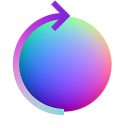

# 法向量旋轉

<table>
<tr style="border: 0;">
<td width="33.33%" style="border: 0;" valign="top">

{width="128px"}

<b>收錄於：</b> 法線貼圖>濾波器

</td>
<td width="100.00%" style="border: 0;" valign="top">

## 說明

一個法線工具節點，能旋轉輸入法線貼圖的所有向量，位於切線空間中。 它其實不是在轉換像素，而是改變像素所代表的數值。 它也可以利用可選的貼圖，為灰階面增加隨機旋轉。

</td>
</tr>
</table>

## 輸入

|  |  |
|:---|:---|
| <b>正常</b> <i>色彩輸入</i> | 用來進行旋轉的基底地圖。 必要資訊。 |
| <b>旋轉映射（可選）</b> <i>灰階輸入</i> | 可以調節旋轉強度的灰階地圖。 |

## 參數

|  |  |
|:---|:---|
| <b>旋轉角</b> <i>0.0 - 1.0</i> | 設定旋轉法線貼圖的角度 |
| <b>一般格式</b> <i>DirectX、OpenGL</i> | 切換不同的法線貼圖格式（反轉綠色通道） |
