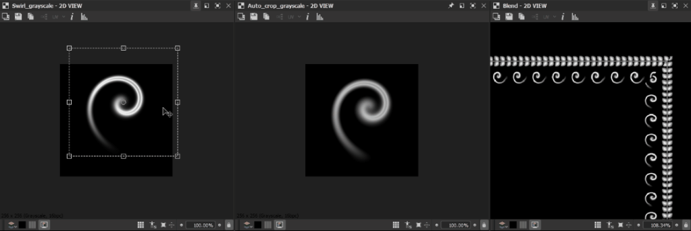
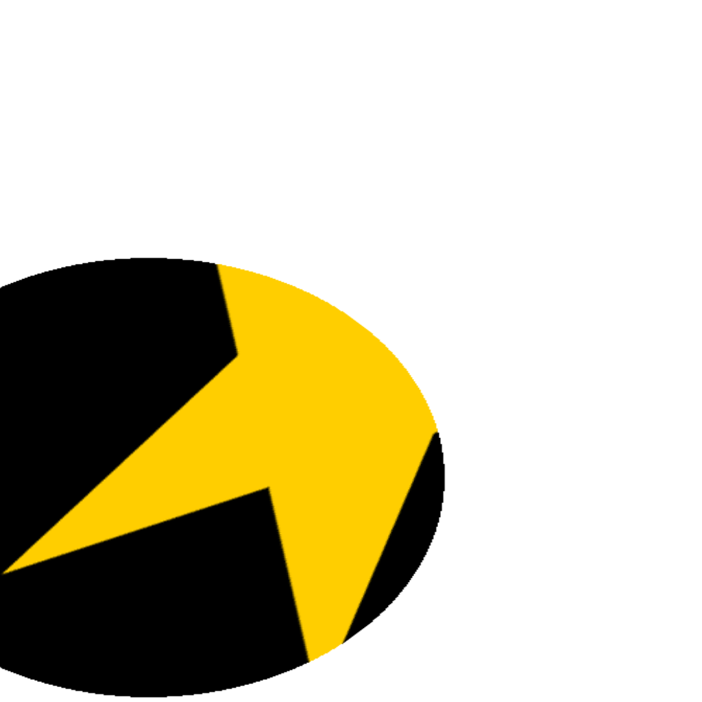

# 自動裁切

<table>
<tr style="border: 0;">
<td width="41.60%" style="border: 0;" valign="top">

<table>
<tr style="border: 0;">
<td style="border: 0;" valign="top">

{width="200px"}

</td>
<td style="border: 0;" valign="top">

{width="200px"}

</td>
</tr>
</table>

**收錄於：** 濾波器*/變換*

**很簡單**

</td>
<td width="58.30%" style="border: 0;" valign="top">

## 說明

**自動裁切**&#x200B;節點會&#x200B;**調整輸入**，使其內容要麼放在&#x200B;*圖片中央*&#x200B;且不調整大小，要麼&#x200B;*調整大小至影像的長度*。

影像內容由一個框定義，該框貼合在 X 和 Y 的首尾像素上，該值&#x200B;*大*&#x200B;於 0 *（即非黑色）。**&#x200B;**&#x200B;**&#x200B;**&#x200B;***彩色**&#x200B;版本允許你從 RGB 和 Alpha 通道中選擇來定義該框。

</td>
</tr>
</table>

## 參數

* **模式整***數*&#x200B;設定應應用的裁切方法：
  * *裁切方格*：將影像裁切成形狀位於最小正方形影像的中心 *，該正方* 形能完整包含該方形
  * *自動*&#x200B;裁切：將影像裁切成形狀位於最小的正方形或非正方形&#x200B;*影像中心*，該影像能完整包含該形狀
  * *貼合（保持比例）：*&#x200B;將影像調整至 *影像的整個展度* ，同時保持 *其比例* （即寬度與長度的比例）
  * *填充（拉伸）：*&#x200B;將影像調整至&#x200B;*整個影像的範圍*
* **使用 alpha** *布林*&#x200B;利用輸入&#x200B;**的** alpha 通道來決定影像內容&#x200B;*的裁切範圍*。當設定為 *False* 時，則會使用黑色像素。\
  *注意*：此參數僅在 **節點的 Color** 版本中提供。
* **濾波模式***整數*&#x200B;定義了在插&#x200B;*值像素時如何處理取樣結果*：
  * *最近*：會取 *樣完全相同的* 值（更快）
  * *雙線性*：會對結果套用雙線性濾波器，讓畫面更&#x200B;**&#x200B;平滑
  * *自動*：根據裁切選擇&#x200B;**&#x200B;**&#x200B;的模式，使用上述兩種模式中最合適的

## 範例圖片

<table>
<tr style="border: 0;">
<td style="border: 0;" valign="top">

{width="768px"}

</td>
<td style="border: 0;" valign="top">

{width="256px"}

</td>
<td style="border: 0;" valign="top">

{width="128px"}

</td>
<td style="border: 0;" valign="top">

{width="256px"}

</td>
<td style="border: 0;" valign="top">

{width="256px"}

</td>
<td style="border: 0;" valign="top">

{width="420px"}

</td>
</tr>
</table>
