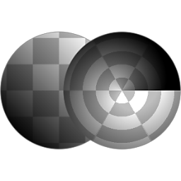

# 笛卡兒到極地

<table>
<tr style="border: 0;">
<td style="border: 0;" valign="top">

{width="128px"}

{width="128px"}

## 笛卡兒到極地（灰階）

**收錄於：***濾波器/轉換*

**很簡單**

</td>
<td style="border: 0;" valign="top">

## 說明

將輸入的笛卡兒座標（X&amp;Y）轉換為極座標（角度與半徑）。 極座標到笛卡兒[&#128279;](../../../../../../compositing-graphs/nodes-reference-for-com/node-library/filters/transforms/polar-to-cartesian/polar-to-cartesian.md)則可逆轉。

## 參數

*沒有參數。*

## 範例圖片

| 

 |
| --- |
|  |

</td>
</tr>
</table>
