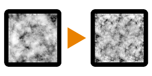

# 噪音升級3

<table>
<tr style="border: 0;">
<td style="border: 0;" valign="top">

{width="128px"}

## 噪音升級3

**收錄於：***濾波器/轉換*

**很簡單**

</td>
<td style="border: 0;" valign="top">

## 說明

它會將輸入噪音程序放大到雙倍解析度，保留細節但不會引入過多平鋪。 使用使用者自訂遮罩，將噪音混合到原始縮放之上。

這個節點主要用來優化使用重且大雜訊的慢速圖形。 它讓你能使用更高解析度，且不會增加太多額外的運算時間。

另 [見 Noise Upscale 1](../../../../../../compositing-graphs/nodes-reference-for-com/node-library/filters/transforms/noise-upscale-1/noise-upscale-1.md) 和 [Noise Upscale 2](../../../../../../compositing-graphs/nodes-reference-for-com/node-library/filters/transforms/noise-upscale-2/noise-upscale-2.md)，這兩款在多數情況下在隱藏平鋪方面稍好一些。

## 參數

### 輸入

* **灰階**： *灰階輸入*\
  目標雜訊影像。
* **遮罩**： *灰階輸入*\
  遮罩槽用於遮蔽節點的效果。

*沒有參數。*

## 範例圖片

| 

 |
| --- |
|  |

</td>
</tr>
</table>
