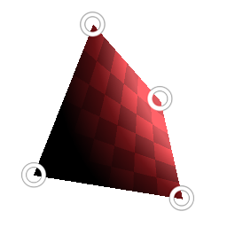

# 四邊變換

<table>
<tr style="border: 0;">
<td width="33.33%" style="border: 0;" valign="top">

{width="128px"}

{width="128px"}

<b>收錄於：</b> 《濾波器>轉換》

</td>
<td width="100.00%" style="border: 0;" valign="top">

## 說明

特殊的轉換節點，允許透過與角點互動來變換四邊形。 允許以非常具體的變身方式進行實務操作。

</td>
</tr>
</table>

## 參數

|  |  |
|:---|:---|
| <b>p00</b> | 左上角。 |
| <b>第01頁</b> | 左下角 |
| <b>第10頁</b> | 右上角。 |
| <b>第11頁</b> | 右下角。 |
| <b>淘汰</b> <i>只在前面，只在後面，前面對後，後面在前面</i> | 設定點交叉時的剔除/隱藏形狀。 |
| <b>啟用平鋪</b> <i>錯誤/真實</i> |  |
| <b>背景色</b> <i>（灰階）</i> | 如果瓷磚不對，背景色會是實色。 |
| <b>抽樣</b> <i>雙線性，最近</i> | 設定取樣品質。 |

## 範例

<table style="margin-top: 32px; margin-bottom: 32px">
    <tr style="border: 0">
        <td style="border: 0; background: transparent">
            
        </td>
    </tr>
</table>
