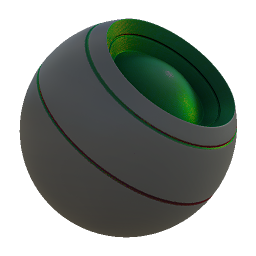

# 材料調整混合

<table>
<tr style="border: 0;">
<td style="border: 0;" valign="top">

{width="128px"}

## 材料調整混合

**收錄於：***材質濾鏡/混合*

**中級**

</td>
<td style="border: 0;" valign="top">

## 說明

此節點允許根據遮罩調整完整材料的任何通道。 它的目的是讓整個材料的工作流程更簡單且快速。

當你想調整材質的幾個通道（例如讓漫反射更亮、粗糙度變暗）時，它很有用。

## 參數

### 輸入

* **色彩識別遮罩**： *色彩輸入*\
  遮罩槽用於遮蔽節點的效果。
* **灰階遮罩**： *灰階輸入*\
  遮罩槽用於遮蔽節點的效果。

### 參數

* **頻道**\
  在這個群組中切換材質通道，例如使用高光/光澤貼圖而非金屬/粗糙度時。\
  這同時也會啟用或停用頻道相關群組的出現。
* **彌漫**\
  在遮罩定義的區域內對擴散通道執行調整操作。
* **底色**\
  在遮罩定義的區域內對基礎色彩通道執行調整操作。
* **正常**
  * **強度**： *0.0 - 1.0*&#x200B;調低正常強度
* **鏡面鏡面**\
  在遮罩定義的區域內對鏡面通道執行調整操作。
* **發射體**\
  對由遮罩定義的區域內的發射通道執行調整操作。
* **光澤**\
  在遮罩定義的光澤通道中執行調整操作。
* **粗糙度**\
  對粗糙通道執行調整操作，範圍由遮罩定義。
* **金屬**\
  在金屬通道中，根據遮罩定義的區域進行調整操作。
* **鏡面層級**\
  在遮罩定義的區域內對鏡面層通道執行調整操作。
* **環境遮蔽**\
  對環境遮蔽通道執行調整操作，範圍由遮罩定義。
* **高度**\
  在遮罩定義的區域內對高度通道執行調整操作。
* **不透明度**\
  在遮罩定義的區域內對不透明度通道執行調整操作。
* **色彩識別遮罩**： *False/True 設定*&#x200B;為使用 Color ID 遮罩而非灰階遮罩。
* **模糊度**： *0.01 - 1.0*&#x200B;若啟用色彩識別遮罩，則決定色彩識別選擇顏色的擴散範圍。
* **Color**：*（Color value）*設定從 Color ID 映射和遮罩中選擇的顏色。
* **填充**： *0.0 - 1.0*&#x200B;決定色彩 ID 遮罩的混合對比度/過渡。

## 範例圖片

|  |
| --- |
| 本頁無附帶圖片。 |

</td>
</tr>
</table>
