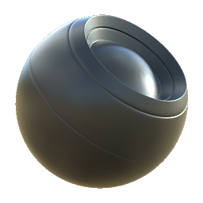

# 基礎材料

<table>
<tr style="border: 0;">
<td width="33.33%" style="border: 0;" valign="top">

{width="128px"}

<b>收錄於：</b> PBR工具>材料過濾器

</td>
<td width="100.00%" style="border: 0;" valign="top">

## 說明

在 Adobe Substance 3D Designer[&#128279;](https://www.adobe.com/products/substance3d-designer.html) 中製作多通道素材最快速、最簡單的方法。此節點回傳一個基於簡單、純色設定與數值的全材質。 此資料可用作佔位符或精煉成複雜材料。

節點在貼圖完整道具和混合多種材質時非常有用。 事實上，你可以從這個節點開始製作每一個材料，完全不需要複雜的材料基底。

</td>
</tr>
</table>

## 輸入

|  |  |
|:---|:---|
|  | 每個通道都有可透過「使用者定義輸入」開關切換的可選輸入。 |

## 參數

|  |  |
|:---|:---|
| <b>PBR 工作流程</b> <i>金屬 - 粗糙度，鏡面 - 光澤度</i> | 設定所使用的PBR模型。 |
| <b>材質預設</b> <i>客製化、介質、黃金、銀、鋁、鐵、銅、鈦、鎳、鈷、鉑金</i> | 快速製造特定金屬的捷徑。 關閉無關選項。 |
| <b>底色</b> <i>（色彩值）</i> | 底色使用純色。 |
| <b>金屬</b> <i>（灰階）</i> | 金屬色的實心價值。 |
| <b>漫遊色彩</b> <i>（色彩值）</i> | Diffuse 使用純色。 |
| <b>鏡面鏡面</b> <i>（色彩值）</i> | Specular 使用純色。 |
| <b>鏡面預設</b> <i>塑膠、木頭、石頭、磚塊、沙子、混凝土、布料、生鏽的金屬、水、冰、玻璃</i> | 可選快速預設以設定PBR正確的鏡面值。 |
| <b>鏡面範圍</b> <i>0.0 - 1.0</i> | 調整鏡面範圍。 |
| <b>粗糙度-光澤度</b> |  |
| <b>粗糙度值</b> <i>（灰階）</i> | 如果通道是啟用的，則設定全域的基準粗糙度值。 |
| <b>光澤價值</b> <i>（灰階）</i> | 如果通道啟動，純色用於光澤效果。 |
| <b>垃圾搖滾量</b> <i>0.0 - 1.0</i> | 可選的 Grunge 地圖輸入在 Gloss 或 Roughness 中融合的程度。 |
| <b>垃圾搖滾瓷磚</b> <i>1 - 16</i> | 可選的垃圾搖滾地圖圖塊範圍。 |
| <b>自訂垃圾搖滾輸入</b> <i>錯誤/真實</i> | 啟用或停用可選的自訂 Grunge 地圖。 |
| <b>正常</b> |  |
| <b>從高度強度判斷為正常</b> <i>0.0 - 16.0</i> | 可選擇性地將自訂高度貼圖轉為法線，並回傳為材質法線貼圖。 |
| <b>高度</b> |  |
| <b>身高位置</b> <i>0.0 - 1.0</i> | 高度輸出的實心值。 |
| <b>身高範圍</b> <i>0.0 - 1.0</i> | 設定使用者自訂高度圖的影響（若啟用）。 |
| <b>使用者自訂地圖</b> | 切換開啟或關閉所有使用者自訂的地圖，回傳這些地圖而非實體值。 |
