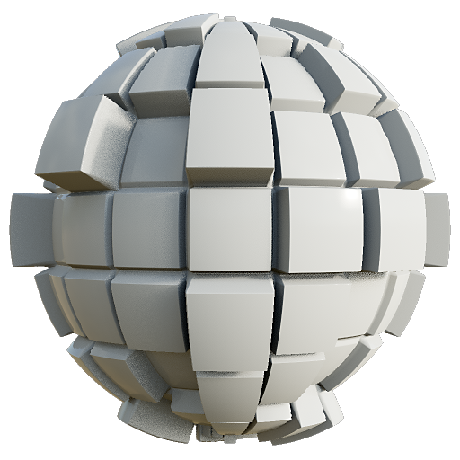
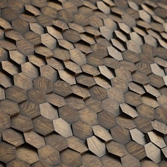

# PBR 渲染

<table>
<tr style="border: 0;">
<td width="33.33%" style="border: 0;" valign="top">

{width="250px"}

<b>收錄於：</b> PBR工具>材料過濾器

</td>
<td width="100.00%" style="border: 0;" valign="top">

## 說明

利用基於影像的光照（IBL）將 PBR 材質渲染到球體、平面或圓柱體上。這是位於節點內的渲染引擎，對於產生縮圖、預覽或 2D 資產非常有用。 它不是像 3D 視圖那樣的渲染，而是實際在你的圖表中產生的貼圖。

此節點至少需插入完整的 PBR 材料。 理想狀況是利用連結建立模式（Link Creation Modes）將材質連接到 PBR Render。 此外，渲染計算光照時，還需要一個球形展開的 HDRI 環境。 測試材料可在 PBR 材料中找到，環境地圖則可在圖書館的 3D View 中找到 [。](../../../../../../compositing-graphs/nodes-reference-for-com/node-library/3d-view-library/3d-view-library.md)

</td>
</tr>
</table>

>[!WARNING]
>
> **CPU（SSE2）引擎**
> 
> PBR 渲染節點非常笨重，且與 SSE2 CPU 引擎相容性不佳。 如果節點表現極差，按 F9 切換到另一個引擎。

## 輸入

|  |  |
|:---|:---|
| <b>物料通道輸入</b> | 多種材質輸入用於在幾何體上渲染材質：  - 底色  - 法線  - 發射  - 粗糙度  - 金屬  - 鏡面層級  - 高度  - 環境遮蔽  - 不透明度遮罩  - 各向異性層級  - 各向異性角度  - 半透明 度 - 散射距離尺度 |
| <b>鏡頭泥土地圖</b> <i>灰階輸入</i> | 鏡頭上的髒污自訂地圖，當鏡頭光暈可見時會出現。 |
| <b>鏡頭光圈地圖</b> <i>灰階輸入</i> | 可以用來覆蓋散景、失焦的形狀。 對比越強烈，它就越明顯。 請注意，貼圖中只有一個圓形會被取樣，所以任何形狀都必須符合圓形。 |
| <b>背景輸入</b> <i>色彩輸入</i> | 當 <b>背景模式</b> 參數設為 <i>Backgroud 輸入時，自訂地圖可用作背景</i> |
| <b>環境地圖</b> <i>色彩輸入</i> | 用環境地圖來計算光照。 必須是球形映射且以 HDR 格式呈現。 |

## 輸出

|  |  |
|:---|:---|
| <b>美</b> | 最終渲染圖 |
| <b>原始輻照</b> | 最終渲染  <i>的輻照度資料 Alpha：</i> 不透明度貼圖 |
| <b>原始鏡面</b> | 最終渲染  <i>的鏡面資料 Alpha：</i> 鏡面陰影貼圖 |
| <b>正常世界空間</b> | 最終渲染  <i>Alpha：</i> 世界空間高度圖的世界空間法線資料 |
| <b>正規切空間</b> | 最終渲染  <i>的切線空間法線資料 Alpha：</i> 切線空間高度圖 |
| <b>紫外線</b> | 最終渲染  <i>Alpha：</i> 不透明度貼圖的 UV 資料 |

## 參數

|  |  |
|:---|:---|
| <b>形狀</b> <i>球體、平面、圓柱體</i> | 設定用於渲染的形狀。 無法自訂形狀。 |
| <b>位移強度</b> <i>0.0 - 0.5</i> | 設定高度位移強度。 |
| <b>環境旋轉</b> <i>0.0 - 1.0</i> | 旋轉光影環境。 比起移動相機，這是預旋轉的。 |
| <b>背景模式</b> <i>色彩、環境、環境、背景輸入</i> | 設定背景中顯示的內容。 顏色是純色，環境是你插入並可選模糊的地圖。 環境音是一個非常模糊的環境版本。 |
| <b>背景色</b> <i>（色彩值）</i> | 只有在背景模式設為彩色時才可用。 |
| <b>環境背景模糊</b> <i>0.0 - 1.0</i> | 只有在背景模式設為環境時才可用。 |
| <b>形狀</b> |  |
| <b>規模</b> <i>0.0 - 2.0</i> | 設定球體的比例。 |
| <b>飛機尺寸</b> <i>0.0 - 1.0</i> | 設定飛機的比例。 |
| <b>汽缸半徑</b> <i>0.0 - 1.0</i> | 設定圓柱體的半徑。 |
| <b>圓柱體長度</b> <i>0.0 - 1.0</i> | 設定圓筒長度。 |
| <b>旋轉</b> <i>0.0 - 1.0</i> | 可以旋轉形狀，但不會旋轉燈光。 |
| <b>旋轉方向</b> <i>0.0 - 1.0</i> | 設定旋轉軸為二維。 |
| <b>繞方向旋轉</b> <i>0.0 - 1.0</i> | 自旋在旋轉軸上成形。 |
| <b>形狀位置</b> <i>-1.0 - 1.0</i> | 移動形狀。 |
| <b>UV 平鋪</b> <i>1.0 - 6.0</i> | 設定 UV 平鋪的量。 |
| <b>球體紫外線尺度</b> <i>0.0 - 4.0</i> | 它設定了球體上的紫外線尺度。 |
| <b>平面紫外線尺度</b> <i>1.0 - 4.0</i> | 設定平面上的紫外線比例。 |
| <b>圓柱體紫外線尺度</b> <i>1.0 - 6.0</i> | 設定圓柱體上的紫外線強度尺度。 |
| <b>紫外線偏移</b> <i>0.0 - 1.0</i> | 偏移 UV |
| <b>傾斜紫外線</b> <i>錯誤/真實</i> | 球體的紫外線會傾斜 45 度。 |
| <b>相機</b> |  |
| <b>曝光</b> <i>-4.0 - 4.0</i> | 設定相機曝光。 |
| <b>音調映射器</b> <i>線性、ACES、電影 Hejl</i> | 設定最終影像要使用的色調映射解決方案。 |
| <b>相機模式</b> <i>透視與正字法</i> | 在兩種投影模式間切換攝影機。 |
| <b>視野範圍</b> <i>0.01 - 100.0</i> | 設定攝影機視野角度。 |
| <b>距離</b> <i>0.0 - 4.0</i> | 設定相機距離物體中心的距離。 |
| <b>小插曲強度</b> <i>0.0 - 1.0</i> | 設定短片效果的強度。 |
| <b>小景半徑</b> <i>0.0 - 1.0</i> | 設定短片效果的半徑。 |
| <b>螢幕位置</b> | 移動攝影機繞著物件移動，也可以用 2D 視角中的裝置來改變。 |
| <b>景深</b> |  |
| <b>光圈半徑</b> <i>0.0 - 0.1</i> | 設定光圈半徑。 數值越高，模糊區域會變得模糊（散景）。 |
| <b>光圈刀片</b> <i>3 - 9</i> | 設定散景模糊的形狀。 |
| <b>光圈環</b> <i>0.0 - 1.0</i> | 為散景形狀增加內部漸層。 |
| <b>孔徑分流</b> <i>0.0 - 2.0</i> | 為散景增添色差。 |
| <b>旋轉散景</b> <i>0.0 - 1.0</i> | 為模糊的散景區域加入漩渦或旋轉效果。 |
| <b>對焦模式</b> <i>自動，點</i> | 設定焦點是預先設定或使用者設定的。 點對焦可以讓你在2D視角中移動一個點來決定對焦距離。 |
| <b>焦點</b> | 如果焦點設為 Point，這可以讓你移動那個點。 有一個 2D 視角裝置。 |
| <b>對焦偏移</b> <i>-0.5 - 0.5</i> | 如果設定為自動，可以來回切換對焦。 |
| <b>使用自訂光圈貼圖</b> <i>錯誤/真實</i> | 覆蓋上述光圈設定，並使用光圈貼圖輸入來決定散景形狀。 需要輸入。 |
| <b>後續影響</b> |  |
| <b>啟用後期效果</b> <i>錯誤/真實</i> | 在最終渲染中切換 <i>所有</i> 後期效果。 |
| <b>綻放強度</b> <i>0.0 - 2.0</i> | 設定光暈效應的強度。 |
| <b>綻放門檻</b> <i>0.0 - 2.0</i> | 設定了低開花出現的門檻。 |
| <b>綻放色度移</b> <i>0.0 - 1.0</i> |  |
| <b>鏡頭光暈強度</b> <i>0.0 - 1.0</i> | 設定鏡頭光暈效果的強度。 |
| <b>鏡頭光暈強度</b> <i>0.0 - 1.0</i> | 設定鏡頭光暈的強度。 確保環境背景的光線在視野內，才能清楚看到這個效果。 |
| <b>鏡頭塵埃強度</b> <i>0.0 - 1.0</i> | 鏡頭的髒污貼圖效果會顯示鏡頭光暈。 |
| <b>渲染設定</b> |  |
| <b>擴散品質</b> <i>16個樣本、32個樣本、64個樣本、128個樣本</i> | 在擴散地圖的品質間切換。 |
| <b>漫射多重器</b> <i>0.0 - 1.0</i> | 控制發射部分對輻照的貢獻程度。 |
| <b>擴散陰影強度</b> <i>0.0 - 1.0</i> | 控制擴散陰影的強度。 |
| <b>鏡面抖動</b> <i>0.0 - 1.0</i> | 設定鏡面鏡面的抖動量。 |
| <b>鏡面陰影倍增器</b> <i>0.0 - 1.0</i> | 控制鏡面反射中陰影的強度。 |
| <b>不透明度模式</b> <i>抖動 Alpha 測試，簡單 Alpha 混合</i> | 控制透明度的應用方式。 <i>簡單 Alpha 混合</i>模式在均勻背景上最為明顯。 |
| <b>環境遮蔽強度</b> <i>0.0 - 1.0</i> | 設定環境遮蔽陰影的強度。 |
| <b>材料調整</b> |  |
| <b>重新計算法線</b> <i>錯誤/真實</i> | 法線會根據位移強度從高度圖重新計算。 |
| <b>一般格式</b> <i>DirectX、OpenGL</i> | 切換不同的法線貼圖格式（反轉綠色通道） |
| <b>介電 F0 輸入</b> <i>恆定值，鏡面電平輸入</i> | 設定驅動 F0 值的因素。 鏡面級輸入代表它會由輸入映射驅動。 |
| <b>介電 F0</b> <i>0.0 - 0.08</i> | 如果介電 F0 輸入選擇 Constant Value，這個滑桿可以設定全域值。 |
| <b>透明外套</b> |  |
| <b>啟用透明外套</b> <i>錯誤/真實</i> | 讓輸入材料上能再塗一層簡單的透明塗層。 |
| <b>透明外層重量</b> <i>0.0 - 1.0</i> | 設定透明層的強度或強度。 |
| <b>透明層鏡面層</b> <i>0.0 - 1.0</i> | 設定透明塗層的粗糙度。 |
| <b>從基礎層繼承普通難度</b> <i>錯誤/真實</i> | 如果透明漆忽略或使用底材的法線，則設定為 |
| <b>發射體</b> |  |
| <b>啟用發射式照明</b> <i>正確/錯誤</i> | 切換發射光的漫射貢獻。 |
| <b>發射強度</b> <i>0.0 - 10.0</i> | 為發射映射設定全域乘數。 |
| <b>次表面散射</b> |  |
| <b>啟用次表面散射</b> <i>正確/錯誤</i> | 在最終渲染中切換次表面散射。  <i>注意：</i> 次表面散射需要 <b>半透明</b> 輸入值高於 <i>0.0</i> |
| <b>散射距離</b> <i>0.0 - 1.0</i> | 調整散射效果的最大距離。  <i>注意：</i>此值與每個色道</i>的散射距離尺</b>度輸入值<i>相乘<b>。 |
| <b>紅移</b> <i>0.0 - 1.0</i> | 調整紅移效應在散射中的強度。 |
| <b>雷利</b> <i>0.0 - 1.0</i> | 調整散射中瑞利效應的強度。 |

## 範例

所有影像皆直接在 Designer 的 2D 視圖窗中產生，使用來自 [Substance 3D 資產](https://substance3d.adobe.com/assets) 庫的材質。

<table style="margin-top: 32px; margin-bottom: 32px">
    <tr style="border: 0">
        <td style="border: 0; background: transparent">
            
        </td>
        <td style="border: 0; background: transparent">
            
        </td>
        <td style="border: 0; background: transparent">
            
        </td>
        <td style="border: 0; background: transparent">
            
        </td>
    </tr>
    <tr style="border: 0; background: transparent">
        <td style="border: 0; background: transparent">
            
        </td>
        <td style="border: 0; background: transparent">
            
        </td>
        <td style="border: 0; background: transparent">
            
        </td>
        <td style="border: 0; background: transparent">
            
        </td>
    </tr>
</table>
