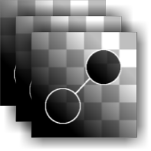

# 多重複製人補丁

<table>
<tr style="border: 0;">
<td width="33.33%" style="border: 0;" valign="top">

{width="128px"}

{width="128px"}

<b>收錄於：</b> 《材料濾>掃描處理》

</td>
<td width="100.00%" style="border: 0;" valign="top">

## 說明

此節點是 Clone Patch[&#128279;](../../../../../../compositing-graphs/nodes-reference-for-com/node-library/material-filters/scan-processing/clone-patch/clone-patch.md) 的多輸入版本。它連接最多八個輸入，並對所有輸入執行完全相同的複製補丁操作。 它主要用於多角度照片，然後 [再與多角度轉反照](../../../../../../compositing-graphs/nodes-reference-for-com/node-library/material-filters/scan-processing/multi-angle-to-albedo/multi-angle-to-albedo.md) 率或 [多角度轉正常](../../../../../../compositing-graphs/nodes-reference-for-com/node-library/material-filters/scan-processing/multi-angle-to-normal/multi-angle-to-normal.md)合成。

>[!NOTE]
>
> 更多資訊請參見 [複製補丁](../../../../../../compositing-graphs/nodes-reference-for-com/node-library/material-filters/scan-processing/clone-patch/clone-patch.md) ，材質版本請參見 [材料複製補丁](../../../../../../compositing-graphs/nodes-reference-for-com/node-library/material-filters/scan-processing/material-clone-patch/material-clone-patch.md) 。

</td>
</tr>
</table>

## 參數

|  |  |
|:---|:---|
| <b>輸入計數</b> <i>1 - 8</i> | 設定將接收相同 Patch 操作的輸入數量。 |
| <b>是正常的（僅限顏色）</b> <i>錯誤/真實</i> | 設定輸入是否為法線貼圖，以及混合是否應以此方式處理。 |
| <b>形狀</b> <i>方形、圓盤</i> | 定印章形狀。 只當作基礎使用。 |
| <b>Edge</b> |  |
| <b>門檻</b> <i>0.0 - 1.0</i> | 設定混合區域應該延伸到多遠。 它沿著目標區域的形狀逐步生長;在均勻背景下幾乎沒有影響。 |
| <b>模糊</b> <i>0.0 - 2.0</i> | 若需要較柔和的過渡，則模糊印章區域的邊緣。 |
| <b>平滑度</b> <i>0.0 - 2.0</i> | 郵票形狀邊緣圓潤，使輪廓更流暢流暢。 |
| <b>網格解析</b> <i>1 - 11</i> | 設定混合分析的品質解析度。 較高的數值代表融合更準確。 |
| <b>變換</b> |  |
| <b>來源矩陣</b> <i>（變換矩陣）</i> | 變換來源（縮放與旋轉）。 無法在 Canvas 上進行，只能透過這些參數來改變。 |
| <b>來源偏移</b> <i>-0.5 - 0.5</i> | 翻譯來源位置。 無法在 Canvas 上進行，只能透過這些參數來改變。 *這個參數大概是你最想改變的！* |
| <b>目標矩陣</b> <i>（變換矩陣）</i> | 轉換目標位置（縮放與旋轉）。 也可以用 Gizmo 在畫布上來完成。 |
| <b>目標偏移</b> <i>-0.5 - 0.5</i> | 翻譯目標位置。 也可以用 Gizmo 在畫布上來完成。 |
