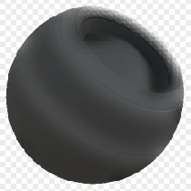

# 布料穿著

<table>
<tr style="border: 0;">
<td style="border: 0;" valign="top">

{width="128px"}

## 布料穿著

**收錄於：***基於網格的生成器**/遮罩生成器*

**很簡單**

</td>
<td style="border: 0;" valign="top">

## 說明

根據烘焙的地圖和使用者設定產生黑白遮罩。 類似 [Painter](https://support.allegorithmic.com/documentation/display/SPDOC/Substance+Painter) 裡[的智慧口罩](https://support.allegorithmic.com/documentation/display/SPDOC/Smart+Materials+and+Masks)。

面具象徵布料上磨損的邊緣。 它使用布料細節高度圖來決定大部分視覺效果;沒有適當的地圖，效果看起來非常簡單。

## 參數

### 輸入

* **布料高度**： *灰階輸入*\
  只有布料圖案的高度。 這不是你（烘焙）物件的高度，而是平鋪細節圖案。
* **遮罩（可選）：***灰階輸入*\
  遮罩槽用於遮蔽節點的效果。
* **曲率**： *灰階輸入*\
  烘焙/產生曲率來決定凸起的邊緣。

### 參數

* **硬邊量**： *0.0 - 1.0*
* **磨損柔軟度**： *0.0 - 5.0*&#x200B;決定磨損邊緣的模糊程度與柔軟度。

## 範例圖片

</td>
</tr>
</table>
