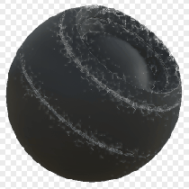

# 邊緣泥土

<table>
<tr style="border: 0;">
<td style="border: 0;" valign="top">

{width="128px"}

## 邊緣泥土

**收錄於：***基於網格的生成器**/遮罩生成器*

**很簡單**

</td>
<td style="border: 0;" valign="top">

## 說明

根據烘焙的地圖和使用者設定產生黑白遮罩。 類似 [Painter](https://support.allegorithmic.com/documentation/display/SPDOC/Substance+Painter) 裡[的智慧口罩](https://support.allegorithmic.com/documentation/display/SPDOC/Smart+Materials+and+Masks)。

這個遮罩代表一種沿邊緣累積的髒污效果，僅基於曲率貼圖。

## 參數

### 輸入

* **曲率**： *灰階輸入*\
  用於效果放置的烘焙地圖。 必備！
* **變異遮罩**： *灰階輸入*\
  遮罩槽用於遮蔽節點的效果，僅在啟用覆寫參數時使用。
* **遮罩（可選）：***灰階輸入*\
  遮罩槽用於遮蔽節點的效果。

### 參數

* **等級**： *0.0 - 1.0*\
  用來設定土壤的量。
* **對比**&#x200B;度： *0.0 - 1.0*\
  調整結果的對比度。
* **變化**： *0.0 - 1.0*&#x200B;混合大規模遮蔽/拆散的程度。
* **覆寫變體遮罩**： *假/真*

## 範例圖片

</td>
</tr>
</table>
